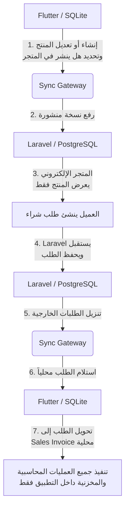
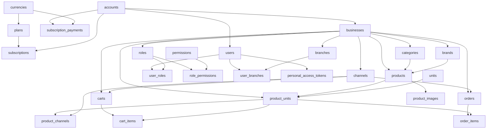

# Cloud Database Extraction Report (Official Reference)

**تاريخ الإصدار:** 2026-07-18  
**المرجع الأساسي (Source of Truth):** `Database_Schema_Extraction.md` & `Platform_Synchronization_Architecture.md`  
**حالة التصميم:** معتمد ومجمد نهائياً (Architecture Frozen)  
**الهدف:** التقرير الرسمي المعتمد لتحديد الفصل والملكية المطلقة لجميع جداول المشروع وسرية البيانات بين محرك **SQLite** (تطبيق الـ ERP المحلي) ومحرك **PostgreSQL** (المنصة السحابية Laravel Cloud Platform).

---

## مقدمة إلزامية: حدود الفصل المعماري (Architectural Separation Bounds)

تم اعتماد معمارية المشروع بشكل نهائي ومجمد (**Architecture Frozen**)، وتقوم على مبدأ الفصل الحاسم والتام بين بيئتين:

1. **بيئة التطبيق المحلي (Flutter + SQLite):**  
   تحتوي على **جميع وحدات الـ ERP التشغيلية بالكامل**، بما في ذلك:
   * **Sales** (المبيعات ونقاط البيع POS والفواتير الآجلة)
   * **Purchases** (المشتريات والتوريدات ومرتجعاتها)
   * **Inventory** (المخزون والحركات والجرد والتحويلات)
   * **Accounting & Finance** (المحاسبة العامة، شجرة الحسابات، قيود اليومية، الصناديق، والبنوك)
   * **Fixed Assets** (الأصول الثابتة وجداول الإهلاك)
   * **HR & CRM** (الموارد البشرية، شؤون الموظفين، وملفات العملاء والموردين)
   * **Manufacturing & Reports** (التصنيع والتقارير المالية والتشغيلية)  
   * **وجميع العمليات اليومية التشغيلية الأخرى.**  
   > [!IMPORTANT]
   > **قاعدة قطعية:** جميع هذه الجداول والعمليات تبقى حصرياً داخل تطبيق **Flutter + SQLite** المحلي، ولا يجوز نقل أو استنساخ أي جدول تشغيلي منها إلى **PostgreSQL** تحت أي ظرف.

2. **بيئة المنصة السحابية (Laravel + PostgreSQL):**  
   تحتوي **فقط** على جداول المنصة المركزية وخدماتها المحددة، ولا تحتوي على أي منطق أو حسابات ERP تشغيلية نهائياً. يقتصر نطاقها الحصري على:
   * **Accounts** (إدارة الحسابات المشتركة)
   * **Businesses & Branches** (إدارة الشركات والفروع والتراخيص)
   * **Users, Roles & Permissions** (المستخدمين وصلاحيات الدخول والمزامنة)
   * **User Roles, Role Permissions, User Branches** (جدول الربط والتخويل ونطاق المزامنة)
   * **Subscription Plans, Subscriptions & Subscription Payments** (باقات واشتراكات المنصة ومدفوعاتها)
   * **Personal Access Tokens** (إدارة جلسات وتوثيق أجهزة المزامنة - Sync Gateway)
   * **Currencies** (لاستخدام المنصة والاشتراكات وتسعير المتجر فقط)
   * **E-Commerce Catalog** (كتالوج المنتجات والصور المنشورة للمتجر الإلكتروني فقط)
   * **E-Commerce Orders** (طلبات المتجر الإلكتروني الواردة عبر الويب فقط)
   * **Sync Gateway** (بوابة وسجلات المزامنة المركزية)

---

## 1. قائمة الجداول التي ستبقى داخل SQLite (Local ERP Operational Kernel)

تضم هذه القائمة جميع الجداول التشغيلية (59 جدولاً) المستخرجة من وثيقة `Database_Schema_Extraction.md`، والتي تشكل النواة المحاسبية والمخزنية الحصرية لتطبيق **Flutter + SQLite**:

| المجال (Domain) | اسم الجدول | الوظيفة التشغيلية الحصرية في SQLite |
| :--- | :--- | :--- |
| **Domain 0** | `account_types` | تصنيف أنواع شجرة الحسابات المحاسبية (أصول، خصوم، إيرادات، مصروفات) |
| **Domain 2** | `branch_product_prices` | تسعير المنتجات المخصص للفروع المحلية وتجاوزات أسعار نقاط البيع (POS) |
| **Domain 3** | `warehouses` | المستودعات وأماكن التخزين الفعلية التابعة للفروع |
| **Domain 3** | `inventories` | الأرصدة الفعلية وكميات المخزون اليومية وحساب متوسط التكلفة |
| **Domain 3** | `inventory_transactions` | رؤوس حركات المخزون (استلام، صرف، تسويات، أرصدة افتتاحية) |
| **Domain 3** | `inventory_transaction_lines` | بنود وتفاصيل حركات المخزون وربطها بالتكلفة |
| **Domain 3** | `inventory_transfers` | مستندات تحويل المخزون بين المستودعات المحلية داخل الفروع |
| **Domain 3** | `inventory_transfer_items` | تفاصيل وبنود والكميات المحولة في تحويلات المخزون المحلي |
| **Domain 4** | `fiscal_years` | السنوات المالية المحاسبية للشركات وحالة فتحها أو إغلاقها |
| **Domain 4** | `fiscal_periods` | الفترات المالية المحاسبية الشهرية (1-12) وضوابطها الدورية |
| **Domain 4** | `exchange_rates` | سجلات ومعدلات صرف العملات المحاسبية التاريخية لإعداد القيود |
| **Domain 4** | `chart_of_accounts` | شجرة الحسابات المحاسبية الكاملة والمراكز المالية والمستويات |
| **Domain 4** | `payment_terms` | شروط الآجال الزمنية والدفع للعملاء والموردين |
| **Domain 4** | `payment_methods` | طرق الدفع المحاسبية المربوطة بحسابات الصندوق والبنك |
| **Domain 4** | `cash_registers` | صناديق النقدية الخاصة بنقاط البيع والفروع ومتابعة أرصدتها |
| **Domain 4** | `cash_transactions` | حركات الصندوق والإيداعات والسحوبات النقدية اليومية |
| **Domain 4** | `bank_accounts` | الحسابات البنكية التشغيلية للشركات وأرصدتها الافتتاحية والحالية |
| **Domain 4** | `bank_transactions` | الحركات البنكية والتسويات والتحويلات المالية اليومية |
| **Domain 5** | `suppliers` | ملفات وسجلات الموردين وحدود الائتمان والأرصدة الافتتاحية |
| **Domain 5** | `purchase_invoices` | رؤوس فواتير المشتريات ومستندات التوريد وحالة سدادها |
| **Domain 5** | `purchase_invoice_items` | بنود وتفاصيل فواتير المشتريات وتكلفة الوحدة والضرائب |
| **Domain 5** | `purchase_returns` | رؤوس فواتير مرتجعات المشتريات ومستندات الخصم المورد |
| **Domain 5** | `purchase_return_items` | تفاصيل وبنود مرتجعات المشتريات وتأثيرها المخزني |
| **Domain 6** | `customers` | ملفات وسجلات العملاء المحليين، الائتمان، والأرصدة الافتتاحية |
| **Domain 6** | `sales_invoices` | فواتير المبيعات المحلية ونقاط البيع (POS) والفواتير الآجلة |
| **Domain 6** | `sales_invoice_items` | بنود فواتير المبيعات واحتساب التكلفة والربحية والمخزون المبيّع |
| **Domain 6** | `sales_returns` | رؤوس فواتير مرتجعات المبيعات المحلية |
| **Domain 6** | `sales_return_items` | تفاصيل وبنود مرتجعات المبيعات وإعادة الكميات للمستودع |
| **Domain 7** | `journal_entries` | قيود اليومية العامة المحاسبية (General Ledger Journal Entries) |
| **Domain 7** | `journal_entry_lines` | بنود تفاصيل القيود المحاسبية المدين والدائن وربطها بالمستندات |
| **Domain 7** | `payments` | سندات القبض والصرف المالية متعددة العملات وربطها بالجهات |
| **Domain 7** | `payment_allocations` | تخصيص وتوزيع الدفعات المالية على الفواتير والمستندات المفتوحة |
| **Domain 7** | `expense_categories` | تصنيفات وتبويبات المصروفات التشغيلية المربوطة بشجرة الحسابات |
| **Domain 7** | `expenses` | المصروفات التشغيلية الفردية وتفاصيل سدادها المحاسبي والضريبي |
| **Domain 7** | `opening_balances` | الأرصدة الافتتاحية السنوية الدقيقة لشجرة الحسابات المحاسبية |
| **Domain 8** | `system_settings` | إعدادات النظام التكوينية والتفضيلات التشغيلية المحلية |
| **Domain 8** | `print_settings` | إعدادات وتنسيقات قوالب الطباعة والفواتير والإيصالات وأبعاد الورق |
| **Domain 8** | `sequences` | مولدات التسلسل الرقمي التلقائي للمستندات والفواتير والقيود |
| **Domain 8** | `departments` | الهيكل الإداري والأقسام الوظيفية لشؤون الموظفين والموارد البشرية |
| **Domain 8** | `job_titles` | المسميات والتوصيفات الوظيفية للموظفين |
| **Domain 8** | `employees` | ملفات وسجلات الموظفين والرواتب والتعاقدات وحالاتهم الوظيفية |
| **Domain 8** | `employee_documents` | وثائق وملفات وشهادات الموظفين الأرشيفية |
| **Domain 8** | `taxes` | تعريفات ونسب الضرائب المطبقة محلياً (مثل القيمة المضافة VAT) |
| **Domain 8** | `product_taxes` | جدول الربط بين بنود المنتجات والضرائب المطبقة عليها |
| **Domain 8** | `product_variants` | خيارات وخصائص المنتجات المحلية (مثل المقاس، اللون، الحجم) |
| **Domain 8** | `stock_adjustments` | رؤوس تسويات الجرد المخزني الفعلي (زيادة، عجز، تلف، فقدان) |
| **Domain 8** | `stock_adjustment_items` | تفاصيل بنود وفروقات الجرد الفعلي مقابل الجرد الدفتري |
| **Domain 8** | `attachments` | المرفقات والملفات المرتبطة بالمستندات والفواتير المحاسبية المحلية |
| **Domain 8** | `activity_logs` | سجلات التدقيق وحركات وأحداث الأمان داخل الجهاز المحلي |
| **Domain 8** | `fixed_assets` | سجل الأصول الثابتة وتواريخ تملكها وحساب الإهلاك التراكمي |
| **Domain 8** | `depreciation_schedules` | جداول وقيود استهلاك الأصول الثابتة الدورية المجدولة |
| **Domain 8** | `bank_reconciliations` | رؤوس التسويات المطابقة بين كشوفات البنوك والدفاتر المحاسبية |
| **Domain 8** | `bank_reconciliation_lines` | تفاصيل البنود المطابقة وغير المطابقة في التسوية البنكية |
| **Domain 9** | `account_mappings` | قواعد التوجيه المحاسبي التلقائي (الربط بمراكز الحسابات الافتراضية) |
| **Domain 9** | `customer_receivables` | أستاذ مساعد ذمم العملاء والأرصدة المستحقة ومتابعة أعمار الديون |
| **Domain 9** | `receivable_entries` | التفاصيل التاريخية لحركات تسديد وتخصيص ذمم العملاء |
| **Domain 9** | `supplier_payables` | أستاذ مساعد ذمم الموردين والفواتير المستحقة للدفع والآجال |
| **Domain 9** | `payable_entries` | التفاصيل التاريخية لحركات تسديد وتخصيص ذمم الموردين |
| **Domain 9** | `accounting_periods` | سجل إغلاق الفترات المالية المحاسبية وحمايتها من التعديل المحاسبي |

---

## 2. قائمة الجداول التي ستنتقل إلى PostgreSQL (Laravel Cloud Platform Tables)

يقتصر التواجد السحابي داخل قاعدة بيانات **PostgreSQL** على هذه الجداول المحددة (26 جدولاً) والمسؤولة حصرياً عن إدارة المنصة المركزية، والاشتراكات، والمصادقة، وكتالوج وطلبات المتجر الإلكتروني، وبوابة المزامنة:

| المجال السحابي | اسم الجدول | الوظيفة ودور المنصة السحابية |
| :--- | :--- | :--- |
| **Core Platform** | `currencies` | تعريف العملات المعتمدة للمنصة والاشتراكات ولتسعير منتجات وطلبات المتجر الإلكتروني فقط |
| **Core Platform** | `accounts` | إدارة الحسابات المشتركة المركزية (Accounts) للعملاء والمؤسسات |
| **Core Platform** | `businesses` | إدارة الشركات المربوطة بالحسابات لتحديد سياق المزامنة وتطبيق حدود الباقات |
| **Core Platform** | `branches` | إدارة فروع الشركات لتطبيق حدود التراخيص وتحديد صلاحيات ونطاقات المزامنة |
| **Subscriptions** | `plans` | خطط والباقات السحابية وحدودها القصوى (الشركات، الفروع، المستخدمين) |
| **Subscriptions** | `subscriptions` | اشتراكات العملاء وحالة الترخيص (Active / Expired) لتخويل أو إيقاف المزامنة |
| **Subscriptions** | `subscription_payments` | مدفوعات وإيصالات الاشتراكات الخاصة بالمنصة المركزية وسداد الباقات |
| **Authorization** | `roles` | الأدوار والصلاحيات المؤسسية لمستخدمي المنصة السحابية وتطبيقات الفروع |
| **Authorization** | `permissions` | الصلاحيات العامة والمعتمدة لتقييد الوظائف ومزامنتها للأجهزة |
| **Authentication** | `users` | مستخدمي المنصة المركزية ومشغلي الفروع وتطبيق المزامنة |
| **Authorization** | `user_roles` | جدول الربط بين المستخدمين والأدوار |
| **Authorization** | `role_permissions` | جدول الربط بين الأدوار والصلاحيات |
| **Authorization** | `user_branches` | جدول الربط المعتمد لتقييد نطاق المزامنة وتحديد الفروع المسموحة للمستخدم |
| **Sync Gateway** | `personal_access_tokens` | إدارة التوكنز وتوثيق جلسات الأجهزة المتصلة ببوابة المزامنة (Sanctum) |
| **E-Commerce Catalog** | `categories` | شجرة تصنيفات المنتجات المخصصة للتصفح في المتجر الإلكتروني |
| **E-Commerce Catalog** | `brands` | العلامات التجارية المخصصة للفلترة والعرض في المتجر الإلكتروني |
| **E-Commerce Catalog** | `units` | وحدات القياس المربوطة بالمنتجات المنشورة على المتجر الإلكتروني |
| **E-Commerce Catalog** | `products` | البطاقات الأساسية للمنتجات المنشورة والمصرح بعرضها في المتجر الإلكتروني |
| **E-Commerce Catalog** | `product_units` | أسعار البيع والوحدات المخصصة للمنتجات المنشورة على المتجر الإلكتروني |
| **E-Commerce Catalog** | `product_images` | ألبوم صور المنتجات المرفوعة للعرض أمام العملاء في المتجر الإلكتروني |
| **E-Commerce Orders** | `channels` | قنوات البيع الإلكتروني (مثل قناة Ecommerce) لتصنيف الطلبات والأسعار |
| **E-Commerce Orders** | `product_channels` | تحديد الأسعار الخاصة وحالة التوفر الفعلي للمنتج على قناة المتجر الإلكتروني |
| **E-Commerce Orders** | `carts` | سلات التسوق النشطة للعملاء والزوار أثناء تصفح المتجر الإلكتروني |
| **E-Commerce Orders** | `cart_items` | محتويات وبنود سلات التسوق في المتجر الإلكتروني قبل تعميد الطلب |
| **E-Commerce Orders** | **`orders`** | **رؤوس طلبات المتجر الإلكتروني الخارجية الواردة من العملاء عبر الويب فقط** |
| **E-Commerce Orders** | **`order_items`** | **تفاصيل وبنود طلبات المتجر الإلكتروني الخارجية الواردة من العملاء عبر الويب فقط** |

---

## 3. ملاحظة هامة وحاسمة حول جداول الطلبات (E-Commerce Orders Clarification)

> [!CAUTION]
> **توضيح قطعي وإلزامي بشأن جدولي `orders` و `order_items`:**
> 
> إن وجود جدولي **`orders`** و **`order_items`** داخل قاعدة بيانات **PostgreSQL** السحابية يُبرر حصرياً بكونهما يمثلان **طلبات المتجر الإلكتروني فقط (Online Store Orders)** التي يقوم العملاء بإدخالها مباشرة عبر واجهة الويب أو تطبيق المتجر الخارجي.
> 
> 1. **ليست فواتير بيع:** هذه الجداول **لا تمثل على الإطلاق** فواتير مبيعات (**Sales Invoices**) ولا بنود فواتير مبيعات (**Sales Invoice Items**).
> 2. **ليست مستندات محاسبية:** لا يترتب على إدراج البيانات في `orders` أو `order_items` في السحابة أي قيد محاسبي، ولا أي سحب مخزني فعلي، ولا أي تأثير على ذمم العملاء أو الصناديق.
> 3. **دورة المعالجة المحلية:** يحتفظ النظام السحابي بهذه الطلبات كـ **مدخلات بيانات خارجية معلقة** حتى تقوم بوابة المزامنة (**Sync Gateway**) بتنزيلها إلى جهاز الفروع المحلي (`Flutter + SQLite`). فور وصول الطلب إلى التطبيق المحلي، يتم معالجته وتحويله محلياً داخل **Flutter** إلى **فاتورة بيع محلية رسمية (`sales_invoices` & `sales_invoice_items`)** داخل **SQLite**، حيث تتم هناك فقط كافة المعالجات والخصومات المخزنية والمحاسبية الدقيقة.

---

## 4. Source of Data & Ownership Policy

### المصدر الحقيقي للبيانات (Single Source of Data)

تعتمد معمارية المشروع على مبدأ **Single Source of Data**، بحيث يكون لكل نوع من البيانات مالك واحد فقط (Single Owner)، ولا يجوز أن يكون هناك أكثر من مصدر لإدارة نفس البيانات.

#### أولاً: المنتجات (Products)
تطبيق **Flutter + SQLite** هو المصدر الأساسي والوحيد لإدارة جميع بيانات المنتجات.  
جميع عمليات:
* إنشاء المنتجات
* تعديل المنتجات
* حذف المنتجات
* أسعار البيع
* وحدات القياس
* الصور
* التصنيفات
* العلامات التجارية
* حالة المنتج
* الكميات
* التوفر

تتم بالكامل من داخل تطبيق Flutter. **ولا يجوز إنشاء أو تعديل هذه البيانات مباشرة من Laravel.**

#### ثانياً: المتجر الإلكتروني
المتجر الإلكتروني ليس نظاماً مستقلاً لإدارة المنتجات، ولا يعتبر PostgreSQL المصدر الأساسي للمنتجات؛ بل هو عبارة عن **واجهة عرض (Published Catalog)** للمنتجات التي يتم نشرها من التطبيق.  
يقوم Flutter بتحديد:
* هل المنتج ينشر في المتجر أم لا.
* هل المنتج متوفر أم غير متوفر.
* هل يسمح بالبيع الإلكتروني.
* سعر المنتج في المتجر.
* صور المنتج.
* بيانات المنتج المعروضة.

ثم يتم مزامنة هذه البيانات إلى PostgreSQL ليقوم المتجر الإلكتروني بعرضها فقط.

#### ثالثاً: مسؤولية Laravel
دور Laravel يقتصر على:
* استقبال بيانات المنتجات المنشورة من التطبيق.
* تخزين نسخة منشورة (**Published Copy**).
* تقديم البيانات للمتجر الإلكتروني.
* استقبال طلبات العملاء.
* حفظ الطلبات.
* إرسال الطلبات إلى التطبيق عبر Sync Gateway.

**ولا يقوم Laravel إطلاقاً بـ:**
* إنشاء منتج.
* تعديل منتج.
* حذف منتج.
* إدارة المخزون.
* إدارة الأسعار التشغيلية.
* إدارة الكميات.
* إدارة العمليات اليومية الخاصة بالـ ERP.

#### رابعاً: دورة البيانات (Data Cycle)
تكون دورة البيانات كما يلي:

> [!CAUTION]
> **قاعدة معمارية إلزامية:**
> يمنع منعاً باتاً إنشاء أي شاشة أو API أو Controller داخل Laravel تسمح بإدارة المنتجات مباشرة.  
> وتعتبر جميع جداول `products, product_units, product_images, categories, brands, units` في السحابة **نسخة منشورة (Published Copy)** فقط، وليست المصدر الأساسي للبيانات. والمصدر الوحيد والحقيقي لهذه البيانات هو تطبيق **Flutter + SQLite**.  
> يعتبر هذا القرار جزءاً من المعمارية المجمدة (**Architecture Frozen**)، ويجب الالتزام به في جميع مراحل التطوير المستقبلية.

---

## 5. Published Catalog Policy

سياسة ونظام حوكمة كتالوج المتجر المنشور، وتُكمل بشكل مباشر سياسة ملكية ومصدر البيانات المعتمدة في القسم السابقة:

### 1. طبيعة كتالوج المتجر (Nature of the Store Catalog)
جميع الجداول التالية الموجودة داخل **PostgreSQL**:
* `products`
* `product_units`
* `product_images`
* `categories`
* `brands`
* `units`

**ليست قاعدة البيانات الأساسية لإدارة المنتجات.** وإنما تعتبر فقط:  
$$\text{\textbf{Published Catalog}}$$  
أي **نسخة منشورة (Published Copy)** يتم استخدامها حصرياً لعرض المنتجات داخل واجهات المتجر الإلكتروني.

### 2. المالك الحقيقي للبيانات (True Data Owner)
المالك الوحيد لهذه البيانات هو:  
$$\text{\textbf{Flutter + SQLite}}$$  
وجميع عمليات:
* **Create** (الإنشاء)
* **Update** (التحديث والتعديل)
* **Delete** (الحذف والإيقاف)

تتم حصرياً داخل تطبيق Flutter المحلي. ولا يجوز نهائياً تنفيذها مباشرة داخل Laravel أو قاعدة وبيانات السحابة.

### 3. مسؤولية Laravel (Laravel Responsibility)
يقتصر دور Laravel في هذا الجزء على:
* استقبال البيانات المنشورة الواردة من تطبيق Flutter عبر بوابة المزامنة.
* تخزين نسخة منشورة في قاعدة البيانات (`Published Copy`).
* عرض البيانات داخل المتجر الإلكتروني للزوار والعملاء.
* خدمة واجهات المتجر الخارجية (**Store APIs**).
* استقبال طلبات شراء العملاء وحفظها.
* تمرير طلبات الشراء إلى **Sync Gateway** لسحبها نحو التطبيق.

> [!IMPORTANT]
> لا يعتبر **Laravel** نظام إدارة منتجات (**Product Management System**) تحت أي ظرف.

### 4. منع التعديل المباشر (Prohibition of Direct Modification)
يُمنع منعاً باتاً إنشاء أو برمجة أو إضافة أي من العناصر التالية داخل **Laravel** لإدارة بيانات المنتجات الأساسية:
* **Product CRUD**
* **Product Admin Panel**
* **Product Update API**
* **Product Delete API**

وأي عملية تعديل في الأسعار أو الصور أو التصنيفات أو بيانات المنتج يجب أن تبدأ وتنطلق حصرياً من تطبيق **Flutter** فقط.

### 5. قاعدة حل التعارض (Conflict Resolution Rule)
تم اعتماد هذه القاعدة كـ **قرار معماري رسمي مجمد**:
> إذا حدث أي اختلاف أو تعارض بين بيانات **Flutter** وبيانات **PostgreSQL** الخاصة بكتالوج المنتجات، فإن **بيانات Flutter تعتبر المرجع الرسمي الوحيد (Source of Truth)**.  
> ويجب معالجة التعارض عبر إجبار إعادة نشر البيانات من **Flutter** إلى **PostgreSQL** لخلف النسخة السحابية. ولا يجوز إطلاقاً اعتماد بيانات PostgreSQL لتحديث أو تعديل بيانات Flutter.

### 6. تعريف دور PostgreSQL في كتالوج المنتجات
إن دور محرك **PostgreSQL** في نطاق المنتجات والمتجر الإلكتروني يعمل فقط وفق المفاهيم التالية:
* **Published Catalog** (كتالوج منشور)
* **Read Model** (نموذج للقراءة والعرض فقط أمام واجهات المتجر)
* **Store Backend** (خلفية تشغيل واجهة المتجر الإلكتروني)

**ولا يعمل نهائياً كنظام لإدارة المنتجات (Product Management System).**

---

## 6. العلاقات بين الجداول السحابية فقط (Cloud Relational Integrity)

تترابط جداول المنصة السحابية في **PostgreSQL** بهيكل علاقات محدد يخدم إدارة الحسابات، والاشتراكات، والتوثيق، وكتالوج وطلبات المتجر، بمعزل تام عن جداول الـ ERP المحاسبية المحلية:

---

## 7. مبرر نقل كل جدول إلى المنصة السحابية (Architectural Justifications)

| الجدول السحابي | مبرر التواجد في المنصة السحابية (PostgreSQL) | المرجعية في المعمارية |
| :--- | :--- | :--- |
| `currencies` | تعريف العملات المعتمدة لتسعير الباقات (`plans`) ومدفوعات الاشتراكات، ولتسعير منتجات وطلبات المتجر الإلكتروني. | *المنصة المركزية / المتجر* |
| `accounts` | الجذر الإداري الأعلى (Account Owner) لإدارة المشتركين والشركات المربوطة بهم والمسؤول أمام نظام الاشتراكات. | *إدارة الحسابات (Accounts)* |
| `businesses` | تحديد الكيانات المؤسسية؛ وهو المعيار الأساسي لتطبيق قيود الباقة (`max_businesses`) وتحميل سياق المزامنة. | *إدارة الشركات / المزامنة* |
| `branches` | فروع الشركات المعتمدة؛ تستخدم لتطبيق قيود الباقات (`max_branches`) وتحديد نطاقات المزامنة المكانية وتوجيه طلبات المتجر. | *إدارة الفروع / المزامنة* |
| `plans` | تعريف باقات الاشتراك والحدود القصوى للشركات، الفروع، والمستخدمين للتحقق منها سحابياً قبل التزامن. | *إدارة الاشتراكات* |
| `subscriptions` | تحديد حالة الترخيص نشط (`Active`) أو منتهي (`Expired`) لمنع مزامنة التطبيقات منتهية الصلاحية وإدارة التجديد. | *إدارة الاشتراكات* |
| `subscription_payments` | توثيق إيصالات وسندات السداد للباقات السحابية لإدارة المحاسبة المركزية الخاصة بمنصة Laravel. | *إدارة الاشتراكات* |
| `roles` | تحديد أدوار المستخدمين الإداريين ومشغلي الفروع لتنزيلها لتطبيق Flutter ولإدارة صلاحيات لوحة التحكم. | *الصلاحيات (Authorization)* |
| `permissions` | قائمة الصلاحيات الشاملة للنظام التي يتم مزامنتها للأجهزة لتقييد واجهة المستخدم محلياً. | *الصلاحيات (Authorization)* |
| `users` | التحقق من الهوية والمصادقة المركزية قبل فتح جلسة المزامنة أو الدخول للوحة التحكم السحابية. | *المصادقة (Authentication)* |
| `user_roles` | ربط المستخدم بالدور لتحديد الصلاحيات المستحقة تنزيلها مع حزمة بيانات الدخول. | *الصلاحيات (Authorization)* |
| `role_permissions` | تفصيل صلاحيات كل دور لضمان تطبيق القواعد محلياً وسحابياً. | *الصلاحيات (Authorization)* |
| `user_branches` | تقييد نطاق المزامنة؛ حيث ترفض بوابة المزامنة دفع أو سحب أي بيانات لفرع غير مصرح للمستخدم بالوصول إليه. | *الصلاحيات (Authorization)* |
| `personal_access_tokens` | إدارة وتتبع جلسات الأجهزة النشطة والتوكنز المؤمنة لـ **Sync Gateway** ورفض الطلبات من الأجهزة الموقوفة. | *المصادقة / Sync Gateway* |
| `categories` | هيكل شجرة التصنيفات المخصصة لعرض وتنظيم المنتجات أمام العملاء عند تصفح المتجر الإلكتروني السحابي. | *المتجر الإلكتروني (E-Commerce)* |
| `brands` | أسماء وشعارات العلامات التجارية المخصصة للفلترة والبحث داخل واجهات المتجر الإلكتروني. | *المتجر الإلكتروني (E-Commerce)* |
| `units` | تعريف وحدات قياس المنتجات المنشورة لضمان عرض مسمياتها بشكل صحيح عند الشراء عبر المتجر. | *المتجر الإلكتروني (E-Commerce)* |
| `products` | بطاقات المنتجات المرفوعة من التطبيق والمصرح بعرضها ونشرها في المتجر الإلكتروني. | *المتجر الإلكتروني (Published Catalog)* |
| `product_units` | أسعار البيع والوحدات المتاحة لكل منتج منشور على المتجر والتي يشتري العميل بناءً عليها. | *المتجر الإلكتروني (Published Catalog)* |
| `product_images` | صور المنتجات المرفوعة للمنصة لعرضها للجمهور في المتجر الإلكتروني ولوحة التحكم. | *المتجر الإلكتروني (Published Catalog)* |
| `channels` | قنوات البيع النشطة (مثل قنوات المتجر أو التطبيقات الخارجية) لتصنيف الطلبات والأسعار حسب القناة. | *المتجر الإلكتروني (E-Commerce)* |
| `product_channels` | تحديد الأسعار المخصصة وحالة التوفر الفعلي للمنتج عبر قناة المتجر الإلكتروني مقارنة بالنقاط المحلية. | *المتجر الإلكتروني (Published Catalog)* |
| `carts` | تخزين جلسات وسلات تسوق الزوار والعملاء على المتجر الإلكتروني قبل تأكيد عملية الشراء. | *المتجر الإلكتروني (E-Commerce)* |
| `cart_items` | البنود والكميات المضافة داخل سلات التسوق النشطة على المتجر الإلكتروني. | *المتجر الإلكتروني (E-Commerce)* |
| `orders` | **المدخل الوحيد للبيانات الخارجة:** يستقبل طلبات زوار المتجر معلقة سحابياً حتى يسحبها محرك المزامنة لـ Flutter. | *المتجر الإلكتروني / Sync Gateway* |
| `order_items` | تفاصيل بنود الطلبات الخارجية ليتم تحميلها ومعالجتها وتحويلها لفاتورة بيع محلية في SQLite. | *المتجر الإلكتروني / Sync Gateway* |

---

## Final Database Ownership Matrix

الجدول المرجعي النهائي والشامل لتصنيف ملكية وقاعدة بيانات كل جدول من جداول النظام (85 جدولاً بالكامل مستخرجة من وثائق المشروع الرسمية):

| Table | Database | Owner |
| :--- | :--- | :--- |
| `accounts` | PostgreSQL | Cloud Platform |
| `businesses` | PostgreSQL | Cloud Platform |
| `branches` | PostgreSQL | Cloud Platform |
| `users` | PostgreSQL | Cloud Platform |
| `roles` | PostgreSQL | Cloud Platform |
| `permissions` | PostgreSQL | Cloud Platform |
| `user_roles` | PostgreSQL | Cloud Platform |
| `role_permissions` | PostgreSQL | Cloud Platform |
| `user_branches` | PostgreSQL | Cloud Platform |
| `plans` | PostgreSQL | Cloud Platform |
| `subscriptions` | PostgreSQL | Cloud Platform |
| `subscription_payments` | PostgreSQL | Cloud Platform |
| `personal_access_tokens` | PostgreSQL | Cloud Platform (Sync Gateway & Devices) |
| `currencies` | PostgreSQL | Cloud Platform / E-Commerce (Shared Reference) |
| `categories` | PostgreSQL | Cloud Platform (Published Catalog Only) |
| `brands` | PostgreSQL | Cloud Platform (Published Catalog Only) |
| `units` | PostgreSQL | Cloud Platform (Published Catalog Only) |
| `products` | PostgreSQL | Cloud Platform (Published Catalog Only) |
| `product_units` | PostgreSQL | Cloud Platform (Published Catalog Only) |
| `product_images` | PostgreSQL | Cloud Platform (Published Catalog Only) |
| `channels` | PostgreSQL | E-Commerce Only |
| `product_channels` | PostgreSQL | E-Commerce Only |
| `carts` | PostgreSQL | E-Commerce Only |
| `cart_items` | PostgreSQL | E-Commerce Only |
| `orders` | PostgreSQL | E-Commerce Only (Online Store Orders - NOT Sales Invoices) |
| `order_items` | PostgreSQL | E-Commerce Only (Online Store Items - NOT Sales Invoice Items) |
| `account_types` | SQLite | ERP |
| `branch_product_prices` | SQLite | ERP |
| `warehouses` | SQLite | ERP |
| `inventories` | SQLite | ERP |
| `inventory_transactions` | SQLite | ERP |
| `inventory_transaction_lines` | SQLite | ERP |
| `inventory_transfers` | SQLite | ERP |
| `inventory_transfer_items` | SQLite | ERP |
| `fiscal_years` | SQLite | ERP |
| `fiscal_periods` | SQLite | ERP |
| `exchange_rates` | SQLite | ERP |
| `chart_of_accounts` | SQLite | ERP |
| `payment_terms` | SQLite | ERP |
| `payment_methods` | SQLite | ERP |
| `cash_registers` | SQLite | ERP |
| `cash_transactions` | SQLite | ERP |
| `bank_accounts` | SQLite | ERP |
| `bank_transactions` | SQLite | ERP |
| `suppliers` | SQLite | ERP |
| `purchase_invoices` | SQLite | ERP |
| `purchase_invoice_items` | SQLite | ERP |
| `purchase_returns` | SQLite | ERP |
| `purchase_return_items` | SQLite | ERP |
| `customers` | SQLite | ERP |
| `sales_invoices` | SQLite | ERP |
| `sales_invoice_items` | SQLite | ERP |
| `sales_returns` | SQLite | ERP |
| `sales_return_items` | SQLite | ERP |
| `journal_entries` | SQLite | ERP |
| `journal_entry_lines` | SQLite | ERP |
| `payments` | SQLite | ERP |
| `payment_allocations` | SQLite | ERP |
| `expense_categories` | SQLite | ERP |
| `expenses` | SQLite | ERP |
| `opening_balances` | SQLite | ERP |
| `system_settings` | SQLite | ERP |
| `print_settings` | SQLite | ERP |
| `sequences` | SQLite | ERP |
| `departments` | SQLite | ERP |
| `job_titles` | SQLite | ERP |
| `employees` | SQLite | ERP |
| `employee_documents` | SQLite | ERP |
| `taxes` | SQLite | ERP |
| `product_taxes` | SQLite | ERP |
| `product_variants` | SQLite | ERP |
| `stock_adjustments` | SQLite | ERP |
| `stock_adjustment_items` | SQLite | ERP |
| `attachments` | SQLite | ERP |
| `activity_logs` | SQLite | ERP |
| `fixed_assets` | SQLite | ERP |
| `depreciation_schedules` | SQLite | ERP |
| `bank_reconciliations` | SQLite | ERP |
| `bank_reconciliation_lines` | SQLite | ERP |
| `account_mappings` | SQLite | ERP |
| `customer_receivables` | SQLite | ERP |
| `receivable_entries` | SQLite | ERP |
| `supplier_payables` | SQLite | ERP |
| `payable_entries` | SQLite | ERP |
| `accounting_periods` | SQLite | ERP |

---

## خاتمة إلزامية وقانون المرجعية (Single Source of Truth Mandate)

> [!IMPORTANT]
> **إقرار ومرجعية ملزمة:**
> 
> إن هذا التقرير يُعد **المرجع الرسمي الوحيد (Single Source of Truth)** لتحديد ملكية ومكان تخزين كل جدول داخل معمارية مشروع **Smart Merchant ERP / Platform**.
> 
> **يُحظر منعاً باتاً إنشاء أي Migration أو Model أو API أو Controller أو أي كود جديد يخالف هذا التوزيع المعتمد.** في حال اقتضت الحاجة البرمجية المستقبلية تعديل أو نقل أو إضافة أي جدول، يجب أولاً تعديل هذا المستند واعتماده رسمياً قبل كتابة أي سطر برمجي.
>
> > [!CAUTION]
> > **حظر تحويل Laravel لمصدر المنتجات:**  
> > إن أي محاولة مستقبلاً لتحويل **Laravel** إلى المصدر الأساسي لإدارة المنتجات تُعتبر مخالفة مباشرة وسيادية لهذه الوثيقة ولمبادئ المعمارية المجمدة (**Architecture Frozen**)، ولا يجوز تنفيذها إطلاقاً إلا بعد تعديل هذا التقرير واعتماده رسمياً.
