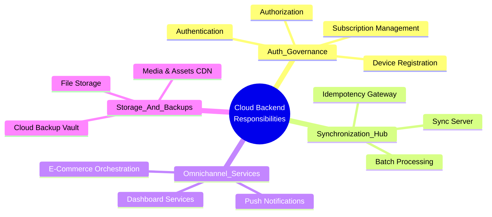

# المرجع الهندسي لمعمارية النظام السحابي — Smart Merchant ERP
*(Cloud Architecture Handbook — Offline-First Ecosystem)*

> **حالة الوثيقة:** معتمدة ونهائية (Cloud Architecture Frozen Reference)  
> **تاريخ الاعتماد:** يوليو 2026  
> **النطاق المعماري:** الخادم السحابي (Cloud Backend)، لوحة التحكم المركزية (Dashboard)، المتجر الإلكتروني (E-Commerce)، وبوابة الخدمات والمزامنة.  
> **المرجع المكمل:** هذا المستند يمثل المرجع الرسمي الحصري لكل ما يعمل في السحابة، بينما تظل وثيقة `Database_Schema_Extraction.md` هي المرجع السيادي والحصري لتصميم قاعدة البيانات المحلية (SQLite) ولكافة عمليات تخزين ومعالجة الـ ERP ميدانياً.

---

## جدول المحتويات (Table of Contents)

1. [الملخص التنفيذي وفلسفة النظام السحابي (Executive Summary)](#1-الملخص-التنفيذي-وفلسفة-النظام-السحابي)
2. [مسؤوليات الخادم السحابي (Cloud Backend Responsibilities)](#2-مسؤوليات-الخادم-السحابي)
3. [ما الذي لا يقوم به الخادم السحابي؟ (What the Cloud DOES NOT Do)](#3-ما-الذي-لا-يقوم-به-الخادم-السحابي)
4. [العلاقة ودورة البيانات بين التطبيق والسحابة (App & Cloud Relationship)](#4-العلاقة-ودورة-البيانات-بين-التطبيق-والسحابة)
5. [هيكلية ودور لوحة التحكم المركزية (Dashboard Architecture)](#5-هيكلية-ودور-لوحة-التحكم-المركزية)
6. [هيكلية ودور المتجر الإلكتروني (E-Commerce Architecture)](#6-هيكلية-ودور-المتجر-الإلكتروني)
7. [خدمات المزامنة من منظور معماري عالي المستوى (High-Level Sync Services)](#7-خدمات-المزامنة-من-منظور-معماري-عالي-المستوى)
8. [تصنيفات وخدمات واجهات برمجة التطبيقات (API Services Taxonomy)](#8-تصنيفات-وخدمات-واجهات-برمجة-التطبيقات)
9. [مسؤوليات الأمان والحوكمة السحابية (Security Responsibilities)](#9-مسؤوليات-الأمان-والحوكمة-السحابية)
10. [المخطط والتدفق السحابي الشامل (High-Level Cloud Flow)](#10-المخطط-والتدفق-السحابي-الشامل)

---

## 1. الملخص التنفيذي وفلسفة النظام السحابي (Executive Summary)

ينطلق نظام **Smart Merchant ERP** من مبدأ معماري جوهري وهو: **"العمل دون اتصال أولاً، وقاعدة البيانات المحلية هي مصدر الحقيقة السيادي الميداني (`Offline-First / Local Database is the Primary Source of Truth`)"**. ومع استكمال واعتماد تصميم قاعدة البيانات المحلية بالكامل (`SQLite/Drift`) لتشغيل كافة حركات تخطيط موارد المنشأة (`ERP`) ومبيعات التجزئة (`POS`) في الأطراف الميدانية، يبرز التساؤل الهندسي الاستراتيجي: **لماذا يوجد خادم سحابي (`Cloud Backend`) في نظام يعمل محلياً بكامل طاقته؟ وما هو المبرر المعماري لوجود طبقة سحابية متكاملة؟**

إن وجود النظام السحابي في هذه المعمارية لا يهدف إلى استبدال قاعدة البيانات المحلية أو سحب السيادة التشغيلية منها، بل يقوم على **فلسفة التكامل المؤسسي الفائق (`Enterprise Cloud Augmentation`)** التي تحقق الخصائص الاستراتيجية التالية التي لا يمكن لأي نظام محلي منفصل تحقيقها بمفرده:

### أولاً: التجميع المركزي والذكاء الموحد للمنشآت متعددة الفروع (`Multi-Branch Aggregation & Visibility`)
لا تعمل المنشآت التجارية الحديثة كجزر معزولة؛ فالمنشأة التي تمتلك عشرة فروع ومستودعات ميدانية تعمل في المدن المختلفة تتطلب رؤية تنفيذية موحدة. يقوم الخادم السحابي بدور **المجمّع التنفيذي (`Central Aggregator`)** الذي يستقبل حزم البيانات المتزامنة من كافة الأطراف الميدانية لدمجها في صورة مؤسسية واحدة، مما يتيح للإدارة العليا وأصحاب القرار مراقبة الأداء المالي والمخزوني الشامل لحظة بلحظة على مستوى شبكة الفروع ككل.

### ثانياً: بوابات النشر والانفتاح على قنوات التجارة الرقمية (`E-Commerce & External Omnichannel Publishing`)
قاعدة البيانات المحلية الموجودة على أجهزة الكاشير أو الحواسب الطرفية في الفروع هي بيئة مغلقة أمنياً ولا يمكن الوصول إليها مباشرة من الإنترنت الخارجي. يعمل النظام السحابي كـ **منصة نشر خارجية وتوجيه رقمي (`Publishing & Distribution Hub`)**؛ حيث يقوم بتحويل بيانات الأصناف المعتمدة، صور الكتالوج، والكميات المتاحة للبيع المجمعة من الفروع إلى منصات التجارة الإلكترونية المفتوحة للجمهور، وفي المقابل يستقبل طلبات الشراء الإلكترونية من العملاء ويهيئها للتوجيه والتنزيل الآمن إلى الأجهزة الطرفية المختصة بالفرع المحدد للتجهيز والتسليم.

### ثالثاً: الحوكمة المركزية والتحكم في التراخيص والاشتراكات (`Platform Governance & Subscription Enforcement`)
تتطلب إدارة البرمجيات كمؤسسة وخدمة (`SaaS Platform`) امتلاك سلطة إدارية مركزية قادرة على إدارة حسابات المستأجرين (`Tenants`)، تطبيق حدود الباقات والخطط (`Plan Limits Enforcement`) من حيث عدد الأجهزة والفروع والمستخدمين المسموح بهم، والتحقق الموثوق من هوية الأجهزة المسجلة. يوفر الخادم السحابي المرجعية الإدارية العليا لحوكمة هذه الاشتراكات دون التدخل في التدفق المالي والحركة التجارية الفورية التي تتم محلياً.

### رابعاً: استمرارية الأعمال والحماية الإستراتيجية من الكوارث (`Disaster Recovery & Historical Preservation`)
الأطراف الميدانية (أجهزة اللوحية، نقاط البيع، حواسب الفروع) هي أصول مادية مُعرضة في أي لحظة للتلف الكهربائي، أو السرقة، أو فقدان نظام التشغيل. يضمن الخادم السحابي من خلال خدمة التزامن المستمر إنشاء **خزنة سحابية تاريخية وتأمين طويل الأمد (`Offsite Cloud Vault & Disaster Recovery`)** لكافة حركات وسجلات المنشأة؛ مما يضمن إعادة استعادة الحساب بالكامل وتنزيل كافة بياناته على أي جهاز ميداني بديل خلال دقائق معدودة، وضمان استئناف العمل الفوري دون أي خسارة في الدفاتر المالية أو المخزونية التاريخية.

---

## 2. مسؤوليات الخادم السحابي (Cloud Backend Responsibilities)

يتحدد نطاق عمل الخادم السحابي (`Cloud Backend`) في نظام **Smart Merchant ERP** بمجموعة من المسؤوليات الخدمية والبنيوية الصارمة التي تدعم المنظومة دون أن تتدخل في المحرك المحاسبي المحلي. تتمثل هذه المسؤوليات حصرياً في النطاقات الآتية:



### 1. المصادقة المركزية وإدارة الهوية (`Authentication`)
* التحقق من الهويات المؤسسية للمالكين، مديري النظام، والمستخدمين عند تسجيل الدخول الأولي للنظام عبر منصة السحابة.
* إصدار وإدارة وثائق العبور الآمنة والرموز المشفرة للمصادقة وتحديثها الدوار، وضمان صلاحية وصول الأجهزة للمنصة السحابية.
* تأمين نقاط الوصول والتحقق من عدم انتحال الهوية أو الدخول غير الموثق إلى البوابات المركزية.

### 2. إدارة الصلاحيات والعزل المؤسسي (`Authorization & Tenant Isolation`)
* فرض العزل الصارم بين المستأجرين (`Multi-Tenant Isolation`) بحيث لا يمكن لأي حساب مؤسسي أو فرع الوصول إلى بيانات أو حزم مزامنة تعود لحساب مؤسسي آخر.
* تطبيق التسلسل الهرمي للصلاحيات المركزية (`Platform RBAC Enforcement`) عند التعامل مع خدمات السحابة أو استدعاء واجهات لوحة التحكم والمتجر الإلكتروني.

### 3. تسجيل الأجهزة وإدارة الرخص الطرفية (`Device Registration & Hardware Governance`)
* التحقق من البصمات الرقمية والتسجيل الموثق لكل جهاز ميداني طرفي (`POS Device Fingerprinting`) يرغب في الاتصال بالنظام السحابي.
* ربط كل جهاز فرعي مُرخص بالحساب والفرع والمستودع المحدد له، وتتبع حالته التشغيلية والنشطة على الشبكة.
* تمكين مسؤولي النظام من إلغاء تنشيط أو حظر أي جهاز ميداني مفقود أو غير مصرح له فوراً من جانب السحابة للحفاظ على سرية المؤسسة.

### 4. بوابة الخدمات واجهات برمجة التطبيقات (`Cloud API Gateway`)
* الترحيب بالطلبات القادمة من مختلف المنصات (تطبيقات Flutter الطرفية، متصفحات لوحة التحكم، المتجر الإلكتروني، والأنظمة الخارجية المتكاملة).
* التحقق المسبق من سلامة الطلبات، فلترة حركة المرور، وتوجيه البيانات نحو الوحدات السحابية المعنية بسرعة وثبات.

### 5. خادم المزامنة المركزي (`Synchronization Server`)
* استقبال حزم وحركات التغييرات المتراكمة (`Upstream Sync Payloads`) المرفوعة من القواعد المحلية للأجهزة الميدانية بعد خروجها من طوابير المزامنة.
* تدقيق مفاتيح عدم التكرار والتحقق من سلامة وصول الدفعات وإصدار إقرارات الاستلام السحابي الرسمية لأجهزة الأطراف لتأكيد تطابق البيانات.
* تجهيز وتوفير حزم التحديثات المرجعية والبيانات المركزية (`Downstream Sync Payloads`) لتنزيلها إلى أطراف النظام عند طلب المزامنة أو عند تهيئة أجهزة فرعية جديدة.

### 6. النسخ الاحتياطي السحابي وحماية الأرصدة (`Cloud Backup & Vaulting`)
* الاحتفاظ بنسخة تاريخية وموحدة لكافة سجلات المنشأة التي تم استقبالها واعتمادها عبر خادم المزامنة.
* إدارة وأرشفة نسخ الاحتياط الدورية والمؤمنة للكيانات المؤسسية، وتوفير نقاط الاستعادة الفورية (`Point-in-Time Recovery Reference`) لحماية المنشآت من كوارث فقدان البيانات المحلية.

### 7. إدارة الاشتراكات والباقات (`Subscription Management`)
* مراقبة دورة حياة اشتراكات الحسابات المؤسسية، فترات التجديد، والتحقق من حالات الباقات الفعالة أو المنتهية أو المعلقة.
* فرض حدود التراخيص على مستوى السحابة وتنبيه النظام الميداني وإشعار الإدارة عند بلوغ الحد الأقصى المسموح به للفروع أو الأجهزة أو المستخدمين النشطين حسب الخطة المشترك بها.

### 8. خادم إرسال الإشعارات التفاعلية (`Push Notifications Orchestrator`)
* استقبال أحداث التنبيه المركزية (مثل وصول طلب جديد من المتجر الإلكتروني، أو قرب انتهاء اشتراك المنشأة، أو رصد انقطاع مزامنة فرع رئيسي لفترة طويلة).
* توجيه الرسائل التنبيهية الفورية والتفاعلية إلى لوحة التحكم الإدارية، وتطبيقات الهواتف الميدانية، وتطبيقات وأجهزة عملاء المتجر الإلكتروني.

### 9. خدمات التغذية والربط مع المتجر الإلكتروني (`Store & E-Commerce Services`)
* تهيئة ونشر الفهارس والكتالوجات المعتمدة للبيع الإلكتروني للجمهور الخارجي بناءً على البيانات المستلمة والمجمعة من القواعد المحلية.
* استقبال طلبات شراء العملاء الخارجيين ومعالجتها مبدئياً وإدراجها في مسار التوزيع تمهيداً لتنزيلها للفرع المسؤول عن التجهيز.

### 10. خدمات إدارة وعرض لوحة التحكم (`Dashboard Management Services`)
* تزويد واجهات لوحة التحكم المركزية بالبيانات المجمعة، المؤشرات الحيوية، وحالة المزامنة لكافة الفروع والأجهزة دون الحاجة للاتصال المباشر بقواعد أطراف الكاشير.
* إدارة حركات الترقيات وإعدادات الحسابات المؤسسية الكبرى وسجلات التدقيق والمراجعة الشاملة للمنصة.

### 11. تخزين الملفات والوسائط والمستندات (`File & Media Object Storage`)
* إدارة وحفظ الصور العالية الدقة لكتالوجات المنتجات، صور العلامات التجارية، والشعارات المؤسسية للحسابات والفروع في سحابة تخزين الكائنات (`Cloud Object Storage / S3 Equivalent`).
* حفظ وثائق الموظفين، مستندات العقود، والمرفقات الإدارية والمالية المؤرشفة وتوفير روابط الوصول السريع والموزع جغرافيا (`CDN Links`) لعرضها عبر اللوحات والمتاجر.

---

## 3. ما الذي لا يقوم به الخادم السحابي؟ (What the Cloud DOES NOT Do)

للحفاظ على نقاء المعمارية ومنع حدوث أي خلط أو تداخل في الصلاحيات الهندسية، يتم التأكيد بصرامة قاطعة على **خطوط السيادة الفاصلة (`Zero-Cloud-Dependency Boundary`)**؛ فالخادم السحابي **ليس محرك تشغيل حركي ولا يعمل كنظام ERP مباشر للعمليات الميدانية**. 

العمليات التالية **محظورة تماماً وليست من مسؤوليات أو مهام الخادم السحابي**، وتتم بالكامل وبشكل حصري ومستقل ومحمي بضمانات الدقة الذرية داخل قاعدة البيانات المحلية (`SQLite`) على الأجهزة الطرفية:

```mermaid
graph TD
    subgraph Cloud_Exclusion_Zone [مربع الحظر السحابي — عمليات لا يقوم بها الخادم نهائياً وتعمل محلياً بحصر مطلق]
        POS[البيع اليومي المباشر وإصدار فواتير ونقاط البيع POS]
        PUR[عمليات الشراء واستلام فواتير الموردين والمرتجعات]
        ACC[المحاسبة وترصيد القيود اليومية Journal Entries وإدارة شجرة الحسابات]
        INV[إدارة المخزون اللحظي وحساب المتوسط المرجح والتكلفة وحركات الصرف والإضافة]
        RUN[تشغيل النظام الميداني أثناء العمل اليومي واستمرار النشاط التجاري]
    </subgraph>
```

### 1. البيع اليومي وإصدار الفواتير المباشرة (`Daily Sales & POS Transactions`)
* الخادم السحابي لا يقوم بإنشاء أو إدخال أو اعتماد فواتير مبيعات التجزئة أو فواتير نقاط البيع المباشرة أو سندات القبض الميدانية.
* كافة حركات البيع، احتساب الخصومات الفورية، تطبيق الضرائب، وتوليد الفواتير تتم محلياً وبشكل فوري في أجزاء من الثانية داخل قاعدة بيانات `SQLite` الطرفية، دون إرسال استعلام سحابي أو انتظار إذن من الخادم.

### 2. عمليات الشراء والتوريد الميداني (`Purchasing & Supplier Operations`)
* لا يتدخل الخادم السحابي في إدخال فواتير الموردين، أو معالجة أوامر الشراء الفرعية، أو توثيق مرتجعات التوريد في الفروع والمستودعات.
* تتم كافة معالجات فواتير الشراء واعتماد سنداتها وحساب التكاليف المترتبة عليها محلياً داخل النظام الطرفي للفرع أو المستودع المستلم.

### 3. المحاسبة وإصدار القيود المالية الحية (`Accounting, Journal Entries & Financial Ledger`)
* الخادم السحابي ليس محركاً محاسبياً للقيود الحية؛ فهو لا يقوم بتوليد قيود اليومية المحاسبية (`Journal Entries`) الناشئة عن المبيعات أو المشتريات أو السندات، ولا يحسب توازنات المدين والدائن الميدانية للحسابات.
* الدورة المحاسبية الكاملة، ترصيد شجرة الحسابات الفوري، إنشاء القيود الآلية وتوليد ميزانيات وأرصدة الفروع الفورية تتم داخل محرك المحاسبة في التطبيق المحلي وقاعدة بياناته السيادية.

### 4. إدارة المخزون اللحظية واحتساب التكاليف (`Real-Time Inventory & Costing Calculations`)
* الخادم السحابي لا يدير حركات الصرف أو الإضافة المخزونية الحية داخل المستودعات، ولا يقوم باحتساب المتوسط المرجح للتكلفة (`Weighted Average Cost Calculation`) عند استلام البضائع.
* تدقيق الرصيد المتاح للبيع المباشر في الكاشير، خصم الكميات اللحظي، حركات التحويل الداخلي بين المستودعات، وعمليات الجرد السريع تعمل وتُعتمد محلياً بالكامل.

### 5. تشغيل وإدارة النظام الميداني أثناء العمل (`Runtime System Operations & Business Continuity`)
* لا يعتمد تطبيق الكاشير أو إدارة الفرع نهائياً على وجود اتصال بالخادم السحابي لكي يفتح شاشاته أو ينفذ مهامه؛ فالنظام يستمر في العمل بكامل طاقته ومميزاته دون أي تباطؤ أو انقطاع حتى لو انقطع الاتصال بالخادم السحابي أو توقف الخادم عن العمل لفترات طويلة.
* السحابة تتلقى لاحقاً **نتائج وثمار هذه العمليات** (من خلال محرك المزامنة في خلفية النظام) لغرض التجميع المركزي والنسخ الاحتياطي، ولا تلعب أي دور في تنفيذ أو معالجة هذه العمليات لحظة وقوعها.

---

## 4. العلاقة ودورة البيانات بين التطبيق والسحابة (App & Cloud Relationship)

تتسم العلاقة بين التطبيق الطرفي الميداني (`Flutter Application`) والخادم السحابي (`Cloud Backend`) بالانفصال المعماري التام في لحظة التنفيذ التجاري، والترابط غير المتزامن الموجه والموثق عبر دورة المزامنة المركزية. تمر دورة البيانات الشاملة منذ توليد الحركة في نقطة البيع وحتى وصولها إلى واجهات التحليل والتجارة الإلكترونية عبر المسار المؤسسي المتكامل التالي:

```mermaid
graph LR
    subgraph Local_Edge_Environment [بيئة الفرع الطرفي — محلي بالكامل]
        UI[Flutter App POS / ERP] -->|ACID Local Transaction| SQL[(SQLite Primary DB)]
    </subgraph>

    subgraph Sync_Transport_Bridge [جسر المزامنة اللامركزي]
        SQL -->|Outbox Queue / Background Worker| SYNC[Sync Engine]
    </subgraph>

    subgraph Cloud_Core_Environment [بيئة السحابة المركزية]
        SYNC -->|Authenticated Upstream Batches| CLOUD[Cloud Backend API Gateway]
        CLOUD -->|Consolidated Master Storage| CDB[(Cloud Central Storage)]
    </subgraph>

    subgraph Omnichannel_Outputs [مخرجات النشر وقنوات التوزيع]
        CDB -->|Aggregated Metrics & Admin Control| DASH[Dashboard Panel]
        CDB -->|Catalog Mirroring & Inventory Sync| ECOM[E-Commerce Storefront]
        CDB -->|Event Triggers & Alerts| NOTIF[Push Notification Engine]
    </subgraph>
```

### المسار الصاعد: تدفق البيانات من الميدان إلى السحابة (`Upstream Data Lifecycle`)

1. **الولادة الميدانية اللحظية (`Local Capture & Storage`):**
   يقوم المستخدم (الكاشير أو أمين المستودع) بإجراء عملية تجارية (مثل حفظ فاتورة مبيعات). يكتب التطبيق الحركة مباشرة في قاعدة بيانات `SQLite` المحلية مع وضع علامة تتطلب المزامنة. تكتمل العملية فوراً على الشاشة ويتم تسليم العميل فاتورته.
2. **التقاط محرك المزامنة (`Sync Engine Extraction`):**
   يعمل محرك المزامنة في خلفية النظام (`Background Pipeline`) بشكل مستقل تماماً عن واجهة المستخدم؛ حيث يقوم بمراقبة طابور الحركات المعلقة محلياً، ويجمع السجلات غير المتزامنة في حزم ودفعات منظمة.
3. **العبور الآمن عبر البوابة السحابية (`Cloud Ingestion & Authentication`):**
   عند توفر اتصال شبكي مستقر، يقوم محرك المزامنة بتغليف الحزمة مع رموز المصادقة ومفاتيح منع التكرار وإرسالها إلى خادم المزامنة عبر البوابة السحابية.
4. **الاعتماد والتجميع المركزي (`Centralized Verification & Storage`):**
   يستقبل الخادم السحابي الحزمة، يتحقق من هوية الفرع وصلاحية الاشتراك، ويدقق مفاتيح عدم التكرار. بعد التأكد، يقوم الخادم بحفظ السجلات المرفوعة في قاعدة البيانات المركزية المجمعة وإصدار إقرار استلام ناجح للجهاز الميداني لكي يقوم بتحديث حالة القيد محلياً إلى متزامن.
5. **التوزيع والنشر للقنوات الخارجية (`Omnichannel Distribution`):**
   بمجرد استقرار البيانات في الخادم السحابي، تتغذى كافة القنوات المرتبطة بالسحابة تلقائياً؛ فتبرز الأرقام وتحديثات المبيعات والمخزون في شاشات **لوحة التحكم المركزية (`Dashboard`)** لمتخذي القرار، وتتحدث أرصدة المنتجات المتاحة للبيع أونلاين في **المتجر الإلكتروني (`E-Commerce`)**، وتنطلق **إشعارات التنبيه (`Notifications`)** في حال استدعاء حدث طارئ.

### المسار الهابط: تدفق البيانات من السحابة إلى الميدان (`Downstream Data Lifecycle`)

1. **إصدار التغييرات الإدارية أو استقبال الطلبات الخارجية:**
   يقوم مدير المنصة عبر **لوحة التحكم** بتغيير خطة اشتراك منشأة، أو يقوم مالك الحساب بإضافة مستخدم أو فرع جديد عبر اللوحة المركزية، أو يقوم عميل خارجي بإنشاء طلب شراء جديد عبر **المتجر الإلكتروني**.
2. **الاحتجاز والتجهيز في طوابير التنزيل السحابي (`Cloud Queueing`):**
   يحتفظ الخادم السحابي بهذه التحديثات المرجعية أو الطلبات في طوابير مخصصة لكل حساب أو فرع مستهدف.
3. **الطلب والاستقطاب الميداني (`Downstream Pull & Sync`):**
   يتصل محرك المزامنة الخاص بتطبيق Flutter الطرفي بالخادم السحابي (وفق جدولة دورية أو استجابة لإشعار فوري)، ويطلب تنزيل الحزم والحركات الجديدة الموجهة لهذا الفرع تحديداً.
4. **الدمج الميداني السيادي في قاعدة البيانات (`Local Ingestion & Integration`):**
   يستقبل التطبيق الطرفي الحزم النازلة، ويقوم بدمجها محلياً داخل قاعدة بيانات `SQLite` (سواء كانت طلبات متجر جديدة تتطلب المعالجة، أو تحديثاً لصلاحيات المستخدمين، أو تمديداً لصلاحية الاشتراك)، لتصبح فوراً جزءاً من بیئة العمل المحلية الحية.

---

## 5. هيكلية ودور لوحة التحكم المركزية (Dashboard Architecture)

تمثل **لوحة التحكم المركزية (`Enterprise Dashboard Panel`)** واجهة القيادة والإدارة العليا لنظام **Smart Merchant ERP** على مستوى المنصة السحابية. تعمل اللوحة كمنصة تحكم إدارية وإشرافية ومراقب أداء مؤسسي يتصل مباشرة بالخادم السحابي وقاعدته المجمعة، وتتفرغ لتقديم الخدمات الاستراتيجية والتنظيمية التي لا مكان لها في شاشات البيع والمحاسبة الميدانية اليومية.

```mermaid
graph TD
    subgraph Dashboard_Core_Domain [النطاق الوظيفي للوحة التحكم المركزية]
        D1[إدارة الاشتراكات والخطط والباقات المالية المشترك بها]
        D2[إدارة الحسابات والمنشآت وتأسيس شجرة الفروع والمستودعات]
        D3[مراقبة الأجهزة الميدانية المسجلة وبصماتها وأرقامها التسلسلية]
        D4[مراقبة نبض المزامنة وتتبع حالات التأخر والاتصال الميداني]
        D5[إدارة وحوكمة النسخ الاحتياطية السحابية ونقاط الاستعادة]
        D6[إدارة المستخدمين والصلاحيات الهرمية على مستوى المنصة]
    </subgraph>
```

تتحدد المسؤوليات البنيوية والخدمية للوحة التحكم المركزية في المحاور التالية حصرياً:

### 1. إدارة الاشتراكات والخطط والباقات (`Plans & Subscriptions Governance`)
* تأسيس وإدارة كتالوج باقات الاشتراك المتاحة في المنصة (سنوية، نصف سنوية، شهرية) مع تحديد حدود وسقوف كل خطة (الحد الأقصى للمنشآت، الفروع، أجهزة نقاط البيع، والمستخدمين).
* مراقبة الفواتير الدورية وحركات السداد الخاصة باشتراكات العملاء وملاك المنشآت، ومتابعة تواريخ الصلاحية وتفعيل سياسات التجديد أو الإيقاف الإداري للباقات.

### 2. إدارة الحسابات المؤسسية والمنشآت (`Accounts & Businesses Management`)
* الإشراف على شجرة المستأجرين المركزية (`Multi-Tenant Directory`)، وإنشاء وتعديل وإلغاء الحسابات العليا للمنشآت التجارية.
* حوكمة إنشاء الفروع والمستودعات الجديدة وافتتاحها إدارياً من خلال اللوحة لتسجيلها في النظام المركزي قبل تنزيل تعريفاتها وتفويضاتها إلى الأجهزة الميدانية.

### 3. مراقبة الأجهزة الميدانية والتحكم الطرفي (`Hardware & POS Devices Monitoring`)
* عرض قائمة شاملة بكافة الأجهزة الطرفية (`POS Terminals & Tablets`) المربوطة بحساب المنشأة، مع توثيق البصمة التعريفية ورقم الترخيص لكل جهاز.
* تتبع الحالة التشغيلية لكل جهاز (نشط، معلق، محظور)، وإتاحة القدرة الفورية لمسؤول النظام على سحب رخصة أي جهاز أو إيقاف دخوله للمزامنة السحابية.

### 4. مراقبة صحة ونبض التزامن الميداني (`Sync Health & Status Observability`)
* مراقبة طوابير وحالات التزامن لكافة الفروع الميدانية في الوقت شبه الفعلي، وعرض مؤشرات واضحة لآخر طابع زمني ناجح للمزامنة (`Last Successful Sync Timestamp`) لكل فرع وجهاز.
* إطلاق التنبيهات الإدارية عند رصد تأخر أو انقطاع جهاز فرعي عن المزامنة السحابية لمدة تتجاوز العتبات الزمنية المسموح بها لتدارك الخلل الميداني مبكراً.

### 5. إدارة وحوكمة النسخ الاحتياطية السحابية (`Cloud Backups Administration`)
* استعراض أرشيف النسخ الاحتياطية المركزية التي تم أخذها وتوليدها دورياً لبيانات المنشأة على الخادم السحابي.
* توفير أدوات إدارية لتوثيق سلامة النسخ السحابية (`Checksum Verification`) وتهيئة حزم الاستعادة الطارئة لتنزيلها عند استبدال الأجهزة الميدانية أو تجديدها.

### 6. إدارة المستخدمين والهيكل الصلاحياتي للمنصة (`Platform RBAC & User Administration`)
* إدارة شجرة المستخدمين المركزية على مستوى الحساب المؤسسي، وتعيين الأدوار العليا (مالك الحساب، المشرف العام، المدقق المالي المركزية).
* ربط الصلاحيات الإدارية والمراقبة المركزية بالتقارير المجمعة عبر الفروع دون التدخل في الجلسات اليومية أو صلاحيات الكاشير المدارة محلياً.

---

## 6. هيكلية ودور المتجر الإلكتروني (E-Commerce Architecture)

يعمل **المتجر الإلكتروني (`E-Commerce Storefront`)** كقناة عرض وبيع تجارية خارجية متصلة مباشرة بالخادم السحابي، وتهدف إلى تمكين المنشآت من عرض منتجاتها للجمهور الرقمي واستقبال الطلبات عبر الإنترنت. لا يتصل المتجر الإلكتروني نهائياً وبأي شكل من الأشكال بقواعد بيانات `SQLite` الميدانية في الفروع، بل يعتمد كلياً على **البنية العاكسة والمجمعة (`Mirroring Architecture`)** التي يوفرها الخادم السحابي وفق دورة تدفق واضحة ومحددة:

```mermaid
graph LR
    subgraph ECommerce_Ingestion_Flow [تدفق وعكس بيانات المتجر الإلكتروني]
        P_SYNC[بيانات الأصناف والمخزون المجمعة بالسحابة] -->|Catalog & Inventory Mirror| CATALOG[كتالوج المتجر الإلكتروني المتاح للجمهور]
        MEDIA[سحابة وسائط الصور والملفات CDN] -->|Product Galleries| CATALOG
        CATALOG -->|إنشاء طلب شراء للعميل| ORDER[طلب المتجر الجديد E-Commerce Order]
        ORDER -->|معالجة سحابية وتحديد الفرع| ROUTE[توجيه الطلب لطابور المزامنة التنازلي]
        ROUTE -->|Downstream Sync Pull| POS_IN[تنزيل الطلب لقاعدة فرع تجهيز الطلب المحلي]
        POS_IN -->|تحديث حالة التجهيز محلياً ورفعها| STATUS_UP[تحديث حالة الطلب بالسحابة وإشعار العميل]
    </subgraph>
```

### 1. عكس الأصناف والكتالوجات التجاريّة (`Catalog & Products Mirroring`)
* يتغذى المتجر الإلكتروني دورياً بالبيانات المرجعية للأصناف والمجموعات والعلامات التجارية ووحدات القياس التي تم اعتمادها ورفعها من القواعد المحلية إلى الخادم السحابي.
* يعرض المتجر فقط المنتجات المحددة والمصرح لها بالنشر الإلكتروني (`Online Published Products`)، ويعكس الفئات، المواصفات الفنية، والأوصاف المعتمدة في النظام.

### 2. تقديم الصور والوسائط عبر التوزيع السحابي (`Media & Assets Delivery via CDN`)
* يستدعي المتجر صور الأصناف والمعارض المرئية والشعارات مباشرة من خدمة التخزين السحابية للكائنات (`Cloud Object Storage`) عبر شبكات توصيل المحتوى (`CDN`).
* يضمن هذا الفصل المعماري عدم تحميل حواسب أو خوادم الفروع المحلية أي عبء شبكي ناتج عن تصفح الآلاف من زوار المتجر الخارجي لصور الكتالوج.

### 3. تطبيق قوائم الأسعار والعروض السحابية (`Pricing & Promotional Rules Enforcement`)
* يعكس المتجر هيكلية الأسعار التنافسية المجمعة في السحابة، بما في ذلك أسعار البيع للوحدات المحددة للبيع الرقمي، والعروض الترويجية المصرح بفعاليتها في المتجر.
* يتيح المتجر دعم التسعير الجغرافي أو التسعير المخصص لفرع التسليم المختار من قبل العميل بناءً على البيانات المزامنة للفرع.

### 4. مزامنة وعرض المخزون المتاح للبيع أونلاين (`Online Available Stock Sync`)
* لا يستعلم المتجر عن الرصيد الميداني المباشر لحظة بلحظة لكي لا يتعطل عند انقطاع اتصال أحد الفروع، بل يعتمد على رصيد المخزون السحابي المحدث في الوقت شبه الفعلي (`Near Real-Time Mirrored Stock`).
* يطبق النظام معادلة الحجز الوقائي على السحابة؛ حيث يتم خصم الكمية المطلوبة افتراضياً على السحابة فور طلبها إلكترونياً لمنع بيع رصيد غير متوفر، حتى تتم مزامنة الطلب مع الفرع الميداني وتأكيد الخصم الفعلي.

### 5. استقبال الطلبات وإدراجها في خط المعالجة (`Orders Ingestion & Routing`)
* عند إتمام العميل لعملية الشراء في المتجر الإلكتروني، يقوم الخادم السحابي باستلام الطلب، التحقق من صحته، وتوثيق بيانات العميل وعنوان التسليم أو الفرع المستهدف للاستلام.
* يتم إدراج الطلب في طابور المزامنة التنازلي (`Downstream Sync Queue`) الموجه تحديداً للفرع المختار أو مستودع التجهيز الميداني المختص.

### 6. تدفق وتحديثات حالة الطلب نحو العميل (`Order Lifecycle & Status Tracking`)
* بمجرد تنزيل الطلب إلى قاعدة بيانات الفرع المحلي عبر المزامنة، يظهر في شاشة تجهيز الطلبات لدى الكاشير أو مسؤول المخزون الميداني.
* مع كل خطوة ميدانية ينفذها الفرع (قبول الطلب، قيد التجهيز، خرج للتوصيل، تم التسليم وإصدار الفاتورة)، يرفع التطبيق المحلي التغيير الحركي للسحابة.
* يستقبل الخادم السحابي هذا التحديث ويقوم فوراً بعكس حالة الطلب في شاشة حساب العميل بالمتجر وإرسال إشعار لحظي له بالتقدم المحرز.

---

## 7. خدمات المزامنة من منظور معماري عالي المستوى (High-Level Sync Services)

تُمثل خدمات المزامنة السحابية (`Synchronization Gateway Services`) الشريان الحيوي الذي يربط القواعد المحلية بالأطراف بالبيئة المركزية في السحابة. من منظور معماري عالي المستوى وبدون الدخول في تفاصيل خوارزميات المعالجة الداخلية لحل النزاع (`Conflict Resolution` — والتي تخضع لوثيقة هندسية ومستقلة خاصة بها)، يعمل خادم المزامنة كبوابة أمان واستقبال وإدارة تدفق تلتزم بالركائز المعمارية التالية:

```mermaid
graph TD
    subgraph Sync_Server_High_Level_Architectural_Hub [خادم المزامنة بوابة التدفق المعماري]
        GATE[بوابة استقبال حزم البيانات المجزأة والمضغوطة]
        IDEM[بوابة التحقق من مفاتيح عدم التكرار والتدقيق Idempotency]
        UP_DOWN[إدارة طوابير الرفع التراكمي وتنزيل التحديثات المرجعية]
        ACK[إصدار إقرارات الوصول والاعتماد السحابي ACK]
    </subgraph>
    GATE --> IDEM --> UP_DOWN --> ACK
```

### 1. بوابة معالجة الحزم والدفعات المنفصلة (`Batch Processing Gateway`)
* تم تصميم خادم المزامنة للتعامل مع **حزم البيانات التراكمية المنفصلة (`Batches / Payloads`)** وليس الاتصال المباشر بقواعد البيانات أو الجلسات المستمرة.
* يستقبل الخادم الحزم المكدسة التي تحتوي على عشرات أو مئات السجلات التي تم إنجازها محلياً أثناء فترات انقطاع الاتصال، ويقوم بفك ضغطها ومعالجتها في معاملات سحابية محمية.

### 2. إدارة طوابير الرفع والتنزيل الموجهة (`Upstream & Downstream Queue Orchestration`)
* **طوابير الرفع (`Upstream Processing`)**: تنظيم وحفظ التغييرات والحركات القادمة من الأجهزة الطرفية وتوجيهها لمعالجة الإدخال والتحديث في القاعدة السحابية المجمعة.
* **طوابير التنزيل (`Downstream Processing`)**: تجميع وحجز التغييرات والإعدادات المرجعية والطلبات الجديدة الصادرة من السحابة أو المتجر، وتجهيزها في قنوات خاصة لا يُسمح بسحبها إلا من قبل الفرع والجهاز المستهدف بناءً على آخر طابع زمني متزامن له.

### 3. بوابات منع التكرار والتحقق من سلامة البايتات (`Idempotency & Integrity Enforcement`)
* يفرض خادم المزامنة فحصاً صارماً على كل سجل وارد للتحقق من المفتاح القياسي لمنع التكرار (`Idempotency Key / Local UUID`).
* في حال انقطاع الشبكة أثناء الرفع وقيام الجهاز المحلي بإعادة إرسال نفس الحزمة، يضمن الخادم عدم تكرار تسجيل الفواتير أو مضاعفة الخصم المخزوني، ويقوم بالتعرف على القيد المستلم سابقاً وإعادة الرد الناجح فقط.

### 4. توليد وإصدار إقرارات الوصول والاعتماد (`ACK Generation & Delivery`)
* بعد نجاح استلام وحفظ الحزمة المرفوعة في السحابة، يُصدر الخادم السحابي شهادة استلام وإقرار رسمي (`Acknowledgment — ACK`) يُرسل للجهاز المحلي الميداني.
* هذا الإقرار هو الوثيقة المعتمدة الوحيدة التي تسمح لمحرك التخزين المحلي بتحويل حالة القيد الميداني من قيد الرفع (`Pending/Dirty`) إلى متزامن ومطابق (`Synced`).

---

## 8. تصنيفات وخدمات واجهات برمجة التطبيقات (API Services Taxonomy)

تُصنف واجهات برمجة التطبيقات السحابية (`Cloud API Gateway`) في **Smart Merchant ERP** إلى سبعة قطاعات خدمية متخصصة ومحددة النطاق. تعمل هذه الخدمات كقنوات اتصال موحدة ومنظمة مع كافة الأطراف المربوطة بالسحابة، ويُقدم الجدول التالي تصنيفاً شاملاً ومفصلاً لأدوارها المعمارية دون الدخول في أسماء أو تفاصيل الـ Endpoints البرمجية:

| تصنيف الخدمة السحابية (`API Taxonomy`) | الوظيفة المعمارية والمسؤولية الخدمية | المنصات والأطراف المستهلكة للخدمة | طبيعة الاتصال والاعتمادية |
|:---|:---|:---:|:---:|
| **1. خدمات المصادقة والهوية<br/>(`Login & Auth Services`)** | التحقق من صحة بيانات الدخول، تسجيل دخول الملاك والموظفين، إصدار وتجديد الرموز المشفرة (`Tokens`)، والتحقق من مصادقة الأجهزة الميدانية عند الاتصال الأولي بالسحابة. | تطبيق Flutter (POS/ERP)<br/>لوحة التحكم المركزية<br/>المتجر الإلكتروني | اتصال متزامن لحظي عند تسجيل الدخول أو التجديد الدوري للرموز. |
| **2. خدمات الرفع وحزم المزامنة<br/>(`Upload & Sync Up Services`)** | استقبال حزم البيانات التراكمية المرفوعة من الأجهزة الميدانية (فواتير، حركات مخزون، تعديلات) ومعالجتها واعتمادها في القاعدة المجمعة وتوليد إقرارات الاستلام (`ACK`). | تطبيق Flutter الميداني في الفروع الموزعة | غير متزامن في الخلفية (`Background Batch Processing`). |
| **3. خدمات التنزيل والاستقطاب<br/>(`Download & Sync Down Services`)** | تزويد الأجهزة الميدانية بحزم التحديثات المرجعية، إعدادات النظام المعتمدة، طلبات المتجر الجديدة، وبيانات الأرصدة الافتتاحية عند تهيئة أو استعادة جهاز فرعي جديد. | تطبيق Flutter الميداني في الفروع الموزعة | استقطاب دوري عند المزامنة أو التهيئة الأولية (`Pull/Bootstrap`). |
| **4. خدمات الطلبات والمتجر<br/>(`Orders & E-Commerce Services`)** | استقبال طلبات شراء متسوقي المتجر الإلكتروني، التحقق من توفر المخزون السحابي المتاح، حجز الأصناف، وتمرير وتتبع تحديثات حالة تجهيز الطلبات من الفروع للعملاء. | واجهات وبوابة المتجر الإلكتروني الخارجي | اتصال متزامن وموجه لتجربة التسوق وبنية حجز الطلبات. |
| **5. خدمات الإشعارات والرسائل<br/>(`Notifications & Alert Services`)** | بث التنبيهات الفورية والتفاعلية (الأحداث المالية الهامة، تنبيهات النظام والإدارة، تحديثات الطلبات للمستهلكين، إشعارات انقطاع مزامنة الفروع) للأجهزة الطرفية. | تطبيق Flutter الميداني<br/>لوحة التحكم المركزية<br/>تطبيقات المتجر الإلكتروني | دفع فوري عبر قنوات الإشعارات المركزية (`Push / Event-Driven`). |
| **6. خدمات التحديثات والتوافق<br/>(`Updates & Schema Check Services`)** | التحقق من توافق إصدارات مخطط قاعدة البيانات المحلية (`Schema Version`) مع المخطط السحابي، والتنبيه بوجود تحديثات حرجة للتطبيق يجب تثبيتها لضمان سلامة التزامن. | تطبيق Flutter الميداني عند التشغيل والاتصال | فحص مرجعي سريع للتوافقية (`Version Validation`). |
| **7. خدمات لوحة التحكم والإدارة<br/>(`Dashboard & Governance Services`)** | تزويد لوحات التحكم بالبيانات التجميعية، تقارير الأداء المركزية للفروع، حركات اشتراكات المنشأة، إدارة الرخص والأجهزة، وحوكمة شجرة الصلاحيات المركزية. | متصفحات وواجهات لوحة التحكم المركزية للإدارة | اتصال متزامن واستعلام تحليلي مجمع (`Aggregated Analytics`). |

---

## 9. مسؤوليات الأمان والحوكمة السحابية (Security Responsibilities)

تتحمل المنصة السحابية في **Smart Merchant ERP** المسؤولية السيادية المطلقة عن حماية البيانات المجمعة وحوكمة المنافذ الخارجية، وتطبق سياسة أمنية متعددة الطبقات لحماية المنشآت والحسابات من أي اختراق أو تداخل غير مشروع:

```mermaid
graph TD
    subgraph Cloud_Security_And_Governance_Layers [طبقات الأمان والحوكمة السحابية الصارمة]
        SEC1[المصادقة المشفرة والتحقق المركزي Authentication]
        SEC2[العزل المؤسسي وحوكمة الوصول Authorization & Tenant Isolation]
        SEC3[إدارة وحوكمة الرموز الأمنية Tokens Lifecycle & Revocation]
        SEC4[التحقق من بصمة ورخصة الجهاز Device Validation & Fingerprinting]
        SEC5[التحقق الصارم من الاشتراك وحدود الباقة Subscription & Plan Enforcement]
    </subgraph>
```

### 1. المصادقة المشفرة وحماية المنافذ (`Authentication`)
* تأمين كافة نقاط الوصول السحابية من خلال معايير تشفير عالية (`TLS/HTTPS Mandatory`) وإلزام جملة الطلبات الموجهة للسحابة بالمرور عبر فلاتر التحقق من الهوية.
* منع أي استدعاء عشوائي أو مجهول لبوابات المزامنة أو تحميل الملفات دون امتلاك هوية مؤسسية موثقة.

### 2. العزل الصارم للمستأجرين وحوكمة الصلاحيات (`Authorization & Multi-Tenant Isolation`)
* تطبيق مبدأ **الجدار الناري المؤسسي للعزل (`Tenant Separation Barrier`)**؛ حيث يتم فحص المعرف المؤسسي (`Business ID / Account ID`) على مستوى كل طلب وقيد سحابي، لضمان استحالة وصول مستخدم أو فرع إلى بيانات حساب مؤسسي آخر.
* تنفيذ التدقيق الصارم لصلاحيات المستخدم (`RBAC Verification`) عند طلب الوصول إلى تقارير لوحة التحكم المركزية أو إجراء تعديلات إدارية على هيكل المنشأة.

### 3. إدارة وحوكمة الرموز المشفرة (`Tokens Lifecycle Governance`)
* التحكم الكامل في دورة حياة رموز الوصول (`Access & Refresh Tokens`) الصادرة للأجهزة الطرفية والمستخدمين.
* إتاحة القدرة السحابية الفورية لإبطال وسحب صلاحية أي رمز (`Token Revocation / Blacklisting`) في حال الإبلاغ عن اختراق جهاز أو تسريح موظف، مما يقطع اتصاله فوراً بالخادم السحابي دون التأثير على عمل القواعد المحلية للأجهزة الميدانية الأخرى الآمنة.

### 4. التدقيق المزدوج لبصمات ورخص الأجهزة (`Device Validation & Hardware Fingerprinting`)
* يفرض الخادم السحابي فحصاً مزدوجاً عند كل محاولة مزامنة: التحقق من هوية المستخدم (`User Token`) والتحقق من هوية الجهاز ورخصته (`Device Fingerprint / License Key`).
* لا يُسمح لأي جهاز بإجراء المزامنة أو رفع البيانات حتى لو كان يمتلك حساب مستخدم صالح، ما لم يكن الجهاز نفسه مُسجلاً إدارياً، مُعتمداً، وغير محظور في شجرة أجهزة المنشأة على السحابة.

### 5. الإنفاذ الصارم لضوابط الاشتراكات والباقات (`Subscription Enforcement & Plan Governance`)
* التحقق الآلي المستمر من حالة اشتراك المنشأة قبل السماح بمرور حزم المزامنة أو تفعيل الخدمات المتقدمة.
* في حال انتهاء اشتراك الحساب أو تعليقه إدارياً، يقوم الخادم السحابي بإيقاف استقبال التحديثات المرفوعة وإلغاء تنزيل التحديثات السحابية وتنبيه الجهاز الميداني فوراً، **مع الحفاظ التام على استمرار عمل الجهاز محلياً في الفرع دون انقطاع لتمكين الكاشير من مواصلة البيع وإصدار الفواتير محلياً**، حتى يتم سداد وتجديد الاشتراك وعودة المزامنة السحابية للعمل.

---

## 10. المخطط والتدفق السحابي الشامل (High-Level End-to-End Cloud Flow)

يوضح المخطط المعماري الشامل التالي التدفق الكلي للبيانات ودورة التكامل الهيكلي العالي المستوى في بيئة **Smart Merchant ERP**، موضحاً بوضوح التفاعل السلس بين الأطراف الميدانية المحلية (`Local Edge`)، وجسر المزامنة اللامركزي (`Sync Gateway`)، وبيانات الخادم السحابي المجمعة (`Cloud Core`)، وقنوات العرض والنشر والتحكم الخارجية (`Omnichannel Core`):

```mermaid
graph TB
    subgraph LOCAL_EDGE ["الفرع الميداني — الطرف المحلي (Local Edge Ecosystem)"]
        UI["Flutter App (POS / ERP Presentation UI)"]
        LOCAL_DB[("SQLite / Drift Database<br/>(Primary Source of Truth & ACID Core)")]
        LOCAL_WORKER["Background Local Sync Worker<br/>(Extracts Pending / Ingests Downstream)"]
        
        UI <-->|ACID Read/Write Queries| LOCAL_DB
        LOCAL_DB <-->|Reads Dirty / Writes Downstream| LOCAL_WORKER
    </subgraph>

    subgraph SYNC_BRIDGE ["جسر وبوابة المزامنة (Cloud Synchronization Bridge)"]
        UP_STREAM["Upstream Sync Pipeline<br/>(Compressed Batches & Idempotency Check)"]
        DOWN_STREAM["Downstream Sync Pipeline<br/>(Reference Catalog & Store Orders)"]
    </subgraph>

    subgraph CLOUD_CORE ["الخادم السحابي المركزي (Cloud Backend Core Environment)"]
        GATEWAY["Cloud API Gateway & Security Firewall<br/>(Auth, RBAC, Device & Plan Validation)"]
        SYNC_SVC["Central Synchronization Hub<br/>(Batch Ingestion & ACK Generation)"]
        CLOUD_DB[("Cloud Central Consolidated DB<br/>(Multi-Tenant Master Storage)")]
        STORAGE_CDN["Cloud Object Storage / S3<br/>(Media CDN, Product Images & Documents)"]
        
        GATEWAY <--> SYNC_SVC
        SYNC_SVC <-->|Store Aggregated / Pull Queues| CLOUD_DB
        GATEWAY <-->|Store & Retrieve Assets| STORAGE_CDN
    </subgraph>

    subgraph OMNICHANNEL_CHANNELS ["قنوات النشر والمراقبة والتوزيع (Omnichannel & Control Ecosystem)"]
        DASHBOARD["Enterprise Dashboard Panel<br/>(Plans, Devices Monitoring, Analytics & Admin)"]
        ECOMMERCE["E-Commerce Storefront<br/>(Mirrored Catalog, Stock & Customer Orders)"]
        PUSH_ENGINE["Push Notification & Event Orchestrator<br/>(Real-Time Alerts & System Triggers)"]
    </subgraph>

    %% Connections between Local Edge and Sync Bridge
    LOCAL_WORKER ==>|Pushes Local Transactions| UP_STREAM
    DOWN_STREAM ==>|Pulls Cloud Updates & Orders| LOCAL_WORKER

    %% Connections between Sync Bridge and Cloud Core
    UP_STREAM ==>|Authenticated Payload Ingestion| GATEWAY
    GATEWAY ==>|Delivers Queued Updates & ACKs| DOWN_STREAM

    %% Connections between Cloud Core and Omnichannel
    CLOUD_DB <-->|Live Metrics & Admin Governance| DASHBOARD
    CLOUD_DB <-->|Catalog Mirror & Order Capture| ECOMMERCE
    STORAGE_CDN -->|Asset Delivery via CDN| ECOMMERCE
    STORAGE_CDN -->|Asset Delivery via CDN| DASHBOARD
    CLOUD_DB -->|Triggers Alert Events| PUSH_ENGINE

    %% Push notifications distribution
    PUSH_ENGINE -.->|Real-Time Push Alerts| UI
    PUSH_ENGINE -.->|Admin Alerts| DASHBOARD
    PUSH_ENGINE -.->|Order Status Updates| ECOMMERCE
```

### ملخص التدفق المعماري الشامل للحركة التنفيذية:
1. **السيادة الميدانية المحلية:** يبدأ التدفق وينتهي في طرف الفرع الميداني (`Local Edge`)؛ حيث يقوم تطبيق `Flutter` بتنفيذ عمليات البيع، الشراء، حركات المخزون، والقيود المحاسبية بالاعتماد الحصري والكامل على قاعدة بيانات `SQLite` المحلية بضمانات `ACID` المطلقة، دون استدعاء أي خدمة سحابية أثناء الحركة.
2. **العبور المنظم عبر جسر المزامنة:** يتولى العامل المحلي (`Local Sync Worker`) سحب السجلات المعلقة وتوجيهها عبر مسار الرفع (`Upstream Pipeline`) إلى البوابة السحابية (`Cloud API Gateway`)، التي تدقق هويات الأجهزة وصلاحية الباقات وتمرر الدفعات لخادم المزامنة المركزي (`Sync Hub`).
3. **التجميع المركزي في السحابة:** يقوم خادم المزامنة بتخزين الحزم المعتمدة في قاعدة البيانات السحابية المجمعة (`Cloud Consolidated DB`)، ويحفظ مرفقات الكتالوج في سحابة تخزين الكائنات (`Cloud Object Storage / CDN`)، ثم يُصدر إقرارات النجاح (`ACKs`) لتنظيف طوابير الأجهزة الميدانية.
4. **الانعكاس الفوري على قنوات النشر والقيادة:** تتغذى واجهات **لوحة التحكم (`Dashboard`)** بالبيانات المجمعة لإتاحة الرؤية المؤسسية للإدارة، ويعكس **المتجر الإلكتروني (`E-Commerce`)** الأصناف والمخزون المتاح للجمهور، بينما يقوم محرك **الإشعارات (`Push Engine`)** ببث التنبيهات والأحداث الحيوية لكافة أطراف المنظومة لضمان التكامل الحي والفعال.

---
*تم اعتماد هذه الوثيقة وتجميدها كمرجع هندسي وإداري رسمي وحصري لمعمارية النظام السحابي في مشروع التاجر الذكي (Smart Merchant ERP).*
