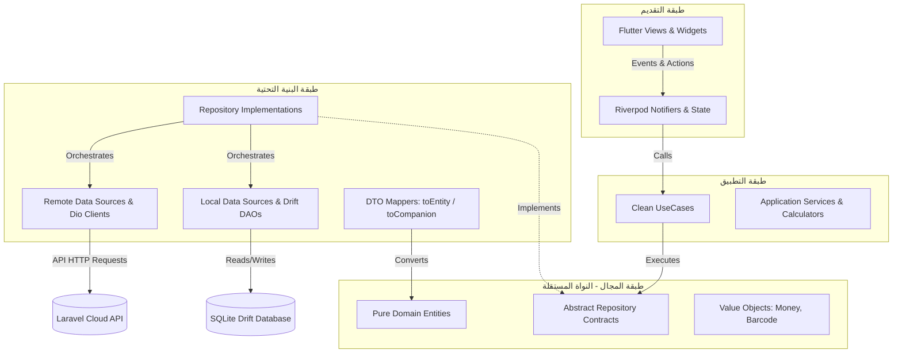
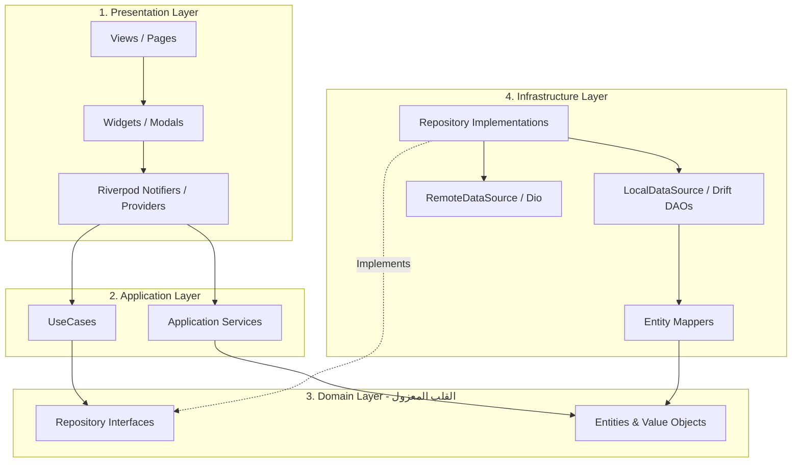
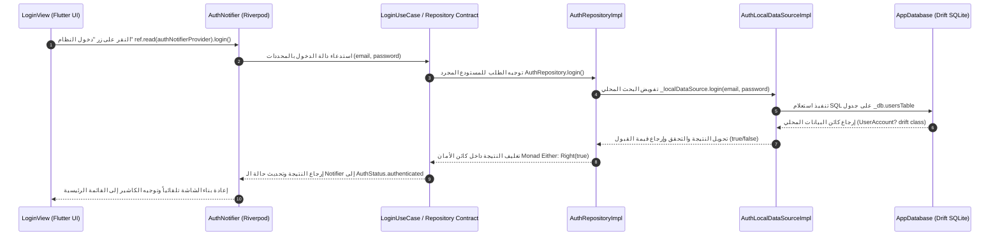
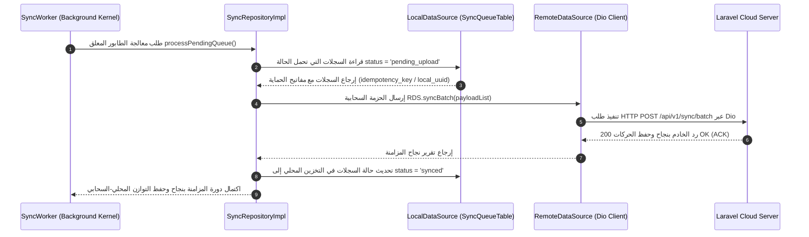
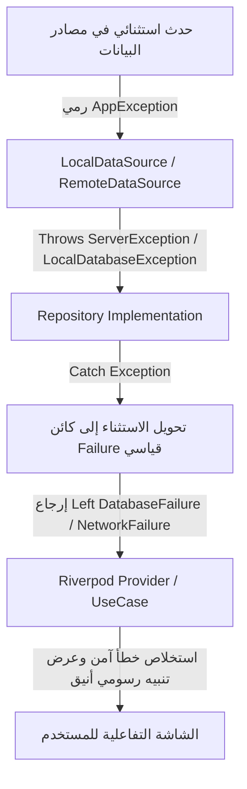
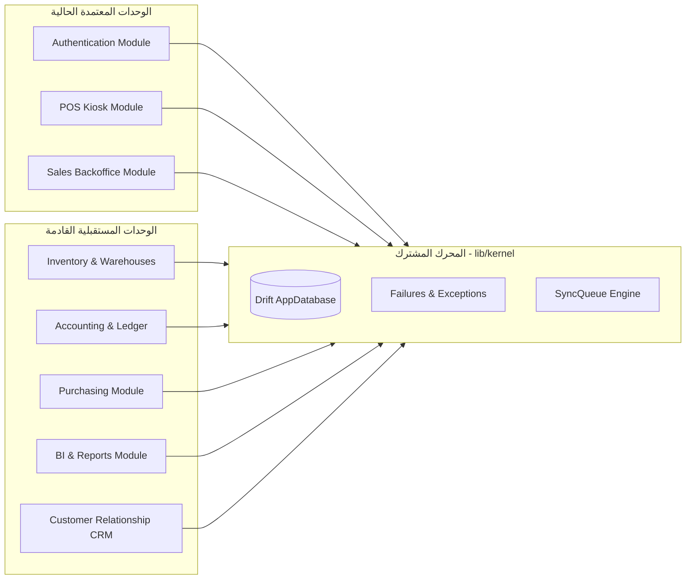

# الدليل الشامل للبنية المعمارية المعتمدة (Smart Merchant ERP - Architecture Handbook)

> **الإصدار:** 1.3 (Enterprise Architecture Handbook - Frozen)  
> **تاريخ الاعتماد:** يوليو 2026  
> **حالة المعمارية:** **مجمدة ومُعتمدة نهائياً (ARCHITECTURE FROZEN)**  
> **الجمهور المستهدف:** مهندسو ومطورو تقنيات Flutter، قادة الفرق البرمجية، ومهندسو ضمان الجودة (QA) المنضمون لمشروع **التاجر الذكي (Smart Merchant ERP)**.

---

## جدول المحتويات (Table of Contents)

1. [مقدمة المشروع](#1-مقدمة-المشروع)
2. [الرؤية المعمارية](#2-الرؤية-المعمارية)
3. [الهيكل العام للمشروع](#3-الهيكل-العام-للمشروع)
4. [طبقات النظام](#4-طبقات-النظام)
5. [رحلة البيانات داخل النظام](#5-رحلة-البيانات-داخل-النظام)
6. [معالجة الأخطاء](#6-معالجة-الأخطاء)
7. [Repository Pattern](#7-repository-pattern)
8. [LocalDataSource](#8-localdatasource)
9. [RemoteDataSource](#9-remotedatasource)
10. [Entity Mapping](#10-entity-mapping)
11. [Dependency Injection](#11-dependency-injection)
12. [Use Cases](#12-use-cases)
13. [Project Coding Rules](#13-project-coding-rules)
14. [How To Add A New Module](#14-how-to-add-a-new-module)
15. [Protected Architecture Rules](#15-protected-architecture-rules)
16. [Offline First Preparation](#16-offline-first-preparation)
17. [Future Expansion](#17-future-expansion)
18. [Frequently Asked Questions (FAQ)](#18-frequently-asked-questions)
19. [Architecture Summary](#19-architecture-summary)

---

## 1. مقدمة المشروع

### 1.1 هدف النظام
مشروع **Smart Merchant ERP (التاجر الذكي)** هو نظام تخطيط موارد المؤسسات (ERP) ونقاط بيع (POS) متطور، مصمم خصيصاً للشركات والمؤسسات التجارية المتعددة الفروع (Multi-Branch) والمتعددة الأنشطة (Multi-Business). يهدف النظام إلى إدارة دورة حياة النشاط التجاري بالكامل (مبيعات، مشتريات، مخزون، حسابات، موارد بشرية، ومزامنة بيانات ميدانية وسحابية) بمرونة وأمان فائقين.

### 1.2 الرؤية
الوصول إلى بنية برمجية مؤسسية قادرة على خدمة آلاف نقط البيع والكاشير الميداني، تعمل بسلاسة فائقة في وضع غير المتصل بالإنترنت (**Offline-First**) لفترات طويلة، مع ضمان تآزر محاسبي محكم ودقة حسابية بالهللة/السنت تتطابق مع القوانين الضريبية (مثل الفاتورة الإلكترونية ZATCA)، ثم إجراء مزامنة موثوقة وخالية من التكرار مع الخوادم السحابية (Laravel Backend) بمجرد عودة الاتصال.

### 1.3 فلسفة المشروع
تعتمد هندسة المشروع على الفلسفات البرمجية التالية:
- **التصميم الموجه بالمجالات (Domain-Driven Design - DDD):** تقسيم النظام الكبير إلى وحدات سياقية مستقلة ومحدودة (`Bounded Contexts`) لا تتداخل أعمالها البرمجية (مثل فصل نظام الكاشير السريع `POS` عن نظام إدارة فواتير المبيعات الخلفية `Sales`).
- **المعمارية النظيفة (Clean Architecture):** عزل جوهر العمل ومفاهيمه المحاسبية الميدانية (`Domain Layer`) عن أي تفاصيل تقنية خارجية (قواعد بيانات SQLite، واجهات المستخدم Flutter، شبكات Dio، أو مكتبات إضافية).
- **العزل الوظيفي للاختبار التلقائي (Test-First Architecture):** بناء كل وحدة وكأنها ستُختبر بشكل مستقل وآلي قبل ربطها بواجهة المستخدم، مما يضمن وصول التغطية البرمجية للاختبارات إلى **80%+** دون تعقيد.

### 1.4 المبادئ العامة
1. **الاستقلالية التامة:** أي خطأ أو تعطل في واجهة الكاشير الميدانية لا يؤدي أبدًا إلى تعطل محاسبة المستودع أو دفتر الأستاذ العام.
2. **الحتمية في البيانات (Immutability):** جميع النماذج والكائنات المتداولة داخل المجال (`Domain Entities` & `Value Objects`) غير قابلة للتغيير بعد إنشائها (`final & Equatable`).
3. **الدقة المحاسبية المطلقة:** لا يُعترف بالأرقام العائمة القياسية (`double`) في تمثيل المبالغ المالية داخل المجال المحاسبي، ويتم التعبير عنها بكائنات قيمة صارمة دقيقة وتجبر الكسور بشكل موحد.

---

## 2. الرؤية المعمارية



### 2.1 لماذا تم اختيار هذه المعمارية؟
تم اختيار **المعمارية الطبقية النظيفة (Layered Clean Architecture)** المقترنة بتقسيم وحدات العمل (`Modular Monolith`) لأن تطبيقات الـ ERP المؤسسية تتوسع بسرعة مذهلة لتصل إلى مئات الشاشات وآلاف الجداول والوظائف المحاسبية. بدون بنية هندسية صارمة ومقسمة، يتحول المشروع خلال شهور معدودة إلى "كرة طين متشابكة (`Big Ball of Mud`)" يصعب تعديلها أو اختبارها.

### 2.2 ما المشاكل التي تحلها؟
1. **مشكلة الاعتمادية المباشرة على قواعد البيانات:** في الأنظمة التقليدية، ترتبط شاشة المستخدم مباشرة باستعلامات الـ SQL أو ملفات الـ ORM. إذا تغير هيكل جدول في قاعدة البيانات أو تغير اسم عمود، تنهار العشرات من شاشات المستخدم ويحدث بطء وشلل في التحميل. **حل المعمارية:** فصلت واجهات المستخدم عن قاعدة البيانات بـ 3 حواجز حماية (المزود `Provider` $\leftarrow$ حالة الاستخدام `UseCase` $\leftarrow$ المستودع المجرد `Repository Contract`).
2. **مشكلة فشل الاختبارات الآلية (Testing Bottleneck):** لا يستطيع المطورون كودياً اختبار استعلام بيع أو خصم دون تشغيل محاكي الهاتف (`Emulator`) والاتصال بخادم إنترنت حقيقي. **حل المعمارية:** من خلال فصل العقود المجردة (`Abstractions`)، يستطيع المطور حقن مستودعات وهمية (`Mocks / Fakes`) واختبار ملايين العمليات المحاسبية في الذاكرة العشوائية (`RAM`) في أجزاء من الثانية دون فتح أي شاشة أو اتصال شبكي.
3. **مشكلة المزامنة غير المتصلة بالإنترنت (Offline-First Complexity):** الكاشير في المواقع النائية أو المتاجر المزدحمة لا ينتظر استجابة الخادم لإصدار فاتورة. **حل المعمارية:** تم توجيه تدفق البيانات ليكون التخزين المحلي هو مصدر الحقيقة الأولي (`Local-First / Single Source of Truth`)، بينما تعمل المزامنة السحابية كمحرك خلفي منفصل ومستقل.

---

## 3. الهيكل العام للمشروع

تم تنظيم المجلدات داخل المجلد الجذري للمشروع (`lib/`) وفق توزيع هرمي صارم وموحد لا يجوز تعديله أو الالتفاف عليه:

```
lib/
├── app/                        # نواة تشغيل وإعداد التطبيق العامة
│   ├── bootstrap.dart          # تهيئة الـ Riverpod وحقن التبعيات وتشغيل منطقة أمان Flutter
│   ├── app.dart                # الجذر الرسومي MaterialApp وتمرير الثيمات واللغات
│   ├── di/                     # حاوية حقن التبعيات (GetIt & Injectable Setup)
│   └── routes/                 # نظام التوجيه العام (GoRouter & Guard Redirects)
├── kernel/                     # المحرك التقني السيادي المشترك والبنية التحتية المشتركة
│   ├── adapters/               # موصلات الأجهزة الخارجية وأنظمة التشغيل (طباعة، مشاركة)
│   ├── core/                   # الفئات المجردة وكائنات القيمة والواجهات المشتركة (UseCases, Failures)
│   ├── error/                  # تعريف استثناءات النظام وأخطاء مصادر البيانات (Exceptions, Failures)
│   ├── locale/                 # مدراء اللغة المحلية والترجمة وإعدادات الأقلمة
│   ├── network/                # واجهات مراقبة الاتصال بالشبكة وإعدادات HTTP المتقدمة
│   ├── security/               # نظام الصلاحيات والأدوار وحظر الوصول (RBAC & Permissions)
│   ├── storage/                # إدارة اتصال قاعدة البيانات المحلية (AppDatabase & Migrations)
│   └── sync/                   # محرك المزامنة الخلفية وطوابير الرفع (SyncQueue & Workers)
├── modules/                    # وحدات العمل السياقية المستقلة (Bounded Contexts)
│   ├── authentication/         # وحدة الهوية وتوثيق الدخول وإعداد النشاط التجاري
│   ├── pos/                    # وحدة نقاط البيع وشاشة الكاشير المباشرة وأدراج النقدية
│   ├── sales/                  # وحدة إدارة فواتير المبيعات، عروض الأسعار، وطلبات العملاء
│   └── [future_modules]/       # الوحدات المستقبلية: inventory, purchasing, accounting, hr
└── shared/                     # الموارد والبيانات العامة ومكتبة التصميم المشتركة
    └── design_system/          # الرموز اللونية (Tokens)، الخطوط، والأدوات الرسومية الموحدة
```

### وصف تفصيلي لأهم المجلدات ومسؤولياتها:
- `lib/kernel/`: يمثل "النظام التشغيلي المصغر" للتطبيق. لا يحتوي على أي شاشة لمستخدم عادي ولا على منطق تجاري مخصص لوحدة واحدة، بل يوفر الأدوات الأساسية (`AppDatabase`, `Failure`, `UseCase`, `ReceiptPrinter`) التي تستخدمها جميع الوحدات البرمجية.
- `lib/modules/`: كل مجلد هنا يمثل "نظاماً برمجياً متكاملاً" يخص مجالاً محدداً. يمنع منعاً باتاً أن يقوم مجلد `pos` باستيراد كود داخلي من `sales/infrastructure/` أو العكس. التواصل بين الوحدات يتم فقط عبر واجهات الاستخدام أو المستودعات المتاحة عاملاً.
- `lib/shared/`: يحتوي فقط على العناصر المشتركة التي لا تحمل منطق عمل تجاري (مثل الأزرار القياسية `PrimaryButton`، الألوان `AppColors`، الحقول النصية `CustomTextField`).

---

## 4. طبقات النظام

داخل كل وحدة برمجية (`Module`)، يتم التقسيم الداخلي الصارم إلى 4 طبقات رئيسية، وتدعمها طبقتي الـ `Kernel` والـ `Shared`:



### 4.1 طبقة التقديم (Presentation Layer)
- **المسؤولية:** عرض واجهات المستخدم الرسومية واستقبال تفاعلات الكاشير والمستخدم (نقرات، إدخال نصوص، تمرير قوائم)، إضافة إلى إدارة الحالة المحلية والمشتركة الشاشة (`State Management`).
- **المكونات:** شاشات الفلتر (`views/` أو `pages/`)، الأدوات المرئية والنوافذ المنبثقة (`widgets/`)، ومدراء الحالة الرديفة (`providers/` عبر Riverpod 2.5).
- **قواعد التواصل المسموحة:** يُسمح لـ Riverpod Notifier فقط باستدعاء حالات الاستخدام (`UseCases`) أو الخدمات الحسابية المعتمدة (`Application Services`).
- **المحظورات القاطعة:** يُمنع على أي أداة مرئية (`Widget` أو `Provider`) استدعاء فئات قاعدة البيانات (`AppDatabase` أو `AuthDao` أو `TableCompanion`) أو كتابة استعلامات SQL أو إرسال طلبات Dio مباشرة.

### 4.2 طبقة التطبيق (Application Layer)
- **المسؤولية:** تنسيق وتوجيه سير العمليات التجارية وتطبيق قواعد الحسابات الآنية (`Orchestration & Pure Computation`).
- **المكونات:** حالات الاستخدام (`UseCases` مثل `LoginUseCase` و `CompleteBusinessSetupUseCase`)، والخدمات الحسابية النقية (`Services` مثل `SalesCalculatorService`).
- **قواعد التواصل المسموحة:** تستقبل الطلبات من طبقة التقديم، وتتخاطب مع طبقة المجال عن طريق استدعاء واجهات المستودعات المجردة (`Repository Interfaces`) أو الفئات الحسابية.
- **المحظورات القاطعة:** يُمنع على هذه الطبقة معرفة كيفية تخزين البيانات أو استرجاعها، كما يُمنع استيراد أي عنصر يخص واجهة المستخدم (`BuildContext` أو `Widget` أو `Colors`).

### 4.3 طبقة المجال (Domain Layer — قلب النظام)
- **المسؤولية:** تعريف جوهر النشاط التجاري ومفاهيمه المحاسبية والميدانية الحقيقية. هذه الطبقة هي مصدر الحقيقة للنماذج والمبادئ.
- **المكونات:** الكيانات النقية (`Entities` مثل `UserEntity`، `AccountEntity`)، كائنات القيمة (`Value Objects` مثل `Money`، `Barcode`)، وعقود المستودعات المجردة (`Abstract Repositories`).
- **قواعد التبعية (Dependency Rule):** **هذه الطبقة لا تعتمد على أي طبقة أو مكتبة خارجية.** لا يوجد داخلها أي استيراد لـ Flutter، ولا Drift، ولا Dio، ولا Riverpod، ولا JSON Serialization. هي كود Dart صافٍ 100% يمتد من `Equatable` فقط.

### 4.4 طبقة البنية التحتية (Infrastructure Layer)
- **المسؤولية:** التنفيذ الفعلي والتقني لكل ما يقع خارج حدود الذاكرة والتنفيذ المباشر. هي التي تتحدث مع الأجهزة، الشبكات، وقواعد البيانات.
- **المكونات:** التطبيقات الفعلية للمستودعات (`Repositories Implementations` مثل `AuthRepositoryImpl`)، مصادر البيانات المحلية (`LocalDataSources` و `Drift DAOs`)، مصادر البيانات السحابية (`RemoteDataSources`)، ومحولات البيانات (`Mappers`).
- **قواعد التواصل المسموحة:** تستقبل الكائنات المجردة، وتقوم بتحويل النماذج التقنية (`UserAccount` من Drift أو `Response` من Dio) إلى كيانات المجال النقية (`UserEntity`) وتعيدها للطبقة العليا.

### 4.5 طبقة النواة (Kernel Layer)
- **المسؤولية:** توفير الهيكل التشغيلي ومستلزمات البنية التحتية المشتركة التي تحتاجها طبقات البنية التحتية والتطبيق عبر كل الوحدات.
- **المكونات:** `AppDatabase` الجذري، فئة `Failure` المشتركة، كائن القيمة `Money` المشترك، محركات المزامنة والطوابير المحلية (`SyncQueueTable`).

### 4.6 طبقة الموارد المشتركة (Shared Layer)
- **المسؤولية:** توفير مكتبة أدوات واجهة المستخدم (`Design System`) الموحدة، من خطوط وألوان وأزرار، لضمان الهوية البصرية المتميزة والفخمة التي تبهر المستخدم (`Wowed UI/UX`).

---

## 5. رحلة البيانات داخل النظام

لتوضيح مسار البيانات الصارم في سيناريوهين رئيسيين:

### 5.1 سيناريو القراءة/الكتابة المحلية في وضع غير المتصل (Local Offline-First Flow)
عندما يقوم الكاشير أو المستخدم بإجراء عملية (مثل تسجيل دخول محلي أو إتمام إعداد حساب تجاري):



### 5.2 سيناريو المزامنة السحابية الخلفية (Remote Cloud Sync Flow)
عندما يعود الاتصال بالإنترنت ويعمل محرك المزامنة لإرسال الحركات للخادم السحابي (Laravel API):



---

## 6. معالجة الأخطاء (Error Handling Strategy)

تعتمد البنية المعمارية للنظام على استراتيجية **التغليف الأحادي الوظيفي (`Monadic Error Handling`)** باستخدام مكتبة `dartz` وفئة `Either<Failure, T>`، مما يلغي تماماً الفوضى الناجمة عن رمي الاستثناءات غير المراقبة في شاشات المستخدم.



### 6.1 الفرق بين الاستثناء (`Exception`) والفشل (`Failure`)
- **الاستثناء (`Exception extends AppException`):** كائن داخلي تقني يُرمى حصراً داخل طبقة مصادر البيانات (`Data Sources`) عندما يتعطل اتصال بقاعدة البيانات (`LocalDatabaseException`) أو تفشل شبكة Dio (`ServerException` / `UnauthorizedException`). **هذا الكائن لا يجوز أن يغادر طبقة الـ Infrastructure نهائياً.**
- **الفشل (`Failure extends Equatable`):** كائن مجال نقي وثابت (`Domain Object`) يمثل نتيجة غير ناجحة لعملية تجارية دون التسبب في انهيار التطبيق أو رمي خطأ برمجـي (`Crash`). يتم تمريره مغلفاً داخل الطرف الأيسر من `Either` (`Left(DatabaseFailure("رسالة الخطأ"))`).

### 6.2 مسؤوليات الطبقات في معالجة الأخطاء
- **مسؤولية مصادر البيانات (`Data Sources`):** التقاط أخطاء المكتبات السفلية (`SqliteException` من Drift أو `DioException` من Dio) وتحويلها فوراً إلى `AppException` واضح ومفهوم.
- **مسؤولية المستودع (`RepositoryImpl`):** إحاطة جميع استدعاءات مصادر البيانات بكتل `try/catch`، والتقاط الـ `AppException` وتحويله إلى `Failure` مناسب وإعادته كـ `Left(Failure)`. في حال نجاح العمليات، يتم تغليف القيمة المطلوبة وإعادتها كـ `Right(Value)`.
- **مسؤولية واجهة المستخدم والمزود (`Provider`):** استلام الـ `Either<Failure, T>`، واستخدام دالة `.fold()` أو `.match()` لتحليل النتيجة:
  ```dart
  final result = await authRepository.login(email, password);
  result.fold(
    (failure) => state = state.copyWith(errorMessage: failure.message), // حالة الخطأ
    (success) => state = state.copyWith(isAuthenticated: true),          // حالة النجاح
  );
  ```

### 6.3 أفضل الممارسات والأخطاء الشائعة
- **الممارسة السليمة (Best Practice):** اجعل جميع أخطاء الشبكة وقاعدة البيانات تعيد رسائل واضحة وكود خطأ رقمي يمكن تتبعه، واستخدم `Equatable` لضمان سهولة مقارنتها في الاختبارات الآلية (`expect(result, equals(Left(DatabaseFailure(...))))`).
- **الخطأ الشائع المحظور (Anti-Pattern):** إرجاع القيمة `null` عند حدوث خطأ للتعبير عن الفشل، أو استخدام `try/catch` مباشرة داخل فئات شاشات الـ `Widget` أو الـ `Provider` للتعامل مع استثناءات `SqliteException`.

---

## 7. Repository Pattern

يمثل نمط المستودع (`Repository Pattern`) جسر العزل الحيوي بين جوهر العمل التجاري التقني ومصادر البيانات التحتية.

### 7.1 لماذا يوجد؟ وما هي مسؤولياته؟
يوجد المستودع لتوفير **واجهة برمجة تطبيقات نقية وموحدة (`Clean API`)** لطبقة التطبيق والمجال، بحيث يظهر المستودع وكأنه "قائمة بيانات حية في الذاكرة" لا تهتم من أين جاءت البيانات (هل هي من SQLite المحلي أم من خادم Laravel أم من الذاكرة المؤقتة).
- **مسؤولياته الأساسية:**
  1. تنسيق جلب البيانات بين مصدر البيانات المحلي (`LocalDataSource`) ومصدر البيانات السحابي (`RemoteDataSource`).
  2. اتخاذ قرارات التخزين المؤقت وحفظ الحركات في طابور المزامنة في حال انقطاع الشبكة.
  3. التقاط استثناءات مصادر البيانات وتحويلها إلى كائنات `Either<Failure, T>`.

### 7.2 ماذا يجب ألا يوضع داخل المستودع أبداً؟ (Anti-Patterns)
1. **منطق عمل تجاري معقد أو حسابات ضريبية:** لا تضع معادلة حساب الضريبة 15% أو جبر الكسور العشرية داخل المستودع. هذا دور الـ `UseCases` أو الـ `Domain Services` (`SalesCalculatorService`).
2. **منطق واجهة المستخدم أو التنقل:** يمنع استدعاء `Navigator.push` أو إظهار `SnackBar` من داخل الـ Repository.
3. **كتابة استعلامات SQL مباشرة:** المستودع لا يستدعي دالة `_db.select(_db.usersTable)` مباشرة؛ بل يفوض هذا العمل بالكامل لـ `LocalDataSource` أو الـ `Drift DAO` المخصص.

---

## 8. LocalDataSource

### 8.1 الغرض والمسؤوليات
كائن `LocalDataSource` هو واجهة البنية التحتية المسؤولة بشكل حصري ومباشر عن الاتصال بوحدات التخزين المحلية داخل الهاتف أو جهاز الكاشير (وخاصة قاعدة بيانات `SQLite / Drift` أو `SharedPreferences`). هو المكان الوحيد الذي يُسمح فيه بكتابة استعلامات SQL، أو شروط الفرز المحلية، أو استدعاء فئات الجداول (`UsersTableCompanion`).

### 8.2 قواعد العمل والبرمجة
1. يجب أن يمتد العقد المجرد دائماً من الواجهة المشتركة `LocalDataSource` المتاحة في `kernel/core/data_sources.dart`.
2. يتم حقن `AppDatabase` أو الـ `DAO` المخصص في بناء كائن التنفيذ (`AuthLocalDataSourceImpl`).
3. يجب أن تقوم جميع الدوال بالتقاط استثناءات محرك Drift ورمي `LocalDatabaseException` بدلاً منها عند الفشل.

### 8.3 مثال عملي معتمد في الكود
عقد ومستودع الوصول المحلي للمصادقة كما تم بناؤه واعتماده في `auth_local_data_source.dart`:

```dart
abstract class AuthLocalDataSource implements LocalDataSource {
  Future<bool> login(String email, String password);
  Future<void> register(String firstName, String lastName, String email, String password);
}

@LazySingleton(as: AuthLocalDataSource)
class AuthLocalDataSourceImpl implements AuthLocalDataSource {
  final AppDatabase _db;

  AuthLocalDataSourceImpl(this._db);

  @override
  Future<bool> login(String email, String password) async {
    try {
      final query = _db.select(_db.usersTable)..where((u) => u.email.equals(email));
      final user = await query.getSingleOrNull();
      return user != null && user.passwordHash == password;
    } catch (e) {
      throw LocalDatabaseException(e.toString());
    }
  }
}
```

---

## 9. RemoteDataSource

### 9.1 الغرض والمسؤوليات
كائن `RemoteDataSource` هو المسؤول الحصري عن إدارة الاتصال بالخوادم السحابية الخارجيّة (وتحديداً واجهات `Laravel REST API` و `Sanctum Authentication` وخوادم المزامنة). يقوم بتجهيز ترويسات الطلبات (`HTTP Headers`)، وتشفير حمولة الـ JSON، واستلام إجابات الخادم ومعالجة حالات أخطاء HTTP.

### 9.2 قواعد العمل والبرمجة
1. يمتد العقد المجرد من الواجهة المشتركة `RemoteDataSource`.
2. يتم حقن عميل الاتصال الشبكي `Dio` داخل الكائن المنفذ (`AuthRemoteDataSourceImpl`).
3. يقوم الكائن بتحليل استثناءات `DioException` وإطلاق `ServerException(message, statusCode)` النظيف ليتعامل معه المستودع العلوى.

### 9.3 مثال عملي معتمد في الكود
عقد ومستودع الاتصال السحابي للمصادقة كما تم بناؤه في `auth_remote_data_source.dart`:

```dart
abstract class AuthRemoteDataSource implements RemoteDataSource {
  Future<bool> loginRemote(String email, String password);
}

@LazySingleton(as: AuthRemoteDataSource)
class AuthRemoteDataSourceImpl implements AuthRemoteDataSource {
  // ignore: unused_field
  final Dio _dio;

  AuthRemoteDataSourceImpl(this._dio);

  @override
  Future<bool> loginRemote(String email, String password) async {
    try {
      // سيتم ربط نقطة الاتصال مع خادم Laravel في المراحل القادمة
      return true;
    } on DioException catch (e) {
      throw ServerException(e.message ?? 'Remote Server Error', e.response?.statusCode);
    } catch (e) {
      throw ServerException(e.toString());
    }
  }
}
```

---

## 10. Entity Mapping

نمط محولات البيانات (`Mappers Extension Pattern`) هو الجدار الفاصل الذي يمنع تسرب تفاصيل التخزين والجداول إلى مجالات التطبيق الحساسة.

```mermaid
graph LR
    subgraph Drift_Persistence [مستوى التخزين - Drift Generated]
        DriftRow[UserAccount]
        DriftComp[UsersTableCompanion]
    end

    subgraph Pure_Domain [مستوى المجال - Pure Dart]
        DomainEntity[UserEntity]
    end

    DriftRow -->|auth_mapper: toEntity()| DomainEntity
    DomainEntity -->|auth_mapper: toCompanion()| DriftComp
```

### 10.1 لماذا يجب أن تبقى كيانات المجال معزولة ومستقلة؟
كيان المجال (`UserEntity` في `domain/entities/`) يمثل جوهر المستخدم في النظام المحاسبي. إذا ربطنا هذا الكيان بمكتبة `Drift` مباشرة (كما يحدث في التطبيقات البسيطة عند استخدام فئة الجداول generated class)، فإن أي تغيير في خوارزميات محرك التخزين أو الترقية لمكتبة قاعدة بيانات أخرى، أو حتى تعديل حقل محلي مخصص للفرع، سيتطلب إعادة كتابة الآلاف من أسطر واجهة المستخدم وحالات الاستخدام في جميع شاشات التطبيق.
بواسطة العزل بالمحولات (`AuthMapper` في `auth_mapper.dart`):
- يقتصر التأثير التقني لأي تعديل في قواعد البيانات على ملف المحول وحده فقط.
- تبقى كيانات المجال خفيفة، سريعة، وخالية تماماً من أي أكواد زائدة أو تعقيدات تقنية (`Zero Persistence Pollution`).

### 10.2 مثال عملي معتمد للتحويل
إضافة امتدادات التحويل في ملف `auth_mapper.dart`:

```dart
extension UserAccountMapper on UserAccount {
  UserEntity toEntity() => UserEntity(
        id: id,
        email: email,
        firstName: firstName,
        lastName: lastName,
        isActive: isActive,
        createdAt: createdAt,
      );
}

extension UserEntityMapper on UserEntity {
  UsersTableCompanion toCompanion({String? passwordHash}) => UsersTableCompanion(
        id: Value(id),
        email: Value(email),
        passwordHash: passwordHash != null ? Value(passwordHash) : const Value.absent(),
        firstName: Value(firstName),
        lastName: Value(lastName),
        isActive: Value(isActive),
        createdAt: Value(createdAt),
      );
}
```

---

## 11. Dependency Injection

يعتمد النظام على أحدث معايير حقن التبعية وإدارة الحاويات باستخدام مكتبتي `GetIt` و `Injectable` المدمجين مع `riverpod_generator`.

### 11.1 آلية تسجيل وحل الخدمات
- يتم تسجيل جميع الخدمات البنيوية (`AppDatabase`, `Dio`) والمستودعات ومصادر البيانات باستخدام الزخارف التلقائية (`@LazySingleton`, `@Injectable`, `@module`).
- عند بدء تشغيل التطبيق في ملف `bootstrap.dart`، يتم استدعاء دالة `configureDependencies()` التي تقوم ببناء شجرة التبعيات في أجزاء من الثانية.

### 11.2 القواعد الحازمة للمطورين في إدارة التبعيات
1. **يُمنع استدعاء البناء المباشر للفئات (`new ClassName()`)** عند إنشاء الخدمات أو المستودعات أو مصادر البيانات داخل الكود التنفيذي أو المزودات. يجب دائماً طلب الخدمة المحقونة أو إتاحتها عبر حاوية `GetIt` أو `Riverpod`.
2. **استخدام `@factoryMethod` عند الحاجة لحل التبعيات التداخلية:** كما تم اعتماده في `AppDatabase.injectable()` و `AuthRepositoryImpl.injectable(local, remote)`، لضمان قدرة المولد التلقائي (`injectable_config_builder`) على بناء الحاوية دون طلب محركات أو بارامترات غير مسجلة.
3. **تحديث الحاوية تلقائياً:** بعد إضافة أو تعديل أي حقن تبعية جديد، يجب على المطور تشغيل أمر التوليد وحذف التعارضات:
   ```powershell
   dart run build_runner build -d --delete-conflicting-outputs
   ```

---

## 12. Use Cases

### 12.1 الغرض والمسؤوليات
حالات الاستخدام (`Use Cases` أو `Interactors`) هي الفئات التي تمثل "الأفعال والمهام المحددة" التي يمكن للمستخدم أو الكاشير تنفيذها في النظام (مثل `CreateInvoiceUseCase` أو `LoginUseCase`).
- **مسؤوليتها:** تغليف مهمة عمل واحدة فقط (`Single Responsibility`) وتنسيق تنفيذها عبر طلب المستودعات وحفظ القواعد المحاسبية أو التحقق من المدخلات قبل الإرسال.

### 12.2 التسمية وتطبيق الواجهات
1. يجب أن تنتهي التسمية بكلمة `UseCase` وتكون وصفية بوضوح تام للفعل (مثال: `CompleteBusinessSetupUseCase`).
2. يجب أن تمتد كل حالة استخدام من الفئة الأساسية المشتركة `UseCase<T, Params>` المتاحة في `kernel/core/usecase.dart`، وتلتزم بتنفيذ دالة `call(Params params)` التي تعيد دائماً `Future<Either<Failure, T>>`.

### 12.3 مثال عملي لحالة استخدام معتمدة
```dart
class LoginParams extends Equatable {
  final String email;
  final String password;
  const LoginParams({required this.email, required this.password});
  @override
  List<Object?> get props => [email, password];
}

class LoginUseCase implements UseCase<bool, LoginParams> {
  final AuthRepository _repository;
  LoginUseCase(this._repository);

  @override
  Future<Either<Failure, bool>> call(LoginParams params) async {
    // يمكن هنا إضافة تحقق أولي من صيغة البريد قبل استدعاء المستودع
    return await _repository.login(params.email, params.password);
  }
}
```

---

## 13. Project Coding Rules

يجب الالتزام الحرفي بالمعايير البرمجية ونمط الكتابة التالي في جميع الملفات والمجلدات الحالية والمستقبلية:

### 13.1 معايير التسمية (Naming Conventions)
- **أسماء المجلدات والملفات:** تُكتب دائماً بصيغة التسمية الثعبانية باللغة الإنجليزية (`snake_case`) (مثال: `auth_local_data_source.dart` أو مجلد `design_system`).
- **أسماء الفئات والواجهات:** تُكتب بصيغة الجمل الإنجليزية (`PascalCase`) (مثال: `AuthRepositoryImpl` أو `SalesCalculatorService`).
- **أسماء المتغيرات والدوال:** تُكتب بصيغة السنام الإنجليزية (`camelCase`) (مثال: `_localDataSource` أو `completeBusinessSetup`).
- **المتغيرات الخاصة الفئات (`Private Members`):** تبدأ دائماً بشرطة سفلية (`_`) (مثال: `final AppDatabase _db;`).

### 13.2 معايير استيراد الملفات (Import Conventions)
- **استخدام المسارات النسبية (`Relative Imports`) للملفات الداخلية داخل نفس الوحدة (`Module`):**
  ```dart
  // صحيح داخل وحدة المصادقة
  import '../../domain/repositories/auth_repository.dart';
  // خطأ محظور
  import 'package:smart_merchant_erp/modules/authentication/domain/repositories/auth_repository.dart';
  ```
- **استخدام المسارات المطلقة (`Absolute Imports`) عند استيراد عناصر من `kernel` أو `shared`:**
  ```dart
  import 'package:smart_merchant_erp/kernel/core/data_sources.dart';
  import 'package:smart_merchant_erp/shared/design_system/tokens/colors.dart';
  ```

### 13.3 قواعد إدارة الحزم والتبعيات (Dependency Rules)
1. **يُمنع إضافة حزمة جديدة إلى `pubspec.yaml`** إلا بعد التأكد من عدم وجود حزمة بديلة تؤدي نفس الغرض تم اعتمادها مسبقاً في المشروع (مثل عدم استدعاء `http` لوجود `dio` المعتمد، وعدم استدعاء `get` أو `provider` لوجود `flutter_riverpod` و `get_it`).
2. يجب فحص كافة الكود باستخدام أداة التحليل القياسية بشكل دوري والتأكد من خلوه تماماً من التنبيهات:
   ```powershell
   flutter analyze
   ```

---

## 14. How To Add A New Module (دليل خطوة بخطوة لإضافة وحدة وظيفية جديدة)

لنفترض أن الفريق يريد بناء وحدة المخزون والمستودعات (`Inventory Module`) أو وحدة العملاء (`Customers Module`). يجب اتباع هذه الخطوات بالترتيب الهندسي الدقيق لضمان التناغم التام مع المعمارية:

### الخطوة 1: إنشاء مجلد الوحدة والهيكل الداخلي
انتقل إلى `lib/modules/` وأنشئ مجلد الوحدة الجديد مع الطبقات الأربع القياسية:
```
lib/modules/inventory/
├── domain/
│   ├── entities/          # كيانات المخزون النقية (InventoryItemEntity)
│   ├── repositories/      # واجهة المستودع المجردة (InventoryRepository)
│   └── services/          # الخدمات الحسابية (مثل خدمة جرد التكلفة المرجحة)
├── application/
│   └── use_cases/         # حالات الاستخدام (GetStockLevelUseCase, AdjustStockUseCase)
├── infrastructure/
│   ├── data_sources/      # مصادر البيانات (InventoryLocalDataSource, InventoryRemoteDataSource)
│   ├── local/             # جداول Drift الخاصة بالمخزون و DAO المستقل (InventoryDao)
│   ├── mappers/           # محولات البيانات (inventory_mapper.dart)
│   └── repositories/      # تطبيق المستودع الفعلي (InventoryRepositoryImpl)
└── presentation/
    ├── providers/         # مدراء حالة المخزون باستخدام Riverpod (@riverpod)
    ├── pages/             # شاشات عرض المخزون والفلترة (InventoryListView)
    └── widgets/           # البطاقات والنوافذ المنبثقة لحركة الصنف
```

### الخطوة 2: بناء كيانات المجال (Domain Entities)
في `domain/entities/inventory_item_entity.dart`، أنشئ الكيان النقي ممتداً من `Equatable` ومستخدماً كائنات القيمة الآمنة (`Money` و `Barcode`):
```dart
class InventoryItemEntity extends Equatable {
  final String id;
  final String sku;
  final String name;
  final int quantityOnHand;
  @override
  List<Object?> get props => [id, sku, name, quantityOnHand];
}
```

### الخطوة 3: تعريف واجهة المستودع المجردة (Domain Repository Contract)
في `domain/repositories/inventory_repository.dart`، ضع العقد باستخدام `Either<Failure, T>`:
```dart
abstract class InventoryRepository {
  Future<Either<Failure, List<InventoryItemEntity>>> getItems();
}
```

### الخطوة 4: إنشاء الجداول ومصادر البيانات والمحولات (Infrastructure Layer)
1. أنشئ جدول البيانات في `infrastructure/local/tables/inventory_tables.dart`.
2. سجل الـ `InventoryDao` في `AppDatabase` عبر `@DriftAccessor` لضمان عدم تضخم قاعدة البيانات.
3. أنشئ `InventoryMapper` لتحويل كائنات Drift إلى `InventoryItemEntity`.
4. أنشئ كائن `InventoryLocalDataSourceImpl` و `InventoryRemoteDataSourceImpl` وزخرفهما بـ `@LazySingleton`.
5. أنشئ تطبيق المستودع `InventoryRepositoryImpl` محقوناً بـ `LocalDataSource` و `RemoteDataSource` وزخرفه بـ `@LazySingleton(as: InventoryRepository)`.

### الخطوة 5: بناء حالات الاستخدام وشاشات واجهة المستخدم
1. أنشئ `GetItemsUseCase` مستدعياً `InventoryRepository`.
2. أنشئ Riverpod Notifier في `presentation/providers/` ليدير حالة التحميل والأخطاء والبيانات.
3. اربط الشاشة بالـ Notifier عبر `ConsumerWidget`.
4. شغّل أمر الترجمة التلقائي وفحص الاختبارات لضمان نجاح دمج الوحدة:
   ```powershell
   dart run build_runner build -d --delete-conflicting-outputs
   flutter analyze
   flutter test
   ```

---

## 15. Protected Architecture Rules (الدستور الهندسي غير القابل للانتهاك)

القائمة التالية تمثل **"الخطوط الحمراء الدستورية"** في معمارية التاجر الذكي (`Protected Rules`). أي طلب دمج برمجـي (`Pull Request`) ينتهك بنداً واحداً من هذه القائمة يُرفض فوراً وبدون نقاش:

1. **يُمنع منعاً باتاً وصول واجهة المستخدم (`Presentation / Riverpod`) إلى قاعدة البيانات (`SQLite / Drift` أو `AppDatabase` أو `DAOs`) مباشرة.** يجب المرور إلزاميّاً عبر واجهات الاستخدام (`UseCases`) أو عقود المستودعات (`Repositories`).
2. **يُمنع نهائياً وضع أي استعلام SQL أو استدعاء لشبكة Dio داخل شاشات واجهة المستخدم (`Widget / View`).**
3. **يُمنع استيراد مكتبات `Flutter` (`package:flutter/material.dart`) داخل طبقة المجال (`Domain Layer`).** المجال يجب أن يظل كود Dart نقي ومستقل يعمل حتى لو تحول النظام إلى تطبيق خادم Command-Line.
4. **يُمنع اعتماد كيانات المجال (`Entities`) على نماذج التخزين (`Drift DataClass` أو `TableCompanion`).** يجب الفصل بينهما دائماً عبر ملفات `Mappers`.
5. **يُمنع استخدام النوع البرمجي `double` أو الأرقام العائمة في تمثيل النقود والمبالغ المالية داخل المستودعات وشاشات المحاسبة؛** يجب التعبير عنها بكائن القيمة المحكم `Money` ذي الدقة الصحيحة بالهللة/السنت لمنع انحراف الكسور.
6. **يُمنع حشر منطق شاشة واجهة المستخدم (مثل `Navigator.of(context).pop()` أو التحقق العرضي من صحة النماذج) داخل المستودعات (`Repositories`).**
7. **يُمنع التسجيل المباشر للجداول الجديدة في القائمة المركزية `@DriftDatabase(tables: [...])` داخل فئة `AppDatabase` الجذري؛** يجب استخدام نظام فئات الوصول المجزأة `DAOs` (`@DriftAccessor`) لضمان عدم تضخم ملف الترجمة.

---

## 16. Offline First Preparation (التأسيس المعماري لوضع غير المتصل)

تم تصميم البنية المعمارية الحالية وهندسة طبقاتها لتكون الأساس المتين الذي يستوعب محرك المزامنة المتقدم (`Domain 17: Sync Engine`) دون الحاجة لتعديل أسطر المستودعات أو الشاشات لاحقاً، وذلك عبر الركائز التالية:

1. **مبدأ التخزين المحلي كأولوية سيادية (`Local-First / Single Source of Truth`):**
   جميع واجهات المستخدم تستقي بياناتها فوراً من التخزين المحلي السريع (`Drift SQLite`). عند إجراء فاتورة مبيعات أو تحصيل سند، يقوم المستودع (`RepositoryImpl`) بحفظ الحركة فوراً في قاعدة البيانات المحلية محاطة بحالة (`status: pending_upload`) وإعادة الإيجاب فوراً للكاشير في أقل من 10 أجزاء من الثانية دون انتظار الإنترنت.
2. **حماية التكرار والمفتاح الحتمي (`Idempotency Key / local_uuid`):**
   تم تأسيس هيكل الجداول وطوابير المزامنة (`SyncQueueTable` في `kernel/sync/`) ليعتمد على توليد معرف فريد محلي (`local_uuid` باستخدام `uuid v4`) لكل حركة لحظة إنشائها في الهاتف. هذا المفتاح يضمن عند عمل محرك المزامنة الخلفي وإرسال البيانات لخادم Laravel، أنه في حال انقطاع الشبكة أثناء الرد (`Timeout ACK`) وإعادة المحاولة، لن يقوم الخادم بتكرار القيد المحاسبي أو مضاعفة الفاتورة.
3. **عزل الطوابير ومحركات الخلفية (`Queue Worker Decoupling`):**
   بفضل فصل عقود `LocalDataSource` عن `RemoteDataSource`، تم تجهيز البنية ليقوم محرك المزامنة الخلفي (`BaseSyncWorker`) بقراءة الطابور المحلي وحزم الحركات وإرسالها بشكل دوري وهادئ في الخلفية دون أي تأثير أو بطء على سرعة شاشة الكاشير التفاعلية.

---

## 17. Future Expansion (تكامل الوحدات القادمة مع المعمارية)

تم تخطيط الهيكل العام للمشروع ليتسع بسلاسة لانضمام الوحدات المؤسسية المتطورة القادمة في خارطة طريق المشروع:



- **وحدة المخزون والمستودعات (`Inventory Module`):** ستتكامل عبر الاستماع التفاعلي لحركات نقاط البيع؛ عند اعتماد فاتورة في وحدة `POS`، يتم استدعاء حالة استخدام جرد المخزون لتحديث الكميات المحلية في `InventoryLocalDataSource` فوراً.
- **وحدة المحاسبة ودفتر الأستاذ (`Accounting & General Ledger Module`):** ستعمل كمحرك محاسبي محلي خالص (`Local Posting Engine`). ستستقبل الأحداث المالية من المبيعات والمشتريات وتولد قيود يومية مزدوجة متوازنة (`Sum(Debit) == Sum(Credit)`) في جداول الأستاذ المساعدة قبل جدولة رفعها للخادم السحابي.
- **وحدة المشتريات والموردين (`Purchasing Module`) ووحدة التقارير (`Reports Module`):** ستستفيد مباشرة من محرك `kernel/adapters/` للطباعة ومشاركة تقارير الـ PDF وأرصدة الموردين على الواتساب دون كتابة كود طباعة متكرر.

---

## 18. Frequently Asked Questions (FAQ)

### س 1: لماذا لا نستخدم فئة `_db.usersTable` المباشرة المولدة من Drift داخل شاشة `LoginView` لتسريع البرمجة؟
**الإجابة:** لأن ذلك يمثل خرقاً صريحاً للدستور الهندسي (`Anti-Pattern`). ربط واجهة المستخدم بجدول قاعدة البيانات يعني أن أي تغيير مستقبلي في بنية الجدول أو تفكيك قاعدة البيانات السحابية سيؤدي إلى انهيار شاشة الدخول وتوقف التطبيق عن العمل، بالإضافة إلى استحالة إجراء اختبارات وحدة سريعة (`Unit Tests`) للشاشة دون تشغيل محرك SQLite فعلي.

### س 2: لماذا نمرر كائن `AuthLocalDataSource` في بناء `AuthRepositoryImpl` بدلاً من تمرير `AppDatabase` مباشرة؟
**الإجابة:** لفصل مسؤوليات البنية التحتية. المستودع (`Repository`) مهمته تنسيق القرار بين المحلي والسحابي ومعالجة الأخطاء، ولا يجب أن يهتم بتفاصيل كتابة استعلامات SQL أو أوامر Drift. هذا الفصل يتيح لنا حقن مصدر بيانات وهمي (`MockLocalDataSource`) واختبار منطق المستودع وكامل حالات الأخطاء (`Left(DatabaseFailure)`) بكفاءة مطلقة.

### س 3: لماذا تم توفير منشئ التوافق السريع `AuthRepositoryImpl.fromDatabase(AppDatabase db)` إلى جانب الحاوية المحقونة؟
**الإجابة:** لضمان **التوافق العكسي التام (`100% Backward Compatibility`)** مع ملفات الاختبار المعتمدة مسبقاً (`auth_repository_test.dart`). هذا المنشئ يسمح للاختبارات القديمة بالعمل بسلاسة تامة دون تغيير سطر واحد فيها، بينما يستخدم التطبيق الحقيقي الحاوية النظيفة `AuthRepositoryImpl.injectable(local, remote)` المعزولة في بيئة الإنتاج.

### س 4: ماذا أفعل إذا احتجت لإضافة متغير جديد في جدول فواتير المبيعات (مثلاً رقم الضريبة المضافة للفرع)؟
**الإجابة:**
1. أضف العمود في ملف `sales_tables.dart` داخل `kernel/storage/tables/` أو `sales/infrastructure/local/tables/`.
2. شغّل أمر التوليد: `dart run build_runner build -d --delete-conflicting-outputs`.
3. قم بزيادة رقم إصدار المخطط أو إعداد التهجير في `AppDatabase` عند الحاجة.
4. أضف الخاصية في كيان المجال النقي `SalesInvoiceEntity`.
5. قم بتحديث ملف المحول `sales_mapper.dart` ليقوم بنقل الخاصية الجديدة بين `TableCompanion` و `Entity`.

### س 5: لماذا نستخدم `@freezed` في بناء حالات الـ Riverpod Notifiers؟
**الإجابة:** لأن مكتبة `freezed` تمنحنا قوة **الاتحادات الختامية (`Sealed Class Unions`)** وخوارزمية تطابق الأنماط (`Pattern Matching` عبر `.when()` و `.map()`). هذا يضمن برمجياً عدم نسيان معالجة أي حالة للشاشة (مثل التحميل، الخطأ، نجاح البيانات، أو انقضاء الاشتراك) ويحمي التطبيق نهائياً من أخطاء الـ `NullPointerException`.

---

## 19. Architecture Summary (الملخص الهندسي الشامل)

لتسهيل مراجعة المبادئ على المهندسين، تتلخص بنية التاجر الذكي المؤسسية في القرارات والركائز العشر الآتية:

| الركيزة المعمارية | التقنية المعتمدة / النمط الهندسي | الهدف والفائدة المؤسسية للمشروع |
|:---|:---|:---|
| **الهيكل العام** | `Modular Monolith + Clean Architecture` | تقسيم المشروع الكبير إلى وحدات سياقية معزولة وسهلة التوسع والصيانة. |
| **إدارة الحالة** | `Riverpod 2.5 (@riverpod + Notifiers)` | تفاعل واجهات سلس وآمن مع إمكانية التمرير والحقن والاختبار الشامل. |
| **حقن التبعية** | `GetIt + Injectable (@lazySingleton)` | إدارة مركزية وسريعة لحاويات الخدمات والمستودعات دون إنشاء كائنات مباشرة. |
| **قاعدة البيانات المحلية** | `Drift SQLite + Modular DAOs` | أداء فائق في الذاكرة ومحلياً، مع حماية المولد التلقائي من التضخم عبر الـ DAOs. |
| **الاتصال السحابي** | `Dio Client + Laravel Sanctum API` | إدارة شبكية متقدمة مع اعتراض الأخطاء السحابية وتحويلها لاستثناءات قياسية. |
| **معالجة الأخطاء** | `Monadic dartz (Either<Failure, T>)` | إلغاء أخطاء استثناءات الشاشة وضمان معالجة متسقة لجميع سيناريوهات الفشل. |
| **عزل التخزين** | `DTO Extension Mappers` | منع تسرب فئات وجداول قاعدة البيانات إلى طبقات المجال وواجهات المستخدم. |
| **دقة المحاسبة** | `Money Value Object (Int64 Cents)` | حماية القيود وميزان المراجعة من انحرافات حسابات الفواصل العشرية القياسية (`double`). |
| **جاهزية المزامنة** | `Offline-First + Idempotency Keys` | العمل الميداني المستمر دون إنترنت مع حماية تكرار القيود عند رفع الطوابير. |
| **الاختبار الآلي** | `Test-First Readiness (80%+ Target)` | عزل الطبقات بالواجهات المجردة للسحابة والبيانات لتمكين حقن الـ Mocks الآمن. |

---
*تم إعداد واعتماد هذا الدليل كمرجع سيادي دائم لمشروع Smart Merchant ERP. أي تحديث أو تعديل على هذا المستند يتطلب موافقة مجلس العمارة الفنية ورئيس الفريق الهندسي.*
