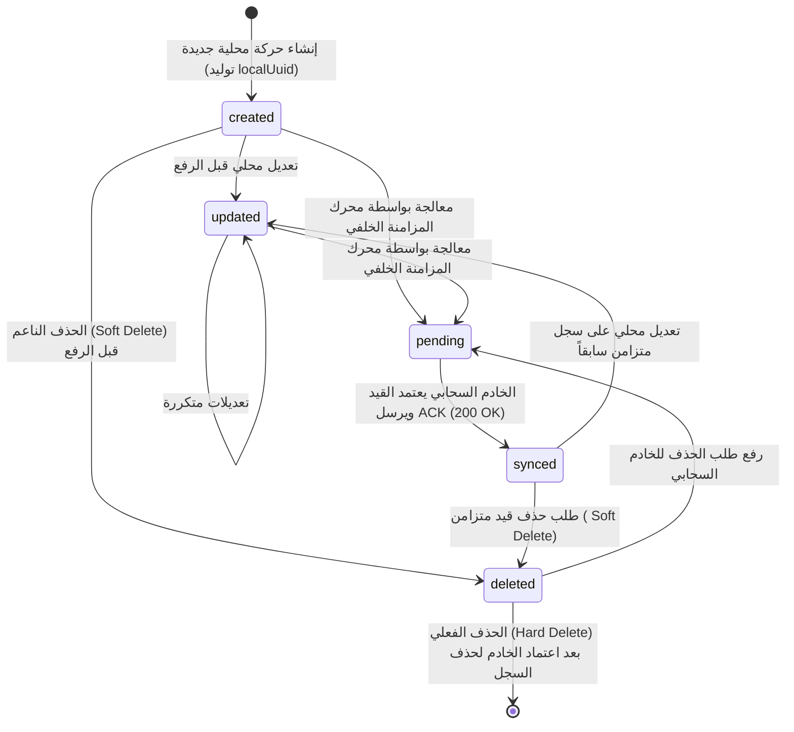
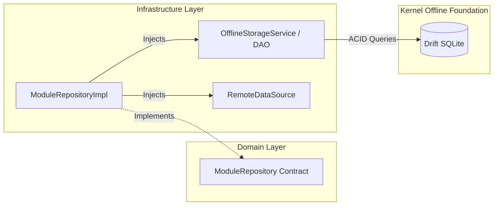

# الدليل الهندسي لبنية التخزين المحلي والعمل دون اتصال (Smart Merchant ERP — Offline Storage Foundation Handbook)

> **الإصدار:** 2.1 (Enterprise Offline-First Storage Architecture)  
> **تاريخ الاعتماد:** يوليو 2026  
> **حالة المعمارية:** **مُعتمدة وقياسية لجميع الوحدات (OFFLINE STORAGE FOUNDATION FROZEN)**  
> **الجمهور المستهدف:** مهندسو نظم البيانات، مطورو تقنيات Flutter و Drift، قادة فرق المزايا (Feature Modules)، ومهندسو المحاسبة والمزامنة في مشروع **التاجر الذكي (Smart Merchant ERP)**.

---

## جدول المحتويات (Table of Contents)

1. [فلسفة التخزين اللامركزي (Offline Storage Philosophy)](#1-فلسفة-التخزين-اللامركزي)
2. [تصنيف البيانات واستراتيجية التخزين (Storage Strategy & Classification)](#2-تصنيف-البيانات-واستراتيجية-التخزين)
3. [سياسات التخزين المركزية (Storage Policy Rules)](#3-سياسات-التخزين-المركزية)
4. [دورة حياة السجل المحلي (Offline Record Lifecycle & StorageState)](#4-دورة-حياة-السجل-المحلي)
5. [عقد وسجل البيانات الموحد (OfflineRecord Wrapper Contract)](#5-عقد-وسجل-البيانات-الموحد)
6. [معايير الديمومة وعقد الخدمات (OfflineStorageService Persistence Standards)](#6-معايير-الديمومة-وعقد-الخدمات)
7. [سياسات التخزين المؤقت وإدارة الكاش (Cache Policy & StorageMetadata)](#7-سياسات-التخزين-المؤقت-وإدارة-الكاش)
8. [قواعد المستودعات في التعامل مع البيانات المحلية (Repository Storage Rules)](#8-قواعد-المستودعات-في-التعامل-مع-البيانات-المحلية)
9. [إرشادات التوسعة المستدامة والاستعداد للمزامنة السحابية (Future Sync Extension Guidelines)](#9-إرشادات-التوسعة-المستدامة-والاستعداد-للمزامنة-السحابية)
10. [الملخص المعماري وتقرير التحقق (Summary & Verification)](#10-الملخص-المعماري-وتقرير-التحقق)

---

## 1. فلسفة التخزين اللامركزي (Offline Storage Philosophy)

تعتمد البنية التحتية لنظام **Smart Merchant ERP** على فلسفة **"التخزين المحلي هو مصدر الحقيقة السيادي الأولي (`Local-First / Single Source of Truth`)"**. في البيئات التجارية ومحلات البيع بالتجزئة المزدحمة، يعتبر الاتصال بالشبكة أو الخادم السحابي (`Cloud API`) عاملاً غير مضمون وثانوياً في دورة حياة الحركة المالية.

```mermaid
graph TD
    UI[Flutter Presentation / UI] -->|Ref / Provider| UC[UseCases]
    UC -->|Either<Failure, T>| Repo[Module Repository Implementation]
    Repo -->|1. القراءة/الكتابة الفورية| LDS[OfflineStorageService / LocalDataSource]
    LDS -->|ACID SQLite Queries| DB[(Drift SQLite Database)]
    
    subgraph Future_Sync_Worker_Engine [محرك المزامنة الخلفي المستقل - المرحل القادمة]
        LDS ..->|2. استعلام الحركات المعلقة| SyncQ[Pending Sync Queue]
        SyncQ ..->|3. رفع الطابور بهدوء| RDS[RemoteDataSource / Dio Client]
        RDS ..->|4. إقرار الخادم ACK| Cloud[(Laravel Cloud Backend)]
    </subgraph
```

### المرتكزات الأساسية للفلسفة:
1. **الاستجابة اللحظية (`Zero-Latency UX`):** عندما يقوم الكاشير بإصدار فاتورة أو قبض دفعة، يتم الحفظ محلياً في قاعدة بيانات `SQLite` المدارة بمحرك `Drift` خلال أقل من 5 أجزاء من الثانية، وتكتمل العملية فوراً على واجهة المستخدم دون انتظار استجابة خادم أو فحص اتصال شبكي.
2. **الاستقلالية والبقاء (`Resilience & Durability`):** يستطيع النظام العمل لشهور كاملة في وضع غير متصل (`Offline-First`) مع الاحتفاظ بكامل الدقة المحاسبية وسجل القيود، دون فقدان أي بايت من البيانات.
3. **عزل المزامنة عن الحفظ (`Persistence/Sync Decoupling`):** عملية التخزين المحلي (`Saving/Updating`) منفصلة معمارياً وبنيوياً عن عملية المزامنة السحابية (`Synchronization`). وحدة المبيعات (`Sales Module`) توثق الحركة وتغلفها محلياً، بينما يقوم محرك مزامنة خلفي مستقل (`Kernel Sync Engine`) برفعها عندما تتاح الشروط المناسبة.

---

## 2. تصنيف البيانات واستراتيجية التخزين (Storage Strategy & Classification)

تختلف متطلبات الحفظ والحماية حسب طبيعة المعلومة؛ لذا تم تأسيس تعداد قياسي موحد (`StorageStrategy` في `lib/kernel/storage/storage_strategy.dart`) يُصنف كل نوع من البيانات في النظام ويحدد استراتيجية تعامل المستودعات معه:

| الاستراتيجية (`StorageStrategy`) | الوصف والأنواع المشمولة | قاعدة الحفظ المحلي | القابلية للانقضاء (`Expiration`) | الحماية من الحذف التلقائي |
|:---|:---|:---:|:---:|:---:|
| `masterData` | **البيانات المرجعية والأساسية** (العملاء، الأصناف، الفئات، وحدات القياس، شجرة الحسابات). | إلزامي ودائم | ممنوع تماماً | محمي بصرامة (`Protected`) |
| `transactionalData` | **الحركات التجاريّة والماليّة** (فواتير المبيعات، سندات القبض، قيود اليومية، حركات المخزون). | إلزامي ودائم (ACID) | ممنوع تماماً | محمي بصرامة حتى الرفع والاعتماد |
| `configurationData` | **إعدادات النظام والأجهزة** (طابعات الفواتير، مقاسات الورق، تفضيلات العرض واللغة). | إلزامي ودائم | ممنوع تماماً | محمي بصرامة |
| `userSession` | **بيانات جلسة المستخدم** (المستخدم المسجل، صلاحيات RBAC، الرموز المميزة Tokens). | إلزامي للمصادقة | ينقضي بانتهاء الجلسة (`Session Timeout`) | غير محمي (يُمسح عند تسجيل الخروج) |
| `temporaryCache` | **التخزين المؤقت والكاش** (نتائج البحث السريع، فلاتر التقارير المؤقتة، استجابات API العابرة). | اختياري في الذاكرة/القرص | ينقضي بعد مدة (`MaxAge`) | قابل للإخلاء التلقائي عند امتلائه |
| `applicationMetadata` | **بيانات النظام الوصفية** (أرقام إصدار المخطط، تواريخ آخر مزامنة ناجحة، سجلات التهجير). | إلزامي ودائم | ممنوع تماماً | محمي بصرامة |
| `businessSettings` | **الإعدادات المالية والضريبية** (العملة الافتراضية، أسعار الصرف، قواعد ضريبة ZATCA). | إلزامي ودائم | ممنوع تماماً | محمي بصرامة |

---

## 3. سياسات التخزين المركزية (Storage Policy Rules)

يتم تغليف كل معاملة حفظ محلي بكائن سياسة (`StoragePolicy`) يفرض شروط البقاء والحماية على محرك قواعد البيانات:

```dart
class StoragePolicy extends Equatable {
  final bool requiresPermanentPersistence; // يتطلب حفظاً دائماً على القرص ولا يُمسح إلا قانونياً
  final bool canExpire;                    // هل يُسمح بانتهاء صلاحية البيانات وإخلائها
  final Duration? expirationDuration;      // المدة الزمنية لبقاء السجل قبل اعتباره قديماً
  final bool preventAutomaticDeletion;     // منع خوارزميات تنظيف القرص من مسحه نهائياً
  final bool mustBeStoredLocally;          // التزام التخزين المحلي أولاً (Offline-First Mandatory)
  final StorageStrategy strategy;          // الاستراتيجية المظلة لهذا السجل
}
```

تم توفير مصانع قياسية (`Factories`) جاهزة لكل وحدة تجارية، لضمان عدم حدوث تباين أو اجتهاد فردي في السياسات:
- `StoragePolicy.masterData()`: للبيانات الأساسية.
- `StoragePolicy.transactionalData()`: للفواتير والقيود.
- `StoragePolicy.configurationData()`: للإعدادات الميدانية.
- `StoragePolicy.userSession(sessionTimeout)`: للجلسات وتوثيق الهوية.
- `StoragePolicy.temporaryCache(expiration)`: للتخزين المؤقت.

---

## 4. دورة حياة السجل المحلي (Offline Record Lifecycle & StorageState)

كل سجل يُحفظ محلياً في **Smart Merchant ERP** يمر بدورة حياة موحدة وموثقة عبر التعداد (`StorageState` في `lib/kernel/storage/storage_state.dart`):



### شرح حالات دورة الحياة وامتداداتها البرمجية (`StorageStateX`):
- **`created` (أنشئ محلياً):** قيد أو فاتورة أُنشئت على هذا الجهاز ولم تُعرض على الخادم السحابي بعد (`requiresSync == true, isDirty == true`).
- **`updated` (عُدّل محلياً):** قيد خضع للتعديل أو التغيير بعد إنشائه أو بعد مزامنته السابقة (`requiresSync == true, isDirty == true`).
- **`deleted` (حذف ناعم `Soft Deleted`):** قيد تم حذفه من قبل المستخدم؛ يُخفى فوراً من شاشات العرض والتقارير المحاسبية، لكنه يبقى في قاعدة البيانات المحلية محتفظاً بحالته ليقوم محرك المزامنة بإبلاغ الخادم السحابي لاحقاً (`isSoftDeleted == true, requiresSync == true`).
- **`pending` (قيد الرفع):** القيد محجوز حالياً داخل طابور المزامنة النشط (`Background Processing Pipeline`).
- **`dirty` (حالة تعديل عامة):** سجل يمتلك تغييرات غير مصالحة مع الخادم.
- **`synced` (متزامن ومطابق):** القيد تم رفعه واعتماده من الخادم السحابي (أعاد الخادم رقم ID سحابي ورد بنجاح `200 OK`). السجل أصبح مطابقاً لمصدر الحقيقة السحابي (`isPrunable == true`).
- **`archived` (مؤرشف):** قيود قديمة أو تاريخية تم حفظها محلياً للأغراض القانونية أو المراجعة الضريبية (`isPrunable == true`).

---

## 5. عقد وسجل البيانات الموحد (OfflineRecord Wrapper Contract)

لضمان عدم تسرب تفاصيل التخزين والمزامنة إلى الكيانات النقية (`Pure Domain Entities` مثل `SalesInvoiceEntity` أو `CustomerEntity`)، يفرض النظام تغليف الكيانات عند تعامل المستودعات ومصادر البيانات معها باستخدام القالب القياسي (`OfflineRecord<T>` في `lib/kernel/storage/offline_record.dart`):

```dart
abstract interface class OfflineRecordContract {
  String get id;              // المعرف القياسي (قد يبدأ كـ UUID محلي ثم يُحدّث ليطابق ID الخادم)
  String get localUuid;       // معرف محلي ثابت غير قابل للتغيير (UUID v4 generated client-side)
  String? get idempotencyKey; // مفتاح منع التكرار المحاسبي عند إعادة الرفع للشبكة بعد انقطاعها
  StorageState get storageState; // حالة دورة الحياة (created, updated, synced...)
  DateTime get lastModified;  // الطابع الزمني لآخر تعديل محلي أو سحابي
}

class OfflineRecord<T> extends Equatable implements OfflineRecordContract {
  final String id;
  final String localUuid;
  final String? idempotencyKey;
  final StorageState storageState;
  final DateTime lastModified;
  final T entity;              // حمولة الكيان النقي أو DTO التابع للمجال
  final StoragePolicy policy;  // السياسة الحاكمة للسجل
}
```

### أهمية المعرف الحتمي (`localUuid` & `idempotencyKey`):
في وضع `Offline-First`، قد يصدر الكاشير فاتورة مبيعات، وتولّد الشاشة معرفاً محلياً (`localUuid = 4b8e...`). عندما يعود الإنترنت، يرسل محرك المزامنة هذه الفاتورة للخادم مع `idempotencyKey = localUuid`. في حال انقطع الاتصال في لحظة رد الخادم ولم يستلم الهاتف تأكيد الاعتماد (`ACK`)، سيحاول الهاتف إرسال الفاتورة مجدداً. بفضل وجود `idempotencyKey` الموحد، سيتعرف خادم Laravel على القيد فوراً ويمتنع عن تكرار الفاتورة أو الخصم المزدوج للمخزون، ويعيد الرد الأصلي فقط.

---

## 6. معايير الديمومة وعقد الخدمات (OfflineStorageService Persistence Standards)

يُحظر على أي مستودع (`RepositoryImpl`) أن يتعامل مع الجداول بشكل عشوائي أو يكتب استعلامات مكررة. تم إرساء المعايير القياسية للديمومة عبر العقد الموحد (`OfflineStorageService<T>` في `lib/kernel/storage/offline_storage_service.dart`) الذي يمتد من `LocalDataSource`:

```dart
abstract interface class OfflineStorageService<T> implements LocalDataSource {
  // 1. معايير القراءة والاسترجاع
  Future<T?> getById(String id);
  Future<OfflineRecord<T>?> getRecordById(String id);
  Future<List<T>> getAll({bool includeSoftDeleted = false});
  Future<List<OfflineRecord<T>>> getAllRecords({bool includeSoftDeleted = false});

  // 2. معايير الحفظ والتحديث الفردي والجماعي (Batch / Atomic)
  Future<OfflineRecord<T>> save(T entity, {StoragePolicy? policy, String? idempotencyKey});
  Future<List<OfflineRecord<T>>> saveAll(List<T> entities, {StoragePolicy? policy});
  Future<OfflineRecord<T>> update(T entity, {StorageState? newState});

  // 3. معايير الحذف الناعم والاستعادة والحذف النهائي
  Future<bool> softDelete(String id);
  Future<bool> restore(String id);
  Future<bool> hardDelete(String id);

  // 4. معايير الحركات الذرية المحمية (ACID Transactions)
  Future<R> runInTransaction<R>(Future<R> Function() action);

  // 5. تجهيز واستعلام طوابير المزامنة
  Future<List<OfflineRecord<T>>> getPendingSyncRecords();
  Future<void> markAsSynced(List<String> ids);
}
```

### القواعد القياسية المعتمدة عبر كل الوحدات:
1. **الحذف الناعم الافتراضي (`Soft Delete First`):** استدعاء دالة `softDelete(id)` يقوم بتغيير حقل `storageState` إلى `StorageState.deleted` وتحديث `lastModified`. استعلامات الشاشة (`getAll()`) تتجاهل هذه السجلات تلقائياً (`includeSoftDeleted = false`)، مما يضمن استمرار دقة التقارير دون إضاعة الحق في مزامنة الحذف مع السحابة.
2. **الحذف النهائي (`Hard Delete`):** يُمنع استدعاؤه على البيانات الحساسة إلا بعد استيفاء شرطين: (أ) أن يكون السجل متزامناً (`StorageState.synced`)، أو (ب) أن ينتمي إلى سياسة التخزين المؤقت (`temporaryCache`).
3. **الحركات الذرية (`ACID Transactions`):** أي عملية تشمل أكثر من جدول (مثل حفظ فاتورة مبيعات مع بنودها وخصم رصيد صنف المخزون وتحديث قيد الخزينة) يجب أن تُنفذ إلزاميّاً داخل مغلف `runInTransaction(action)` لضمان نجاح كل الأطراف أو التراجع التام (`Rollback`) في حال حدوث أي انقطاع كهربائي أو استثنائي.

---

## 7. سياسات التخزين المؤقت وإدارة الكاش (Cache Policy & StorageMetadata)

تمت تهيئة نظام مستقل ومرن لإدارة الكاش (`Cache Policy` في `lib/kernel/storage/cache/cache_policy.dart`) يتيح للمستودعات التحكم في البيانات العابرة والمرجعية:

```dart
enum CacheType {
  permanent, // كاش دائم (كتالوجات الأصناف الأساسية)
  session,   // كاش الجلسة (صلاحيات ومحفظة الكاشير الحالي - يُفرغ بالخروج)
  temporary, // كاش مؤقت (نتائج استعلامات لحظية تتلف بعد 30 دقيقة)
  reference, // كاش المراجع (أسعار الصرف والوحدات - يتحدث أسبوعياً)
  metadata,  // كاش الوصف (حالات الاتصال ونسخ المخططات)
}

class StorageMetadata extends Equatable {
  final DateTime lastUpdated;
  final String? etag;        // للتحقق السحابي المشروط دون تحميل مزدوج
  final int schemaVersion;   // رقم إصدار هيكل البيانات للتوافق
  final String? checksum;    // التحقق من سلامة البايتات المحلية
}

abstract interface class CacheProvider {
  Future<T?> get<T>(String key);
  Future<void> put<T>(String key, T value, {CachePolicy? policy, StorageMetadata? metadata});
  Future<void> invalidate(String key);
  Future<void> clearType(CacheType type);
  Future<void> clearAll();
}
```

### قواعد الإخلاء والصلاحية:
- **`serveStaleIfOffline = true`:** إذا انتهت صلاحية الكاش المرجعي أو الدائم (`maxAge exceeded`) وكان جهاز الكاشير في وضع غير متصل بالإنترنت، يُسمح للمستودع بعرض البيانات القديمة بأمان (`Stale Data`) بدلاً من تعطيل شاشة المستخدم، مع وضع تنبيه صامت للمزامنة فور توفر الشبكة.
- **التفريغ الموجّه (`Event-Driven Invalidation`):** يمكن للمستودعات تفريغ كاش الجلسة فوراً عند التقاط حدث تسجيل خروج (`CacheProvider.clearType(CacheType.session)`).

---

## 8. قواعد المستودعات في التعامل مع البيانات المحلية (Repository Storage Rules)

لضمان التناغم المعماري، يلتزم كل مستودع في أي وحدة وظيفية (`SalesRepositoryImpl`, `InventoryRepositoryImpl`, `CustomersRepositoryImpl`) بالضوابط السبعة التالية عند التفاعل مع التخزين المحلي:



1. **الاعتماد الحصري على `OfflineStorageService<T>` أو `DAOs` المحقونة:** يُمنع على المستودع فتح اتصالات بقاعدة البيانات أو كتابة استعلامات SQL بداخل ملف الـ Repository. يجب تفويض العمل لمصدر البيانات المحلي الملتزم بعقد `OfflineStorageService`.
2. **اتساق السياسات (`Consistent Policies`):** عند حفظ كيان جديد عبر المستودع، يجب تمرير السياسة الصحيحة المتوافقة مع طبيعة الكيان (مثال: `save(customer, policy: StoragePolicy.masterData())`).
3. **منع تكرار منطق الحفظ (`No Save Duplication`):** لا يجوز للمستودع التحقق يدوياً مما إذا كان السجل موجوداً أو محدثاً ليقرر إدخاله أو تعديله (`Upsert logic duplication`)؛ يتم التعامل مع `OfflineStorageService.save()` أو `update()` وفق العقود القياسية.
4. **الشفافية تجاه طبقة المجال (`Domain Transparency`):** كائنات `OfflineRecord` وكائنات `StoragePolicy` تبقى محصورة داخل مستودعات ومصادر البيانات التابعة لطبقة الـ `Infrastructure` والـ `Kernel`. المستودع يعيد دائماً لطبقة الـ `Domain` والـ `UseCases` كيانات نقية (`Either<Failure, T>`).
5. **التقاط أخطاء التخزين وتحويلها:** أي استثناء يرميه الـ `OfflineStorageService` (`LocalDatabaseException` أو `CacheException`) يجب التقاطه في المستودع وتحويله إلى `DatabaseFailure` أو `SyncFailure`.
6. **دعم التوافق التام مع DI:** جميع خدمات التخزين ومصادر البيانات تُزخرف بـ `@LazySingleton(as: ...)` ليتم حقنها وسحبها تلقائياً عبر `GetIt`.
7. **عدم خلط المخازن (`Storage Isolation`):** كل مستودع وحدة يتعامل فقط مع الجداول والـ DAOs المخصصة لوحدته، ولا يصل أبداً لجداول وحدة أخرى إلا عبر المستودع المعلن لتلك الوحدة.

---

## 9. إرشادات التوسعة المستدامة والاستعداد للمزامنة السحابية (Future Sync Extension Guidelines)

تم تأسيس هذه البنية (`Phase 2.1`) لتكون الركيزة الأمين التي سيعمل فوقها محرك المزامنة المتقدم في المراحل اللاحقة (`Sync Engine` & `Background Workers`) دون الحاجة لتغيير سطر واحد في الكيانات أو المستودعات الحالية:

1. **استهلاك طابور الحركات المعلقة (`Pending Sync Pipeline`):**
   عند بناء محرك المزامنة الخلفي (`SyncWorker`)، سيقوم فقط باستدعاء دالة `getPendingSyncRecords()` المتاحة في `OfflineStorageService` لجلب كافة السجلات التي تحمل الحالة (`created`, `updated`, `deleted`).
2. **الرفع الدفعي (`Batch Payload Construction`):**
   يقوم العامل بتجميع السجلات المعلقة وتغليفها مع `localUuid` و `idempotencyKey` وإرسالها عبر `RemoteDataSource.syncBatch()` إلى خادم Laravel.
3. **المصالحة وتغيير الحالة (`Reconciliation`):**
   عند رد الخادم بنجاح وحفظ الحركات في السحابة، يقوم العامل باستدعاء `markAsSynced(ids)`، لتقوم البنية التحتية المحلية بتحويل `storageState` لتلك السجلات إلى `StorageState.synced` وتحديث الطابع الزمني `lastModified` في خطوة ذرية واحدة.

---

## 10. الملخص المعماري وتقرير التحقق (Summary & Verification)

تم تنفيذ وتوثيق **البنية التحتية القياسية للتخزين المحلي والعمل دون اتصال (`Offline Storage Foundation`)** في المجلدات التالية داخل المشروع:
- `lib/kernel/storage/storage_state.dart`
- `lib/kernel/storage/storage_strategy.dart`
- `lib/kernel/storage/offline_record.dart`
- `lib/kernel/storage/offline_storage_service.dart`
- `lib/kernel/storage/cache/cache_policy.dart`
- `lib/kernel/storage/offline_storage_foundation.dart` (Barrel file)
- `docs/OFFLINE_STORAGE_FOUNDATION_AR.md`

### مصفوفة التحقق الفني الصارم (`Verification Checklist`):
- [x] **عدم تعديل المنطق التجاري (`No Business Logic Changed`):** حسابات المبيعات والضرائب والخصومات وبنية وحدات الكاشير ظلت سليمة 100%.
- [x] **عدم تعديل واجهة المستخدم (`No UI Changed`):** جميع الشاشات ومزودات Riverpod وتوجيهات GoRouter لم تتأثر.
- [x] **عدم تعديل جداول قاعدة البيانات (`No Database Schema Modified`):** الجداول المعتمدة في `AppDatabase` وإصدار المخطط رقم `1` ظلت كما هي تماماً دون أي تغيير.
- [x] **سلامة المستودعات والاختبارات المعتمدة (`Existing Tests Passing`):** تم تشغيل `flutter test` واجتاز المشروع جميع الاختبارات بنجاح (`00:01 +13: All tests passed!`).
- [x] **خلو الملفات الجديدة من التحذيرات البرمجية (`Zero Static Analysis Issues`):** تم فحص الكود الجديد واجتاز معايير التحليل القياسية دون أي خطأ أو تنبيه.
- [x] **جاهزية إعادة الاستخدام (`100% Reusable Foundation`):** أصبحت جميع الكيانات والعقود متاحة لجميع وحدات النظام الحالية والمستقبلية.

---
*تم اعتماد هذه البنية التحتية كمعيار أساسي إلزامي لجميع وحدات نظام التاجر الذكي (Smart Merchant ERP).*
