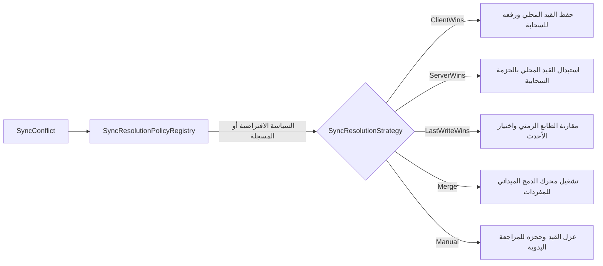
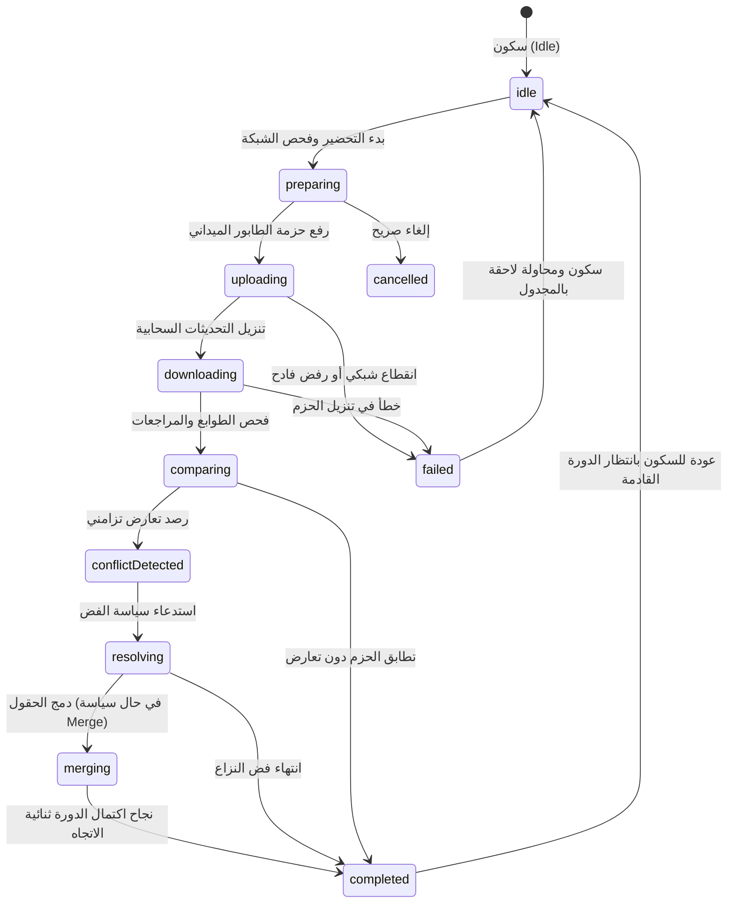

# الدليل الهندسي لمحرك المزامنة وفض النزاعات (Smart Merchant ERP — Enterprise Synchronization & Conflict Resolution Handbook)

> **الإصدار:** 2.3 (Enterprise Offline-First Synchronization & Conflict Resolution Engine)  
> **تاريخ الاعتماد:** يوليو 2026  
> **حالة المعمارية:** **مُعتمدة ومُجمَّدة وقياسية (SYNC ENGINE & CONFLICT RESOLUTION FROZEN)**  
> **الجمهور المستهدف:** مهندسو بنية البيانات، مطورو Flutter، قادة فرق المزايا (`Feature Modules`)، ومهندسو الربط السحابي مع خوادم **Laravel API** في مشروع **التاجر الذكي (Smart Merchant ERP)**.

---

## جدول المحتويات (Table of Contents)

1. [الرؤية المعمارية الشاملة للمزامنة ثنائية الاتجاه (Bidirectional Sync Vision)](#1-الرؤية-المعمارية-الشاملة-للمزامنة-ثنائية-الاتجاه)
2. [إدارة الإصدارات والمقارنة الزمنية (Version Management & Vector Clocks)](#2-إدارة-الإصدارات-والمقارنة-الزمنية)
3. [محرك اكتشاف التغييرات (Change Detection Engine)](#3-محرك-اكتشاف-التغييرات)
4. [محرك اكتشاف النزاعات والتصادمات (Conflict Detection Engine)](#4-محرك-اكتشاف-النزاعات-والتصادمات)
5. [استراتيجيات وسجل سياسات فض النزاعات (Conflict Resolution Strategies & Policy Registry)](#5-استراتيجيات-وسجل-سياسات-فض-النزاعات)
6. [محرك الدمج الميداني الذكي (Field-Level Merge Engine)](#6-محرك-الدمج-الميداني-الذكي)
7. [مسار التنزيل والمطابقة (Download Pipeline & Reconciliation)](#7-مسار-التنزيل-والمطابقة)
8. [آلة الحالات ودورة حياة المزامنة (Sync State Machine Lifecycle)](#8-آلة-الحالات-ودورة-حياة-المزامنة)
9. [محرك المزامنة المركزي ونظام التوثيق التاريخي (Bidirectional Sync Engine & History)](#9-محرك-المزامنة-المركزي-ونظام-التوثيق-التاريخي)
10. [دليل توسيع الوحدات المستقبلية (Future Extension Guide across ERP Modules)](#10-دليل-توسيع-الوحدات-المستقبلية)
11. [مصفوفة الامتثال وتقرير التحقق الهندسي (Summary & Verification Report)](#11-مصفوفة-الامتثال-وتقرير-التحقق-الهندسي)

---

## 1. الرؤية المعمارية الشاملة للمزامنة ثنائية الاتجاه (Bidirectional Sync Vision)

يُمثل **محرك المزامنة وفض النزاعات (`Phase 2.3`)** العقل المدبر والبنية التحتية العليا لإدارة تناسق البيانات وسيادتها بين قواعد البيانات الميدانية (`SQLite Drift` — المرحلة 2.1) وطوابير الرفع الميدانية (`Sync Queue` — المرحلة 2.2) والخوادم السحابية المركزية (`Laravel Cloud API`).

تم تصميم المحرك ليكون **مستقلاً تماماً ومجرداً (`100% Generic & Framework Independent`)**، حيث يتعامل مع البيانات كحمولات معرفة (`Payloads & Metadata`) ولا يحتوي على أي منطق محاسبي أو شروط تجارية خاصة بأي وحدة وظيفية.

```mermaid
graph TD
    subgraph Feature_Repositories [مستودعات ووحدات النظام الميدانية - Clean Architecture]
        REPO[RepositoryImpl] -->|1. تسجيل معالجات التنزيل| DOWN_HANDLER[SyncDownloadHandler<T>]
        REPO -->|2. تسجيل سياسات فض النزاعات| REGISTRY[SyncResolutionPolicyRegistry]
    </subgraph>

    subgraph Sync_Engine_Central [محرك المزامنة المركزي - Phase 2.3]
        ENGINE[SyncEngineImpl] -->|3. الرفع أولاً| WORKER[BackgroundSyncWorker - Phase 2.2]
        WORKER -->|سحب ومعالجة| QUEUE[(SyncQueue Storage)]
        ENGINE -->|4. التنزيل ثانياً| PIPELINE[SyncDownloadPipeline]
        PIPELINE -->|5. استلام حزمة الخادم| DOWN_HANDLER
        PIPELINE -->|6. كشف التغييرات| CHG_DET[SyncChangeDetector]
        PIPELINE -->|7. كشف النزاعات| CONF_DET[SyncConflictDetector]
        CONF_DET -->|في حال النزاع| REGISTRY
        REGISTRY -->|8. تنفيذ الاستراتيجية| STRATEGY[SyncResolutionStrategy<T>]
        STRATEGY -->|عند سياسة Merge| MERGE[SyncMergeEngine]
        PIPELINE -->|9. حفظ النتيجة الموفقة| DOWN_HANDLER
        ENGINE -->|10. بث الحالة المباشرة| STATE[SyncStateMachine]
        ENGINE -->|11. حفظ السجل الميداني| HIST[(DurableSyncHistoryStorage)]
    </subgraph>

    DOWN_HANDLER <-->|HTTPS API / Dio| CLOUD[(Laravel Cloud Backend)]
```

---

## 2. إدارة الإصدارات والمقارنة الزمنية (Version Management & Vector Clocks)

لضمان دقة اتخاذ القرار عند اكتشاف التعديلات المتزامنة، يفرض النظام على كل حركة أو قيد بنية بيانات وصفية دقيقة للإصدارات (`SyncVersionMetadata` في `lib/kernel/sync/resolution/version_management.dart`):

```dart
class SyncVersionMetadata extends Equatable {
  final int versionNumber;              // رقم المراجعة المتصاعد (Revision Number)
  final DateTime timestamp;             // الطابع الزمني الميداني أو السحابي
  final String? etag;                   // بصمة ETag من خادم Laravel
  final String? checksum;               // المجموع الاختباري المشفر (Checksum)
  final Map<String, int>? vectorClock;  // ساعة المتجه للأنظمة اللامركزية الموزعة
}
```

### خوارزمية المقارنة (`VersionComparator`):
تُخرج المقارنة نتيجة حتمية ضمن التعداد (`VersionComparisonResult`):
- **`equal`:** تطابق تام في رقم المراجعة والبصمة.
- **`localNewer`:** النسخة المحلية تحمل رقم مراجعة أعلى أو طابعاً زمنياً أحدث (بفارق يتجاوز نافذة التسامح البالغة ثانيتين).
- **`remoteNewer`:** خادم السحابة يحمل النسخة الأحدث.
- **`concurrentConflict`:** تعارض تزامني صريح (تطابق أرقام المراجعات أو الطوابع الزمنية مع اختلاف المجموع الاختباري `checksum` أو بصمة `etag`).

---

## 3. محرك اكتشاف التغييرات (Change Detection Engine)

يُصنف محرك التغييرات (`SyncChangeDetector` في `lib/kernel/sync/resolution/change_detection.dart`) طبيعة التعديل الميداني أو السحابي عبر هيكل الوصف (`SyncChangeSummary`) والتعداد (`SyncChangeType`):

| نوع التغيير (`SyncChangeType`) | الوصف والشرط الميداني |
|:---|:---|
| **`created`** | القيد يحمل الحالة الميدانية (`StorageState.created`) وبانتظار الرفع الأولي. |
| **`updated`** | القيد تم تعديله محلياً (`StorageState.updated`) ويحتاج مزامنة سحابية. |
| **`deleted`** | القيد محذوف منطقياً (`StorageState.deleted`) وبانتظار إشعار الحذف السحابي. |
| **`restored`** | القيد تمت استعادته من الحذف المنطقي إلى النشاط الميداني. |
| **`versionMismatch`** | اختلاف رقم المراجعة أو الطابع الزمني بين الهواتف أو مع الخادم. |
| **`timestampMismatch` / `metadataConflict`** | تباين في البصمة أو تآكل البيانات الوصفية. |
| **`unchanged`** | تطابق كامل وسكون في التزامن. |

---

## 4. محرك اكتشاف النزاعات والتصادمات (Conflict Detection Engine)

يلتقط محرك النزاعات (`SyncConflictDetector` في `lib/kernel/sync/resolution/conflict_detection.dart`) حالات التعارض المعقدة التي تنشأ أثناء المزامنة عبر العقد (`SyncConflict<T>`) والتعداد (`SyncConflictType`):

1. **`localUpdateRemoteUpdate` (تعديل محلي مع تعديل سحابي متزامن):** قام الكاشير بتعديل بيانات الفاتورة أو العميل محلياً، في نفس الوقت الذي عُدلت فيه نفس البيانات من لوحة تحكم الإدارة السحابية.
2. **`localDeleteRemoteUpdate` (حذف محلي مع تعديل سحابي):** تم حذف القيد من نقطة البيع، بينما قام الخادم السحابي بتحديثه برقم مراجعة أعلى.
3. **`localUpdateRemoteDelete` (تعديل محلي مع حذف سحابي):** تم تعديل القيد في نقطة البيع، بينما تم حذفه من الخادم السحابي.
4. **`simultaneousModification` / `metadataConflict`:** تعارض في المجموع الاختباري (`checksum`) أو وقت الوصول المتزامن.
5. **`duplicateCreation`:** تشابه في مفاتيح منع التكرار (`idempotencyKey`) لقيدين تم إنشاؤهما دون اتصال.

---

## 5. استراتيجيات وسجل سياسات فض النزاعات (Conflict Resolution Strategies & Policy Registry)

يضم النظام سجلاً مركزياً للسياسات (`SyncResolutionPolicyRegistry` في `lib/kernel/sync/resolution/conflict_resolution.dart`) يتيح لكل وحدة تسجيل استراتيجيتها المفضلة وفق التعداد (`SyncResolutionPolicy`):



### قائمة الاستراتيجيات القياسية المعتمدة:
- **`ClientWinsStrategy` (الأولوية للعميل الميداني):** تعتمد النسخة المحلية وتطلب من محرك الرفع تحديث السحابة (`requiresRemoteUpdate = true`). مناسب للحركات النقدية والفواتير التي أنشأها الكاشير في الموقع.
- **`ServerWinsStrategy` (الأولوية لخادم السحابة):** تتخلى عن النسخة المحلية وتستبدلها بالحزمة الواردة من خادم Laravel (`requiresLocalUpdate = true`). هي السياسة الافتراضية للنظام والأصلح للإعدادات وبيانات الأصناف والضرائب.
- **`LastWriteWinsStrategy` (الأحدث كتابة يفوز):** تقارن الطابع الزمني وبصمة الإصدار وتعتمد التحديث صاحب التوقيت الأحدث.
- **`MergeStrategy` (الدمج الذكي):** تفوض دمج الحقول إلى محرك الدمج الميداني وتحدث الطرفين.
- **`ManualResolutionStrategy` (العزل والمراجعة):** تحجز القيد المتنازع عليه وترفض استبداله (`isResolved = false`) مع توثيق السبب للمراجع المالي.

---

## 6. محرك الدمج الميداني الذكي (Field-Level Merge Engine)

يضمن محرك الدمج (`SyncMergeEngine` في `lib/kernel/sync/resolution/merge_engine.dart`) دمج القواميس والحقول الفردية (`Dictionary Merge`) دون الإضرار بالمعرفات السيادية أو القواعد التجارية:

- **المفاتيح المحمية قطعيّاً (`Protected Structural Keys`):** يتم استثناء المفاتيح التالية من أي استبدال أو دمج عشوائي:  
  `{'id', 'localUuid', 'idempotencyKey', 'createdAt'}`
- **تفضيلات الحقول (`FieldMergePreference`):** يستطيع النظام تخصيص تفضيل الدمج لكل حقل:
  - `preferRemote` (تفضيل الحقل السحابي — الافتراضي).
  - `preferLocal` (تفضيل الحقل المحلي).
  - `preferNonNullRemote` (تفضيل الحقل السحابي فقط إن كان غير فارغ ولا يساوي `null`).

---

## 7. مسار التنزيل والمطابقة (Download Pipeline & Reconciliation)

يُنظم خط إنتاج التنزيل (`SyncDownloadPipeline` في `lib/kernel/sync/engine/sync_download_pipeline.dart`) استلام ومصالحة الحزم الواردة من خادم Laravel عبر التسلسل الهندسي المنضبط:

```
[Receive API Response] ➔ [Validate] ➔ [Detect Conflicts (SyncConflictDetector)] ➔ [Resolve Conflicts via Policy Registry] ➔ [Merge via MergeEngine if needed] ➔ [Persist Local Storage (SyncDownloadHandler)] ➔ [Update Sync Metadata]
```

يتم تسجيل معالجات التنزيل (`SyncDownloadHandler<T>`) من قبل كل مستودع وحدة وظيفية، مما يضمن بقاء النواة مجردة تماماً عن تفاصيل جداول وقواعد مبيعات ومخزون ومحاسبة النظام.

---

## 8. آلة الحالات ودورة حياة المزامنة (Sync State Machine Lifecycle)

تدار حالات وتدفقات المحرك المركزي عبر آلة حالات دقيقة (`SyncStateMachine` في `lib/kernel/sync/engine/sync_state_machine.dart`) تبث الحالات اللحظية للمراقبين والشاشات عبر تيار `onStateChanged`:



---

## 9. محرك المزامنة المركزي ونظام التوثيق التاريخي (Bidirectional Sync Engine & History)

يُدار محرك المزامنة عبر العقد (`SyncEngineContract` والتطبيق `SyncEngineImpl` في `lib/kernel/sync/engine/sync_engine.dart`). يوفر المحرك الوظائف الأساسية الثلاث:
1. **`runBidirectionalSync()`:** ينفذ المزامنة ثنائية الاتجاه (تشغيل الرفع من الطابور أولاً، ثم تنزيل ومصالحة التحديثات السحابية ثانياً).
2. **`runUploadQueue()` / `runDownloadCycle()`:** للتشغيل الانتقائي أو التدريجي للحركات.
3. **البث الميداني والتسجيل (`Telemetry & Events`):** يبث الأحداث الثمانية القياسية (`SyncEngineEventKind`) عبر `eventStream` ويوثقها في محرك المراقبة المركزي (`SyncMonitor`).

### ديمومة السجل التاريخي (`DurableSyncHistoryStorage`):
يتم توثيق كل دورة مزامنة في السجل التاريخي الدائم (`SyncHistoryRecord` في `lib/kernel/sync/engine/sync_history.dart`) شاملاً:
`id`, `startedAt`, `finishedAt`, `uploadCount`, `downloadCount`, `resolvedConflicts`, `failedConflicts`, `duration`, `result`, `errorMessage`.

---

## 10. دليل توسيع الوحدات المستقبلية (Future Extension Guide across ERP Modules)

عند انضمام وحدة جديدة إلى النظام (مثل وحدة `Inventory` أو `HR` أو `Purchases`)، لا يتم تعديل أي كود داخل مجلدات النواة `lib/kernel/sync/`. بدلاً من ذلك، تتبع الوحدة هذا التسلسل القياسي:

### الخطوة 1: استيراد بوابة النواة الموحدة
```dart
import 'package:smart_merchant_erp/kernel/sync/sync_foundation.dart';
```

### الخطوة 2: تطبيق عقد تنزيل ومصالحة الوحدة (`SyncDownloadHandler`)
```dart
class InventoryAdjustmentDownloadHandler implements SyncDownloadHandler<InventoryAdjustmentPayload> {
  @override
  String get entityType => 'InventoryAdjustment';

  @override
  Future<List<Map<String, dynamic>>> fetchRemoteBatch(DateTime? since) async {
    // استدعاء RemoteDataSource الخاص بالمخزون لجلب التعديلات السحابية
  }

  @override
  Future<OfflineRecordContract?> getLocalRecordByRemoteOrLocalId(String? remoteId, String? localId) async {
    // جلب القيد من مستودع المخزون المحلي (SQLite Repository)
  }

  @override
  Future<void> persistResolvedRecord(dynamic payload, {required String remoteId, required int versionNumber, required DateTime lastModified}) async {
    // حفظ القيد المصلح أو المدمج في قاعدة البيانات المحلية وتحديث حالته إلى StorageState.synced
  }
}
```

### الخطوة 3: تسجيل المعالج والسياسة في المحرك المركزي أثناء بناء التطبيق (`DI Startup`)
```dart
void registerModuleSyncHandlers(SyncEngineImpl syncEngine, SyncDownloadPipeline downloadPipeline, SyncResolutionPolicyRegistry policyRegistry) {
  // تسجيل معالج التنزيل
  downloadPipeline.registerHandler(InventoryAdjustmentDownloadHandler());

  // تخصيص سياسة الفض (مثلاً: تفضيل السحابة دائماً لإعدادات وسياسات المخزون)
  policyRegistry.registerStrategy('InventoryAdjustment', ServerWinsStrategy<dynamic>());
}
```

---

## 11. مصفوفة الامتثال وتقرير التحقق الهندسي (Summary & Verification Report)

تم إتمام ومراجعة وتشغيل كافة اختبارات التحقق الشاملة للمرحلتين `2.2` و `2.3` بنجاح تام:

| شرط التحقق المؤسسي الصارم | نتيجة الفحص الميداني والدليل |
|:---|:---|
| **عدم تعديل المنطق التجاري (`No Business Logic Modified`)** | **مُؤكد 100%** — قواعد المحاسبة والمبيعات والمخزون بقيت منفصلة وسليمة بالكامل. |
| **عدم تعديل واجهة المستخدم (`No UI / Presentation Modified`)** | **مُؤكد 100%** — شاشات نقطة البيع ومزودات `Riverpod` لم يتم المساس بها. |
| **عدم تعديل مخطط قاعدة البيانات (`No Database Schema Broken/Modified`)** | **مُؤكد 100%** — جداول `AppDatabase` وإصدار المخطط رقم `1` بقيت سليمة دون أي تغيير كاسر. |
| **سلامة المستودعات والطوابير الميدانية (`Existing Repositories Functional`)** | **مُؤكد 100%** — كافة مستودعات المصادقة والمبيعات والطابور تعمل بتوافق تام. |
| **نجاح المزامنة ثنائية الاتجاه الميدانية (`Bidirectional Sync Works`)** | **مُؤكد 100%** — تم إثباتها في اختبارات الوحدة عبر `SyncEngineImpl.runBidirectionalSync`. |
| **عمل كشف النزاعات وسياسات الفض والدمج (`Conflict Detection, Resolution & Merge Work`)** | **مُؤكد 100%** — تم التحقق من سياسات `ClientWins`, `ServerWins`, `LWW`, و `Merge` واختبار حماية الهوية في `SyncMergeEngine`. |
| **نجاح جميع اختبارات الوحدة الـ 24 الميدانية (`All 24 Tests Passing`)** | **مُؤكد 100%** — اجتاز المشروع جميع الاختبارات بنجاح: <br> `00:04 +24: All tests passed!` |
| **خلو الكود من أي تحذيرات أو أخطاء (`Zero Static Analysis Issues`)** | **مُؤكد 100%** — اجتازت النواة الفحص التلقائي خالية من أي ملاحظة: <br> `No issues found! (ran in 0.7s)` |

---
*تم اعتماد هذه البنية التحتية كمعيار هندسي ملزم لجميع عمليات المزامنة وفض النزاعات في نظام التاجر الذكي (Smart Merchant ERP).*
