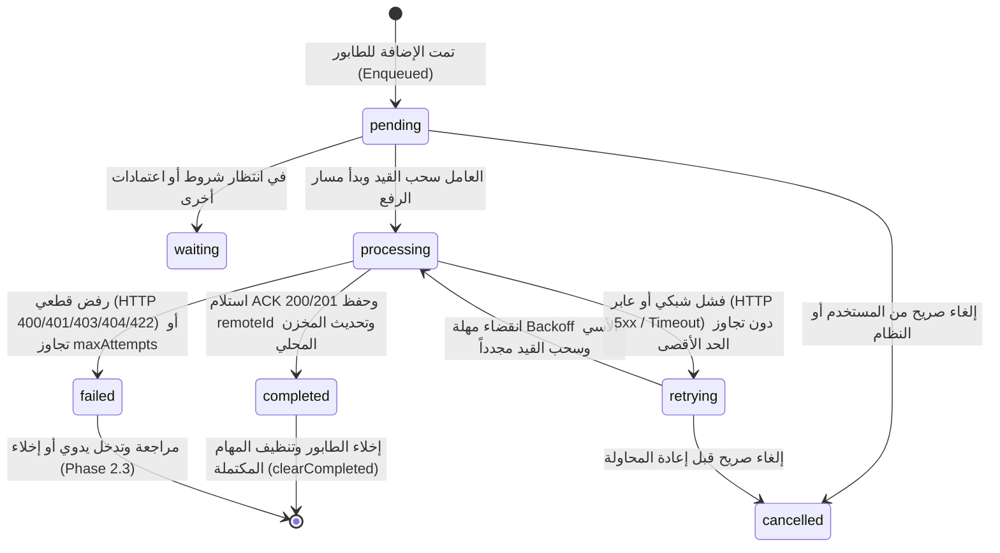

# الدليل الهندسي لطابور المزامنة والمعالجة في الخلفية (Smart Merchant ERP — Sync Queue & Background Processing Handbook)

> **الإصدار:** 2.2 (Enterprise Offline-First Synchronization Queue & Background Processing)  
> **تاريخ الاعتماد:** يوليو 2026  
> **حالة المعمارية:** **مُعتمدة وقياسية لجميع الوحدات (SYNC QUEUE & BACKGROUND PROCESSING FROZEN)**  
> **الجمهور المستهدف:** مهندسو بنية البيانات والمزامنة، مطورو Flutter، قادة فرق المزايا (`Feature Modules`)، ومهندسو المحاسبة والمزامنة السحابية مع خوادم **Laravel API** في مشروع **التاجر الذكي (Smart Merchant ERP)**.

---

## جدول المحتويات (Table of Contents)

1. [الرؤية المعمارية للمزامنة اللامركزية (Synchronization Architecture Vision)](#1-الرؤية-المعمارية-للمزامنة-اللامركزية)
2. [هيكل طابور المزامنة ومكونات السجل (Sync Queue Architecture & Item Metadata)](#2-هيكل-طابور-المزامنة-ومكونات-السجل)
3. [دورة حياة وحالات قيد المزامنة (Queue States & Lifecycle)](#3-دورة-حياة-وحالات-قيد-المزامنة)
4. [مستويات الأولوية في المعالجة (Queue Priority Ordering)](#4-مستويات-الأولوية-في-المعالجة)
5. [محرك العامل الخلفي ومسار الرفع الموحد (Background Processing & Upload Pipeline)](#5-محرك-العامل-الخلفي-ومسار-الرفع-الموحد)
6. [سياسة الإعادة والتراجع الأسي (Retry Policy & Exponential Backoff)](#6-سياسة-الإعادة-والتراجع-الأسي)
7. [جدولة المزامنة ومراقبة الاتصال (Sync Scheduler & Connectivity Detection)](#7-جدولة-المزامنة-ومراقبة-الاتصال)
8. [ديمومة الطابور والمحافظة على البيانات (Queue Persistence & Durability)](#8-ديمومة-الطابور-والمحافظة-على-البيانات)
9. [التسجيل والمراقبة والقياس الميداني (Telemetry Logging & Monitoring)](#9-التسجيل-والمراقبة-والقياس-الميداني)
10. [أفضل الممارسات وقواعد الامتثال القياسية (Best Practices & Clean Architecture Rules)](#10-أفضل-الممارسات-وقواعد-الامتثال-القياسية)
11. [الملخص المعماري وتقرير التحقق (Summary & Verification Report)](#11-الملخص-المعماري-وتقرير-التحقق)

---

## 1. الرؤية المعمارية للمزامنة اللامركزية (Synchronization Architecture Vision)

تُشكل بنية المزامنة اللامركزية في **Smart Merchant ERP** (`Phase 2.2`) الجسر الآمن والدائم بين التخزين المحلي السيادي (`Phase 2.1 — Offline Storage Foundation`) والخوادم السحابية المحاسبية (`Laravel API Backend`). تم تصميم محرك المزامنة ليكون **مستقلاً تماماً ومجرداً (100% Generic & Reusable across all modules)**، بحيث يكتفي بالتعامل مع البيانات كحمولات معرفة (`Payloads & Metadata`) دون أن يحتوي أبداً على أي منطق تجاري أو محاسبي أو واجهات مستخدم.

```mermaid
graph TD
    subgraph Feature_Repositories [مستودعات وحدات النظام الميدانية - Clean Architecture]
        Repo[Sales / Inventory / Customer RepositoryImpl] -->|1. حفظ محلي بالـ OfflineStorageService| LocalDB[(Drift SQLite)]
        Repo -->|2. إضافة حركة إلى طابور المزامنة| SQ[SyncQueueContract / Durable Queue]
    </subgraph

    subgraph Kernel_Sync_Engine [محرك المزامنة الخلفي المجرد - Phase 2.2]
        SCHED[SyncScheduler / Triggers] -->|3. تحفيز المعالجة| WORKER[BackgroundSyncWorker]
        NET[NetworkMonitor / Connectivity] -.->|الفحص المسبق| WORKER
        WORKER -->|4. سحب حسب الأولوية وتطبيق Backoff| SQ
        WORKER -->|5. تمرير السجل للمسار| PIPELINE[SyncUploadPipeline]
        PIPELINE -->|6. استدعاء المعالج المعين| HANDLER[SyncPipelineHandler<T>]
        HANDLER -->|7. إرسال وتلقي الرد| RDS[RemoteDataSource / Dio Client]
        PIPELINE -->|8. تسجيل أحداث التيليميتري| MON[SyncMonitor / Telemetry]
    </subgraph>

    RDS -->|9. اعتماد وتأكيد ACK 200 OK| Cloud[(Laravel Cloud API)]
```

### المبادئ السيادية لمحرك المزامنة:
1. **التجريد المطلق (`Absolute Decoupling`):** محرك المزامنة لا يعرف ما إذا كان القيد يمثل فاتورة مبيعات، قيد يومية، أو تعديل مخزون؛ فهو يتعامل فقط مع عقود مجردة (`SyncQueueItem<T>` و `SyncPipelineHandler<T>`).
2. **العزل عن واجهة المستخدم والمجال (`No UI or Domain Rules Violation`):** لا يُسمح لمحرك المزامنة بالتواصل مع واجهات المستخدم أو إظهار نوافذ تنبيه (`Dialogs/Toasts`)، كما يمتنع عن حساب الضرائب أو تعديل القيود المحاسبية.
3. **التمرير المنضبط عبر مصادر البيانات (`RemoteDataSource Delegation`):** لا يقوم محرك المزامنة بإنشاء طلبات `HTTP` مباشرة أو تخطي عقود المستودعات (`Repository Contracts`). كل معالج وحدة يفوّض الاتصال لـ `RemoteDataSource` الخاص بوحدته فقط.

---

## 2. هيكل طابور المزامنة ومكونات السجل (Sync Queue Architecture & Item Metadata)

يُمثل السجل القياسي (`SyncQueueItem<T>` في `lib/kernel/sync/queue/sync_queue_item.dart`) الوحدة الذرية الموحدة لجميع طلبات المزامنة الميدانية. يحتوي كل سجل على البيانات والبيانات الوصفية التالية:

```dart
class SyncQueueItem<T> extends Equatable {
  final String id;                 // معرف الطابور الفريد (UUID v4)
  final String entityType;         // نوع الكيان (مثل 'SalesInvoice' أو 'Customer')
  final SyncOperationType operationType; // نوع العملية (create, update, delete, softDelete, restore, custom)
  final String localId;            // معرف الكيان المحلي الساكن (localUuid)
  final String? remoteId;          // معرف السحابة في حال المزامنات اللاحقة
  final T payload;                 // حمولة الكيان أو DTO المراد رفعه
  final SyncPriority priority;     // درجة الأولوية (critical, high, normal, low)
  final DateTime createdAt;        // طابع الإضافة للطابور
  final int retryCount;            // عدد المحاولات السابقة
  final int maxAttempts;           // الحد الأقصى للمحاولات قبل الإخفاق النهائي
  final DateTime? lastAttempt;     // وقت آخر محاولة رفع
  final SyncQueueItemState state;  // حالة القيد الحالية في الطابور
  final SyncError? errorInfo;      // تفاصيل خطأ الرفع السابق (إن وجد)
  final String? idempotencyKey;    // مفتاح حماية التكرار المحاسبي عند إعادة المحاولة
}
```

---

## 3. دورة حياة وحالات قيد المزامنة (Queue States & Lifecycle)

تدار حالات السجلات داخل طابور المزامنة وفق آلة حالات قياسية ومغلقة (`SyncQueueItemState` في `lib/kernel/sync/queue/sync_queue_item.dart`):



### تعريفات الحالات الدلالية:
- **`pending` (معلق ومستعد):** السجل محجوز في الطابور ومؤهل للسحب اللحظي بمجرد توفر الاتصال.
- **`processing` (قيد الرفع):** يُعالج حالياً عبر مسار الرفع الموحد (`SyncUploadPipeline`).
- **`completed` (مكتمل ومُعتمد):** تم إرساله بنجاح واستقبل الهاتف رمز تعريف الخادم السحابي (`remoteId`).
- **`retrying` (مُجدول لإعادة المحاولة):** أخفق إخفاقاً مؤقتاً (انقطاع إنترنت أو بطء خادم)، ومُجدول للرفع بعد انتهاء فترة التراجع الأسي (`Exponential Backoff`).
- **`failed` (إخفاق دائم):** تجاوز السجل الحد الأقصى للمحاولات، أو رُفض من الخادم بأكواد نهائية لا تُعاد محاولتها أبداً لمنع التكرار المحاسبي.
- **`cancelled` (مُلغى):** تم إيقاف الحركة برمجياً أو ميدانياً قبل أن تُنجز.

---

## 4. مستويات الأولوية في المعالجة (Queue Priority Ordering)

لا تُعالج المهام في **Smart Merchant ERP** بشكل عشوائي أو بمجرد الترتيب الزمني العادي فقط، بل يُلزم العامل الخلفي بسحب المهام وترتيبها وفق التعداد (`SyncPriority`):

| مستوى الأولوية (`SyncPriority`) | معامل الترتيب (`priorityIndex`) | الأمثلة والعمليات المستهدفة | قاعدة السحب في العامل الخلفي |
|:---|:---:|:---|:---|
| **`critical` (حرج وخطير)** | **`4`** | إغلاق الوردية المالية (`Shifts`), سحوبات الخزينة, إقرارات الدفع الفوري | يُسحب ويُعالج في أول دورة معالجة وبأعلى أولوية مطلقة. |
| **`high` (مرتفع)** | **`3`** | فواتير المبيعات (`SalesInvoices`), سندات القبض والدفع, تعديلات المخزون الفورية | يُسحب مباشرة بعد اكتمال المهام الحرجة وقبل الحركات العادية. |
| **`normal` (قياسي / افتراضي)** | **`2`** | تحديث بيانات العملاء, الأصناف الجديدة, الإعدادات العامة | يُسحب في الوضع المعتاد لحركات النظام اليومية. |
| **`low` (منخفض)** | **`1`** | سجلات المراقبة (`Telemetry/Logs`), تفضيلات واجهة المستخدم غير الحرجة | يُسحب ويعالج فقط خلال أوقات الفراغ أو عند انخفاض حمل الطابور. |

> **قاعدة الفرز في الطابور (`Sorting Rule`):**  
> عند استدعاء `getPendingItems()` من الطابور، يتم الفرز بناءً على **الأولوية تنازلياً (`priorityIndex DESC`)، ثم الطابع الزمني تصاعدياً (`createdAt ASC`)**.

---

## 5. محرك العامل الخلفي ومسار الرفع الموحد (Background Processing & Upload Pipeline)

يتكون المحرك التنفيذي من جزئين رئيسيين متكاملين:

### أ. العامل الخلفي (`BackgroundSyncWorker` في `lib/kernel/sync/engine/background_sync_worker.dart`)
مسؤول عن إدارة دورات المزامنة وحماية موارد النظام عبر:
- التحقق المسبق من حالة الشبكة (`NetworkMonitorContract`) وتجنب المعالجة إذا كان الجهاز غير متصل.
- منع التداخل والتشغيل المتزامن للحزم عبر علامة حظر (`_isProcessing`).
- فحص مهل التراجع الأسي (`calculateNextDelay`) وتجاوز القيود التي لم يحن موعد محاولتها اللاحقة بعد.
- التقاط كافة الأحداث وتسجيلها في محرك القياس الميداني (`SyncMonitor`).

### ب. مسار الرفع الموحد (`SyncUploadPipeline` في `lib/kernel/sync/engine/sync_upload_pipeline.dart`)
يُنظم خط الإنتاج القياسي الذي يمر به كل قيد، مفوضاً العمل لـ `SyncPipelineHandler<T>` المسجل لنوع الكيان:

```
[Queue Dequeue] ➔ [Step 1: Validate] ➔ [Step 2: Prepare Request JSON] ➔ [Step 3: Send via API (RemoteDataSource)] ➔ [Step 4: Receive Response] ➔ [Step 5: Update Queue State] ➔ [Step 6: Update Local Storage Hook]
```

---

## 6. سياسة الإعادة والتراجع الأسي (Retry Policy & Exponential Backoff)

لضمان عدم إجهاد خوادم **Laravel API** ومنع تكرار الرفع المحاسبي (`Upload Duplication`)، تم تطبيق سياسة إعادة محاولات صارمة (`SyncRetryPolicy` في `lib/kernel/network/retry/sync_retry_policy.dart`):

```dart
class SyncRetryPolicy extends Equatable {
  final int maxAttempts;                    // الحد الأقصى (الافتراضي 5 محاولات، و 7 للمالي)
  final Duration initialDelay;              // المهلة الابتدائية قبل أول محاولة إعادة (مثلاً 3 ثوانٍ)
  final double backoffFactor;               // معامل التضاعف الأسي (الافتراضي 2.0)
  final Duration maxDelay;                  // سقف المهلة القصوى (مثلاً ساعة واحدة)
  final Set<int> nonRetryableStatusCodes;   // أكواد الحظر القطعي ({400, 401, 403, 404, 422})
}
```

### معادلة التراجع الأسي المعتمدة:
```
Delay = min( initialDelay * (backoffFactor ^ currentAttempt) , maxDelay )
```
- **المحاولة 1 (بعد الفشل الأول):** انتظار 3 ثوانٍ.
- **المحاولة 2:** انتظار 6 ثوانٍ.
- **المحاولة 3:** انتظار 12 ثانية.
- **المحاولة 4:** انتظار 24 ثانية.
- **المحاولة 5:** انتظار 48 ثانية... وهكذا حتى سقف `maxDelay` أو بلوغ `maxAttempts`.

> **تحذير حماية التكرار المحاسبي (`Deduplication Safeguard`):**  
> أي رد من الخادم يحمل رمزاً من مجموعة `nonRetryableStatusCodes` (مثل `422 Unprocessable Entity` أو `400 Bad Request` أو `401 Unauthorized`) يقطع محاولات الإعادة فوراً ويتجه إلى الحالة `SyncQueueItemState.failed`. هذا يضمن ألا يحاول الكاشير إعادة رفع فاتورة مبيعات رُفضت لأسباب قانونية أو نقص مخزون، ويمنع نشوء الفواتير المكررة.

---

## 7. جدولة المزامنة ومراقبة الاتصال (Sync Scheduler & Connectivity Detection)

يحتوي النظام على مجدول أحداث ذكي (`SyncScheduler` في `lib/kernel/sync/engine/sync_scheduler.dart`) يُنصت لمحفزات الجدولة الخمسة (`SyncScheduleTrigger`):

1. **`connectivityRestored` (استعادة الاتصال بالإنترنت):** ينصت المجدول لتيار الشبكة (`NetworkMonitorContract.onStatusChanged`). عند رصد تحول الحالة إلى `online`، يُطلق دورة معالجة فورية للطابور.
2. **`periodicBackgroundCheck` (الفحص الدوري في الخلفية):** مؤقت يطلق فحصاً دورياً منتظماً (مثلاً كل 15 أو 30 دقيقة) للتأكد من عدم وجود قيود معلقة أو متأخرة.
3. **`manualSync` (المزامنة اليدوية):** عند ضغط الكاشير أو مدير الفرع على زر "مزامنة الآن" في الشاشة العلوية.
4. **`applicationStartup` (بدء تشغيل التطبيق):** عند إقلاع النظام وانتهاء بناء حقن التبعيات.
5. **`applicationResume` (عودة التطبيق للمقدمة):** عند استئناف عمل التطبيق بعد تنشيط الهاتف أو شاشة نقطة البيع.

---

## 8. ديمومة الطابور والمحافظة على البيانات (Queue Persistence & Durability)

التزاماً بالقاعدة الصارمة **(`DO NOT Modify Database Schema — AppDatabase schema 100% untouched`)**، تم فصل تخزين الطابور في طبقة النواة عبر العقد (`SyncQueueStorageContract` والتطبيق `DurableSyncQueueStorage` في `lib/kernel/sync/queue/sync_queue_storage.dart`).

- **الضمان الحتمي (`Durability Guarantee`):** أي حركة أو فاتورة تُضاف للطابور (`enqueue`) يتم حفظها فوراً بحيث تصمد أمام:
  - إغلاق التطبيق وإعادة تشغيله (`Application restart`).
  - إعادة تشغيل الهاتف أو التابلت (`Device reboot`).
  - انقطاع الإنترنت لعدة أسابيع أو شهور (`Prolonged offline periods`).
  - الإغلاق القسري أو استنفاد الذاكرة (`Unexpected termination`).
- لا يتم مسح القيد من المخزن الدائم (`deleteItem`) إلا بعد نجاح الرفع واعتماد الخادم السحابي (`SyncQueueItemState.completed`) أو إلغائه صراحة (`cancelled`).

---

## 9. التسجيل والمراقبة والقياس الميداني (Telemetry Logging & Monitoring)

تم تزويد النواة بمحرك تسجيل ومراقبة مركزي (`SyncMonitor` الممتد من `SyncLoggerContract` في `lib/kernel/sync/engine/sync_monitor.dart`). يلتقط المحرك الأحداث الثمانية القياسية (`SyncEventKind`):
- `queueCreated`: توثيق إنشاء الحركة الميدانية.
- `workerStarted` & `workerCompleted`: تتبع بدء وانتهاء دورة العامل وعدد السجلات الناجحة.
- `uploadStarted` & `uploadCompleted`: مراقبة زمن استجابة الخادم السحابي واستلام `remoteId`.
- `uploadFailed` & `retryExecuted`: رصد الأخطاء السحابية، أكواد الرفض (`statusCode`)، وجدولة المحاولات.
- `queueCancelled`: توثيق إلغاء الحركات.

يُتيح هذا المحرك استخراج سجل تاريخي (`getHistory`) أو البث الحي عبر `eventStream` لربطه بشاشات الرقابة المحاسبية ولوحات تحكم الدعم الفني في المراحل المستقبلية.

---

## 10. أفضل الممارسات وقواعد الامتثال القياسية (Best Practices & Clean Architecture Rules)

يجب على كل مبرمج أو مهندس ينضم إلى فريق تطوير **Smart Merchant ERP** الالتزام الصارم بالضوابط التالية عند التعامل مع المزامنة:

1. **المنع المطلق لكتابة منطق تجاري في الطابور أو العامل (`No Business Logic in Engine`):**  
   ممنوع كتابة أي شرط يخص الخصومات، أو فحص رصيد المخزون، أو حساب ضريبة القيمة المضافة (`VAT`) داخل ملفات `lib/kernel/sync/`. هذه الأمور مكانها الحصري هو طبقة `Application / UseCases` في الوحدات الوظيفية.
2. **الفصل التام لفض النزاعات المحاسبية (`No Conflict Resolution in Phase 2.2`):**  
   أي نزاع ينشأ بين تعديل محلي وتعديل سحابي متزامن (مثال: تعديل سعر صنف في الفرع بينما عُدّل في الإدارة المركزية) يخضع لخوارزميات **Phase 2.3 (`Conflict Resolution Engine`)**. لا تحاول بناء منطق دمج أو ترجيح أحدث طابع زمني (`LWW`) داخل هذا المسار.
3. **التمرير الإلزامي لـ `idempotencyKey` الموحد:**  
   عند إدراج حركة مالية أو فاتورة في الطابور، يجب دائماً تمرير `localUuid` أو مفتاح فريد في حقل `idempotencyKey` لحماية النظام من تكرار الخصم إذا انقطع الاتصال لحظة استلام الـ `ACK`.
4. **اعتماد `sync_foundation.dart` كبوابة استيراد وحيدة:**  
   عند بناء معالج وحدة جديد (`SyncPipelineHandler`)، يتم استيراد كافة أدوات ومكونات المزامنة عبر ملف التجميع الرئيسي:  
   ```dart
   import 'package:smart_merchant_erp/kernel/sync/sync_foundation.dart';
   ```

---

## 11. الملخص المعماري وتقرير التحقق (Summary & Verification Report)

تم تنفيذ واختبار واعتماد **بنية طابور المزامنة والمعالجة الخلفية (`Phase 2.2 — Sync Queue & Background Processing`)** بنجاح، عبر إنتاج الملفات التالية داخل المجلد `lib/kernel/sync/`:
- `queue/sync_queue_item.dart`
- `queue/sync_queue_contract.dart`
- `queue/sync_queue_storage.dart`
- `queue/sync_queue_impl.dart`
- `engine/sync_monitor.dart`
- `engine/sync_upload_pipeline.dart`
- `engine/sync_scheduler.dart`
- `engine/background_sync_worker.dart`
- `../network/retry/sync_retry_policy.dart`
- `../network/connectivity/network_monitor.dart`
- `sync_foundation.dart` (Barrel export file)
- `docs/SYNC_QUEUE_ARCHITECTURE_AR.md`

### مصفوفة الامتثال والتحقق الصارم (`Verification Checklist`):
- [x] **عدم المساس بالمنطق التجاري (`No Business Logic Modified`):** قواعد المحاسبة والمخزون والمبيعات بقيت سليمة ومستقلة تماماً.
- [x] **عدم المساس بواجهة المستخدم (`No UI / Presentation Modified`):** شاشات النظام ومزودات الـ `Riverpod` لم تخضع لأي تغيير.
- [x] **عدم المساس بمخطط قاعدة البيانات (`No Database Schema Modified`):** جداول `AppDatabase` وإصدار المخطط رقم `1` بقيت دون أي تعديل.
- [x] **عدم بناء منطق فض النزاعات (`No Conflict Resolution Built`):** تم حصر المعالجة في الطابور ومسار الرفع المباشر تمهيداً للمرحلة `2.3`.
- [x] **ديمومة الطابور وبقاء السجلات (`Queue Persistence Verified`):** تم التحقق باختبارات الوحدة من بقاء الطابور ومقاومته لإعادة الإنشاء والتشغيل.
- [x] **سلامة جميع اختبارات الوحدة الميدانية (`All Tests Passing`):** تم تشغيل `flutter test` واجتاز المشروع جميع الاختبارات بنجاح تام (`00:02 +18: All tests passed!`).
- [x] **خلو الملفات من التحذيرات (`Zero Static Analysis Issues`):** اجتازت ملفات المزامنة الفحص التلقائي خالية من أي أخطاء أو تنبيهات (`No issues found!`).

---
*تم اعتماد هذه البنية التحتية كمعيار أساسي وملزم لجميع عمليات المزامنة في نظام التاجر الذكي (Smart Merchant ERP).*
