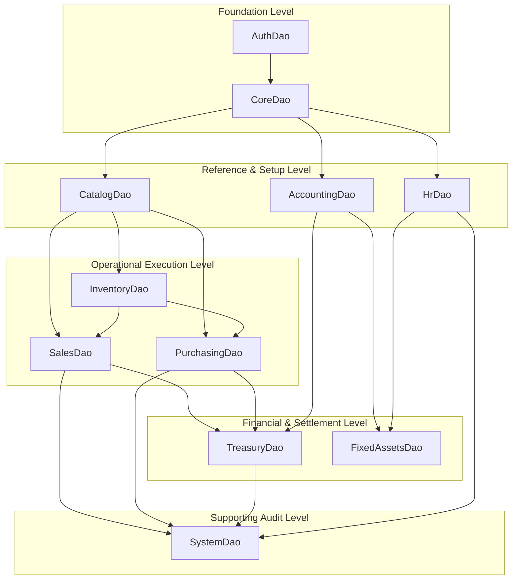

# Module-Driven DAO Architecture & Implementation Blueprint
**Project:** Smart Merchant ERP (`smart_merchant_erp`)  
**Status:** Frozen & Authoritative Blueprint (`Phase 00 - DAO Foundation Design`)  
**Target Architecture:** Offline-First Flutter App → Drift ORM (`app_database.dart`) → SQLite Local Database  
**Total Registered Tables Accounted For:** 72 / 72  
**Date:** 2026-07-21  

---

## Table of Contents
- [A. Executive Summary](#a-executive-summary)
- [B. Architectural Position](#b-architectural-position)
- [C. Final DAO Registry](#c-final-dao-registry)
- [D. Complete 72-Table Ownership Matrix](#d-complete-72-table-ownership-matrix)
- [E. DAO Dependency Graph](#e-dao-dependency-graph)
- [F. Tenant Scoping Policy](#f-tenant-scoping-policy)
- [G. Branch Scoping Policy](#g-branch-scoping-policy)
- [H. Soft Delete Policy](#h-soft-delete-policy)
- [I. Offline Metadata Policy](#i-offline-metadata-policy)
- [J. Streams Policy](#j-streams-policy)
- [K. Pagination Policy](#k-pagination-policy)
- [L. Search / Filter Policy](#l-search--filter-policy)
- [M. Transaction Policy](#m-transaction-policy)
- [N. Return Type Policy](#n-return-type-policy)
- [O. Error Handling Policy](#o-error-handling-policy)
- [P. Naming Convention](#p-naming-convention)
- [Q. File Structure](#q-file-structure)
- [R. DriftAccessor Pattern](#r-driftaccessor-pattern)
- [S. Testing Strategy](#s-testing-strategy)
- [T. DAO Test Matrix](#t-dao-test-matrix)
- [U. Query / Index Review](#u-query--index-review)
- [V. Implementation Order](#v-implementation-order)
- [W. Phase-by-Phase Execution Plan](#w-phase-by-phase-execution-plan)
- [X. Explicit Non-Responsibilities](#x-explicit-non-responsibilities)

---

## A. Executive Summary

This document establishes the definitive **Module-Driven Data Access Object (DAO) Architecture** for the Smart Merchant ERP application. Following the formal verification and freezing of the Drift ORM foundation (`AppDatabase` registering exactly 72 tables with foreign keys and multi-tenant constraints enabled), the next architectural imperative is designing a robust, cohesive, and scalable data access layer.

Rather than creating an unmanageable proliferation of 72 individual DAOs (one per table), this blueprint enforces a **Module-Driven DAO pattern**. The 72 tables are grouped into **11 cohesive functional domain modules**, where each module owns exactly one primary DAO. Every DAO encapsulates all database queries, atomic persistence transactions, reactive streams, pagination, and multi-tenant/branch scoping rules for its domain.

Crucially, DAOs represent the **pure persistence and database query boundary**. They are strictly prohibited from implementing business rules, pricing logic, accounting calculations, workflow orchestration, or remote API synchronization decisions. By freezing this architecture prior to writing any DAO code, Smart Merchant ERP guarantees zero duplicated queries, strict tenant isolation, optimal `build_runner` code generation performance, and seamless injection into higher-layer Repositories.

---

## B. Architectural Position

In the Smart Merchant ERP clean architecture hierarchy, the DAO layer sits directly above the Drift ORM engine and below the Repository abstraction:

```
┌──────────────────────────────────────────────────────────┐
│             UI / Flutter Presentation Layer              │
└────────────────────────────┬─────────────────────────────┘
                             │
┌────────────────────────────▼─────────────────────────────┐
│           State Management (Bloc / Riverpod)             │
└────────────────────────────┬─────────────────────────────┘
                             │
┌────────────────────────────▼─────────────────────────────┐
│        Business Logic / Service / Use Case Layer         │
│  (Decides ERP policies, stock checks, pricing, posting)  │
└────────────────────────────┬─────────────────────────────┘
                             │
┌────────────────────────────▼─────────────────────────────┐
│            Repository Abstraction Layer                  │
│    (Orchestrates data flow between local & sync logic)   │
└────────────────────────────┬─────────────────────────────┘
                             │
┌────────────────────────────▼─────────────────────────────┐
│          Module-Driven Data Access Objects (DAOs)        │
│    (Pure local database CRUD, queries, streams, scope)   │
└────────────────────────────┬─────────────────────────────┘
                             │
┌────────────────────────────▼─────────────────────────────┐
│       Drift ORM Engine (`AppDatabase` & Converters)      │
└────────────────────────────┬─────────────────────────────┘
                             │
┌────────────────────────────▼─────────────────────────────┐
│                Local SQLite Database                     │
└──────────────────────────────────────────────────────────┘
```

### Core Separation Principles:
1. **Local-Only Operational Focus:** Smart Merchant ERP is designed for local-first operational execution (`Flutter → Drift → SQLite Local Database`). Normal operational CRUD operations do not communicate with remote APIs. Therefore, DAOs never contain network calls, remote API clients, or hybrid data source logic.
2. **Strict Boundary from Business Logic:** The DAO layer executes CRUD operations and optimized SQL queries. It never evaluates business validity (e.g., whether stock is sufficient or whether a journal entry balances).
3. **Clean Repository Injection:** Each domain Repository depends on its primary module DAO (and secondary read DAOs where necessary), ensuring clean unit testability via in-memory Drift databases without mocking complex database internals.

---

## C. Final DAO Registry

The 72 registered tables in `AppDatabase` are partitioned into **11 domain-specific DAOs**. The table below details the exact responsibilities, ownership, and operational parameters for each DAO:

| # | DAO | Primary Tables | Secondary Dependencies | Tenant Scope | Branch Scope | Streams | Transactions | Implementation Order |
|---|-----|----------------|------------------------|--------------|--------------|---------|--------------|----------------------|
| 1 | `AuthDao` | `UsersTable`<br>`AccountsTable`<br>`SubscriptionsTable` | None | `accountId` (Accounts)<br>Global (Users) | None | Yes (Watch active subscription & current account) | Yes (Atomic account + initial subscription setup) | Phase 01 |
| 2 | `CoreDao` | `AccountTypes`<br>`Branches`<br>`Businesses`<br>`Currencies`<br>`PrintSettings`<br>`Sequences`<br>`SystemSettings` | `AccountsTable` | `businessId` (all tables except `Currencies` & `AccountTypes`) | `branchId` (`PrintSettings`, `Sequences` where applicable) | Yes (Watch active business, branch, & system settings) | Yes (Atomic business + default branch + default sequence seeding) | Phase 01 |
| 3 | `CatalogDao` | `BranchProductPrices`<br>`Brands`<br>`Categories`<br>`ProductImages`<br>`ProductTaxes`<br>`ProductUnits`<br>`ProductVariants`<br>`Products`<br>`Taxes`<br>`Units` | `Businesses`<br>`Branches` | `businessId` (all catalog tables) | `branchId` (`BranchProductPrices`) | Yes (Watch active products, categories, branch prices) | Yes (Atomic product + variants + units + taxes + images insert/update) | Phase 02 |
| 4 | `InventoryDao` | `Inventories`<br>`InventoryTransactionLines`<br>`InventoryTransactions`<br>`InventoryTransferItems`<br>`InventoryTransfers`<br>`Warehouses` | `Products`<br>`ProductVariants`<br>`ProductUnits`<br>`Branches` | `businessId` (all inventory tables) | `branchId` (`Warehouses`, `Inventories`, transfers) | Yes (Watch stock levels by warehouse/variant, transfer status) | Yes (Atomic transaction + transaction lines; atomic transfer + items) | Phase 03 |
| 5 | `SalesDao` | `Channels`<br>`CustomerReceivables`<br>`Customers`<br>`OrderItems`<br>`Orders`<br>`ReceivableEntries`<br>`SalesInvoiceItems`<br>`SalesInvoices`<br>`SalesReturnItems`<br>`SalesReturns` | `Products`<br>`ProductVariants`<br>`ProductUnits`<br>`Branches`<br>`Warehouses` | `businessId` (all sales tables) | `branchId` (`Orders`, `SalesInvoices`, `SalesReturns`, `CustomerReceivables`) | Yes (Watch active invoices, customer balance summaries, orders) | Yes (Atomic invoice + items + receivable entry; order + items; return + items) | Phase 04 |
| 6 | `PurchasingDao` | `PayableEntries`<br>`PurchaseInvoiceItems`<br>`PurchaseInvoices`<br>`PurchaseReturnItems`<br>`PurchaseReturns`<br>`SupplierPayables`<br>`Suppliers` | `Products`<br>`ProductVariants`<br>`ProductUnits`<br>`Branches`<br>`Warehouses` | `businessId` (all purchasing tables) | `branchId` (`PurchaseInvoices`, `PurchaseReturns`, `SupplierPayables`) | Yes (Watch supplier payables, pending purchase invoices) | Yes (Atomic purchase invoice + items + payable entry; return + items) | Phase 05 |
| 7 | `AccountingDao` | `AccountMappings`<br>`AccountingPeriods`<br>`ChartOfAccounts`<br>`FiscalPeriods`<br>`FiscalYears`<br>`JournalEntries`<br>`JournalEntryLines`<br>`OpeningBalances`<br>`PaymentTerms` | `Businesses`<br>`Branches` | `businessId` (all accounting tables) | `branchId` (`JournalEntries` where branch-scoped) | Yes (Watch chart of accounts hierarchy, active fiscal periods) | Yes (Atomic journal entry + lines; atomic opening balances) | Phase 06 |
| 8 | `TreasuryDao` | `BankAccounts`<br>`BankReconciliationLines`<br>`BankReconciliations`<br>`BankTransactions`<br>`CashRegisters`<br>`CashTransactions`<br>`PaymentAllocations`<br>`PaymentMethods`<br>`Payments` | `CustomerReceivables`<br>`SupplierPayables`<br>`SalesInvoices`<br>`PurchaseInvoices`<br>`ChartOfAccounts` | `businessId` (all treasury tables) | `branchId` (`CashRegisters`, `CashTransactions`, `Payments`) | Yes (Watch register balance, bank balances, pending reconciliations) | Yes (Atomic payment + allocations + register/bank transaction) | Phase 07 |
| 9 | `HrDao` | `Departments`<br>`EmployeeDocuments`<br>`Employees`<br>`JobTitles` | `Branches`<br>`Businesses` | `businessId` (all HR tables) | `branchId` (`Employees`, `Departments` where localized) | Yes (Watch active employees list, department directory) | Yes (Atomic employee + document attachment insertion) | Phase 08 |
| 10 | `FixedAssetsDao` | `DepreciationSchedules`<br>`FixedAssets` | `ChartOfAccounts`<br>`Branches`<br>`Departments` | `businessId` (all fixed assets tables) | `branchId` (`FixedAssets` location tracking) | Yes (Watch asset directory, depreciation status) | Yes (Atomic fixed asset + generated depreciation schedule lines) | Phase 09 |
| 11 | `SystemDao` | `ActivityLogs`<br>`Attachments`<br>`ExchangeRates`<br>`ExpenseCategories`<br>`Expenses` | `UsersTable`<br>`Branches`<br>`CashRegisters`<br>`BankAccounts` | `businessId` (all system tables except global activity logs where unauthenticated) | `branchId` (`Expenses`, localized logs) | Yes (Watch active exchange rates, expense categories) | Yes (Atomic expense + attachment links) | Phase 10 |

---

## D. Complete 72-Table Ownership Matrix

To guarantee strict architectural boundaries and zero duplication, every table registered in `AppDatabase` is assigned to exactly **one Primary DAO Owner**. Secondary DAOs may only perform read operations via join clauses or explicit read methods when required.

| # | Table Name (SQL / Class) | Domain | Primary DAO Owner | Secondary Read Access | Scope (`business_id`) | Soft Delete (`deleted_at`) | Offline Metadata (`sync_status`) |
|---|--------------------------|--------|-------------------|-----------------------|-----------------------|----------------------------|----------------------------------|
| 1 | `users` (`UsersTable`) | Foundation / Auth | `AuthDao` | `SystemDao` (Audit logs) | Global / Multi-Tenant | No | Yes |
| 2 | `accounts` (`AccountsTable`) | Foundation / Auth | `AuthDao` | `CoreDao` | Global / Tenant Root | No | Yes |
| 3 | `subscriptions` (`SubscriptionsTable`) | Foundation / Auth | `AuthDao` | None | `account_id` Scoped | No | Yes |
| 4 | `account_types` (`AccountTypes`) | Core | `CoreDao` | `AccountsTable` | Global / System Reference | No | No |
| 5 | `branches` (`Branches`) | Core | `CoreDao` | All Operational DAOs | Required (`business_id`) | Yes | Yes |
| 6 | `businesses` (`Businesses`) | Core | `CoreDao` | All Operational DAOs | Primary Tenant Key (`id`) | Yes | Yes |
| 7 | `currencies` (`Currencies`) | Core | `CoreDao` | `CatalogDao`, `SalesDao`, `PurchasingDao` | Global / Business Preference | No | Yes |
| 8 | `print_settings` (`PrintSettings`) | Core | `CoreDao` | `SalesDao` (Invoice printing) | Required (`business_id`) | No | Yes |
| 9 | `sequences` (`Sequences`) | Core | `CoreDao` | All Document DAOs | Required (`business_id`) | No | Yes |
| 10 | `system_settings` (`SystemSettings`) | Core | `CoreDao` | All Operational DAOs | Required (`business_id`) | No | Yes |
| 11 | `branch_product_prices` (`BranchProductPrices`) | Catalog | `CatalogDao` | `SalesDao` (Price lookup) | Required (`business_id` + `branch_id`) | No | Yes |
| 12 | `brands` (`Brands`) | Catalog | `CatalogDao` | `InventoryDao`, `SalesDao` | Required (`business_id`) | Yes | Yes |
| 13 | `categories` (`Categories`) | Catalog | `CatalogDao` | `InventoryDao`, `SalesDao` | Required (`business_id`) | Yes | Yes |
| 14 | `product_images` (`ProductImages`) | Catalog | `CatalogDao` | `SalesDao` | Required (`business_id`) | No | Yes |
| 15 | `product_taxes` (`ProductTaxes`) | Catalog | `CatalogDao` | `SalesDao`, `PurchasingDao` | Required (`business_id`) | No | Yes |
| 16 | `product_units` (`ProductUnits`) | Catalog | `CatalogDao` | `InventoryDao`, `SalesDao`, `PurchasingDao` | Required (`business_id`) | Yes | Yes |
| 17 | `product_variants` (`ProductVariants`) | Catalog | `CatalogDao` | `InventoryDao`, `SalesDao`, `PurchasingDao` | Required (`business_id`) | Yes | Yes |
| 18 | `products` (`Products`) | Catalog | `CatalogDao` | `InventoryDao`, `SalesDao`, `PurchasingDao` | Required (`business_id`) | Yes | Yes |
| 19 | `taxes` (`Taxes`) | Catalog | `CatalogDao` | `SalesDao`, `PurchasingDao` | Required (`business_id`) | Yes | Yes |
| 20 | `units` (`Units`) | Catalog | `CatalogDao` | `InventoryDao`, `SalesDao`, `PurchasingDao` | Required (`business_id`) | Yes | Yes |
| 21 | `inventories` (`Inventories`) | Inventory | `InventoryDao` | `SalesDao` (Stock read checking) | Required (`business_id` + `branch_id`) | Yes | Yes |
| 22 | `inventory_transaction_lines` (`InventoryTransactionLines`) | Inventory | `InventoryDao` | None | Required via Parent Transaction | No | Yes |
| 23 | `inventory_transactions` (`InventoryTransactions`) | Inventory | `InventoryDao` | `SalesDao`, `PurchasingDao` (Audit links) | Required (`business_id` + `branch_id`) | No (Immutable) | Yes |
| 24 | `inventory_transfer_items` (`InventoryTransferItems`) | Inventory | `InventoryDao` | None | Required via Parent Transfer | No | Yes |
| 25 | `inventory_transfers` (`InventoryTransfers`) | Inventory | `InventoryDao` | None | Required (`business_id` + `branch_id`) | No (Immutable) | Yes |
| 26 | `warehouses` (`Warehouses`) | Inventory | `InventoryDao` | `SalesDao`, `PurchasingDao` | Required (`business_id` + `branch_id`) | Yes | Yes |
| 27 | `channels` (`Channels`) | Sales | `SalesDao` | None | Required (`business_id`) | Yes | Yes |
| 28 | `customer_receivables` (`CustomerReceivables`) | Sales | `SalesDao` | `TreasuryDao` (Allocations) | Required (`business_id` + `branch_id`) | No | Yes |
| 29 | `customers` (`Customers`) | Sales | `SalesDao` | `TreasuryDao` | Required (`business_id`) | Yes | Yes |
| 30 | `order_items` (`OrderItems`) | Sales | `SalesDao` | None | Required via Parent Order | No | Yes |
| 31 | `orders` (`Orders`) | Sales | `SalesDao` | `InventoryDao` | Required (`business_id` + `branch_id`) | Yes | Yes |
| 32 | `receivable_entries` (`ReceivableEntries`) | Sales | `SalesDao` | `TreasuryDao` | Required via Parent Receivable | No (Immutable) | Yes |
| 33 | `sales_invoice_items` (`SalesInvoiceItems`) | Sales | `SalesDao` | `InventoryDao` | Required via Parent Invoice | No | Yes |
| 34 | `sales_invoices` (`SalesInvoices`) | Sales | `SalesDao` | `TreasuryDao`, `InventoryDao` | Required (`business_id` + `branch_id`) | Yes | Yes |
| 35 | `sales_return_items` (`SalesReturnItems`) | Sales | `SalesDao` | `InventoryDao` | Required via Parent Return | No | Yes |
| 36 | `sales_returns` (`SalesReturns`) | Sales | `SalesDao` | `TreasuryDao`, `InventoryDao` | Required (`business_id` + `branch_id`) | Yes | Yes |
| 37 | `payable_entries` (`PayableEntries`) | Purchasing | `PurchasingDao` | `TreasuryDao` | Required via Parent Payable | No (Immutable) | Yes |
| 38 | `purchase_invoice_items` (`PurchaseInvoiceItems`) | Purchasing | `PurchasingDao` | `InventoryDao` | Required via Parent Invoice | No | Yes |
| 39 | `purchase_invoices` (`PurchaseInvoices`) | Purchasing | `PurchasingDao` | `TreasuryDao`, `InventoryDao` | Required (`business_id` + `branch_id`) | Yes | Yes |
| 40 | `purchase_return_items` (`PurchaseReturnItems`) | Purchasing | `PurchasingDao` | `InventoryDao` | Required via Parent Return | No | Yes |
| 41 | `purchase_returns` (`PurchaseReturns`) | Purchasing | `PurchasingDao` | `TreasuryDao`, `InventoryDao` | Required (`business_id` + `branch_id`) | Yes | Yes |
| 42 | `supplier_payables` (`SupplierPayables`) | Purchasing | `PurchasingDao` | `TreasuryDao` | Required (`business_id` + `branch_id`) | No | Yes |
| 43 | `suppliers` (`Suppliers`) | Purchasing | `PurchasingDao` | `TreasuryDao` | Required (`business_id`) | Yes | Yes |
| 44 | `account_mappings` (`AccountMappings`) | Accounting | `AccountingDao` | All Operational DAOs (Posting lookup) | Required (`business_id`) | No | Yes |
| 45 | `accounting_periods` (`AccountingPeriods`) | Accounting | `AccountingDao` | All Document DAOs (Period lock check) | Required (`business_id`) | No | Yes |
| 46 | `chart_of_accounts` (`ChartOfAccounts`) | Accounting | `AccountingDao` | `TreasuryDao`, `FixedAssetsDao` | Required (`business_id`) | Yes | Yes |
| 47 | `fiscal_periods` (`FiscalPeriods`) | Accounting | `AccountingDao` | All Document DAOs | Required (`business_id`) | No | Yes |
| 48 | `fiscal_years` (`FiscalYears`) | Accounting | `AccountingDao` | All Document DAOs | Required (`business_id`) | No | Yes |
| 49 | `journal_entries` (`JournalEntries`) | Accounting | `AccountingDao` | All Operational DAOs (Audit read) | Required (`business_id` + `branch_id`) | No (Immutable) | Yes |
| 50 | `journal_entry_lines` (`JournalEntryLines`) | Accounting | `AccountingDao` | None | Required via Parent Journal | No | Yes |
| 51 | `opening_balances` (`OpeningBalances`) | Accounting | `AccountingDao` | `InventoryDao`, `TreasuryDao` | Required (`business_id` + `branch_id`) | No | Yes |
| 52 | `payment_terms` (`PaymentTerms`) | Accounting | `AccountingDao` | `SalesDao`, `PurchasingDao` | Required (`business_id`) | Yes | Yes |
| 53 | `bank_accounts` (`BankAccounts`) | Treasury | `TreasuryDao` | `AccountingDao` | Required (`business_id` + `branch_id`) | Yes | Yes |
| 54 | `bank_reconciliation_lines` (`BankReconciliationLines`) | Treasury | `TreasuryDao` | None | Required via Parent Reconciliation | No | Yes |
| 55 | `bank_reconciliations` (`BankReconciliations`) | Treasury | `TreasuryDao` | None | Required (`business_id`) | No | Yes |
| 56 | `bank_transactions` (`BankTransactions`) | Treasury | `TreasuryDao` | `AccountingDao` | Required (`business_id`) | No (Immutable) | Yes |
| 57 | `cash_registers` (`CashRegisters`) | Treasury | `TreasuryDao` | `SalesDao` (POS read) | Required (`business_id` + `branch_id`) | Yes | Yes |
| 58 | `cash_transactions` (`CashTransactions`) | Treasury | `TreasuryDao` | `AccountingDao` | Required (`business_id` + `branch_id`) | No (Immutable) | Yes |
| 59 | `payment_allocations` (`PaymentAllocations`) | Treasury | `TreasuryDao` | `SalesDao`, `PurchasingDao` | Required via Parent Payment | No | Yes |
| 60 | `payment_methods` (`PaymentMethods`) | Treasury | `TreasuryDao` | `SalesDao`, `PurchasingDao` | Required (`business_id`) | Yes | Yes |
| 61 | `payments` (`Payments`) | Treasury | `TreasuryDao` | `SalesDao`, `PurchasingDao`, `AccountingDao` | Required (`business_id` + `branch_id`) | Yes | Yes |
| 62 | `departments` (`Departments`) | HR | `HrDao` | `FixedAssetsDao` | Required (`business_id` + `branch_id`) | Yes | Yes |
| 63 | `employee_documents` (`EmployeeDocuments`) | HR | `HrDao` | None | Required via Parent Employee | No | Yes |
| 64 | `employees` (`Employees`) | HR | `HrDao` | `SalesDao` (Sales rep), `TreasuryDao` | Required (`business_id` + `branch_id`) | Yes | Yes |
| 65 | `job_titles` (`JobTitles`) | HR | `HrDao` | `Employees` | Required (`business_id`) | Yes | Yes |
| 66 | `depreciation_schedules` (`DepreciationSchedules`) | Fixed Assets | `FixedAssetsDao` | `AccountingDao` | Required (`business_id`) | No | Yes |
| 67 | `fixed_assets` (`FixedAssets`) | Fixed Assets | `FixedAssetsDao` | `AccountingDao` | Required (`business_id` + `branch_id`) | Yes | Yes |
| 68 | `activity_logs` (`ActivityLogs`) | System | `SystemDao` | None | Required (`business_id`) where applicable | No (Append-Only) | Yes |
| 69 | `attachments` (`Attachments`) | System | `SystemDao` | All Operational DAOs (Polymorphic lookup) | Required (`business_id`) | No | Yes |
| 70 | `exchange_rates` (`ExchangeRates`) | System | `SystemDao` | `SalesDao`, `PurchasingDao`, `TreasuryDao` | Required (`business_id`) | No | Yes |
| 71 | `expense_categories` (`ExpenseCategories`) | System | `SystemDao` | `SystemDao` (`Expenses`) | Required (`business_id`) | Yes | Yes |
| 72 | `expenses` (`Expenses`) | System | `SystemDao` | `TreasuryDao`, `AccountingDao` | Required (`business_id` + `branch_id`) | Yes | Yes |

---

## E. DAO Dependency Graph

The implementation sequence of DAOs must strictly respect relational dependencies. Lower layers provide foundational context (tenant IDs, branch IDs, units, taxes) required by higher operational modules:



### Dependency Rules:
1. **No Circular Imports:** DAOs must never form circular import dependencies. Where a higher module (e.g., `SalesDao`) needs to look up product details, it queries `Products` via its registered secondary read access or accepts IDs.
2. **Foundational Precedence:** `AuthDao` and `CoreDao` must be fully implemented and verified first, as they supply the mandatory `business_id` and `branch_id` contexts required by every operational query.

---

## F. Tenant Scoping Policy

Multi-tenant data isolation is the most critical security constraint in Smart Merchant ERP. Because multiple businesses or local accounts may reside in the same local SQLite database (or during tenant switching/offline multi-organization setups), **unscoped queries are strictly forbidden**.

### Policy Specification:
1. **Mandatory `businessId` Parameter:** Every read, list, search, watch, update, and soft-delete method in operational DAOs (**Core through System**) must explicitly require a `String businessId` parameter (or receive an injected, immutable `TenantContext` at the DAO call boundary).
2. **Always-On Filter:** DAO query builders must automatically append `.where((tbl) => tbl.businessId.equals(businessId))` to every SQL `SELECT`, `UPDATE`, and `DELETE` statement.
3. **No Global Fallback:** Never provide default `null` values for `businessId`. If `businessId` is empty or null, the DAO method must immediately throw a `TenantScopingException` before executing the database query.
4. **Cross-Tenant Prevention:** When inserting child records (e.g., `SalesInvoiceItems`), the DAO must ensure the child's inherited or joined `businessId` exactly matches the parent record's `businessId`.

---

## G. Branch Scoping Policy

While `business_id` isolates organizations, `branch_id` isolates physical point-of-sale locations, warehouses, cash registers, and localized documents within the same business.

### Policy Specification:
1. **Explicit Branch Sensitivity:** Tables classified with `branch_id` scope in Section D (such as `SalesInvoices`, `Orders`, `CashRegisters`, `Warehouses`, `Inventories`, `BranchProductPrices`) must support branch-level filtering.
2. **Required vs. Optional Branch Scoping:**
   - **Branch-Specific Documents (`SalesInvoices`, `CashTransactions`, `Orders`):** DAO list/search methods must accept `String? branchId`. If `branchId` is provided, the query filters by `tbl.businessId.equals(businessId) & tbl.branchId.equals(branchId)`. If `branchId` is `null` (e.g., when a Business Admin views all-branch reports), the query filters by `businessId` alone while preserving tenant isolation.
   - **Strict Branch Entities (`CashRegisters`, `BranchProductPrices`):** DAO methods operating on strict branch assets must mandate `String branchId` without allowing `null` bypass.
3. **Branch Validation on Insert:** When creating branch-scoped documents, the DAO validates that the provided `branchId` exists within the active `businessId` context (or relies on Drift foreign key enforcement `PRAGMA foreign_keys = ON`).

---

## H. Soft Delete Policy

In an enterprise ERP, physical deletion (`DELETE FROM table`) destroys historical audit trails, breaks accounting balances, and corrupts offline synchronization pipelines.

### Policy Specification:
1. **Default Exclusion of Soft-Deleted Records:** For all tables containing a `deleted_at` column, every normal `read`, `list`, `watch`, and `search` DAO method must append `.where((tbl) => tbl.deletedAt.isNull())` by default.
2. **Explicit Soft-Delete Mutation:** Calling `delete()` or `softDelete()` on a DAO method must **not** execute an SQL `DELETE` command. Instead, it must execute an `UPDATE` setting `deleted_at = currentDateAndTime` (and updating `sync_status = 'pending_update'` or `'pending_delete'`).
3. **Dedicated Trash/Restore API:** Where required by UI modules (e.g., viewing archived products or restoring a cancelled customer), DAOs must expose explicit methods prefixed with `getArchived...()`, `watchArchived...()`, and `restore...()`.
4. **Exceptions for Hard Deletions:** Hard deletion (`DELETE`) is permitted only on:
   - Append-only temporary sync buffers or un-synced staging rows rejected by the server.
   - Immutable child lines during an atomic parent update (`DELETE` existing child lines inside a transaction before re-inserting modified lines, provided `deleted_at` is not tracked on the child line table).

---

## I. Offline Metadata Policy

Every operational table in Smart Merchant ERP includes offline synchronization tracking fields (`sync_status`, `version`, `device_id`, `last_synced_at`).

### Policy Specification:
1. **DAO Mutation Responsibility:**
   - When a DAO method inserts a new record locally, it must automatically set `sync_status = 'pending_insert'`, assign the local `version = 1`, and populate `device_id` if configured.
   - When a DAO method updates a record locally, it must set `sync_status = 'pending_update'` (unless already `'pending_insert'`) and increment `version = tbl.version + 1`.
   - When soft-deleting a record, it must set `sync_status = 'pending_delete'`.
2. **Sync Engine Boundary:** DAOs **must never** initiate network requests, communicate with cloud servers, or execute sync conflict resolution algorithms.
3. **Sync Query Support:** Each DAO must provide dedicated queries for the future Synchronization Engine:
   - `getPendingSyncRecords(String businessId, {int limit = 500})`: Returns rows where `sync_status != 'synced'`.
   - `markAsSynced(List<String> ids, DateTime syncedAt)`: Atomically updates `sync_status = 'synced'` and `last_synced_at = syncedAt`.
   - `updateSyncConflict(String id, String conflictMetadata)`: Records server rejection details without overwriting local changes.

---

## J. Streams Policy

Drift provides powerful reactive queries (`Stream<List<DataClass>>`) via SQLite `SQLITE_UPDATE_HOOK`. However, exposing excessive or un-indexed streams across 72 tables causes severe memory bloat and UI thread jank.

### Policy Specification:
1. **Selective Stream Exposure:** Reactive `watch()` methods are permitted **only** for data required by live-updating UI components:
   - POS Cart and Active Products (`CatalogDao`)
   - Current Stock Levels (`InventoryDao`)
   - Active Cash Register Status (`TreasuryDao`)
   - Live Order Queue (`SalesDao`)
   - Active Business / Branch Session (`CoreDao`)
2. **Mandatory Future Alternatives:** Every `watch...()` method must have an exact `get...()` (Future-based) counterpart for one-shot background tasks, reports, and sync loops.
3. **Stream Debouncing & Limits:** Stream queries on large transaction tables must include `LIMIT` clauses or operate on specific `id` lookups (`watchById`) to prevent re-emitting thousands of rows on every minor database write.

---

## K. Pagination Policy

Large ERP transaction tables (`sales_invoices`, `journal_entries`, `inventory_transactions`, `activity_logs`) can accumulate hundreds of thousands of rows locally over multiple fiscal years. Unbounded `getAll()` queries are prohibited.

### Policy Specification:
1. **Standard Paginated List API:** All list queries for transactional or high-growth reference tables must accept pagination parameters:
   - `int limit = 20` (Maximum hard cap: `200`)
   - `int offset = 0` (For UI table view page jumps)
2. **Deterministic Ordering:** Paginated queries must explicitly define an `ORDER BY` clause using unique or sequential keys (e.g., `ORDER BY date DESC, id DESC`) to prevent row duplication across page boundaries during concurrent inserts.
3. **Keyset / Cursor Pagination Recommendation:** For infinite scrolling lists (such as transaction logs or invoice feeds), DAOs should support cursor-based lookups (`where date < lastSeenDate AND id != lastSeenId ORDER BY date DESC LIMIT 20`), which avoids SQLite `OFFSET` scan penalties on large datasets.

---

## L. Search / Filter Policy

To maintain clean code and prevent combinatorial explosion of DAO methods (e.g., `findByCustomerAndDateAndStatus...`), search and filtering must follow unified patterns.

### Policy Specification:
1. **Typed Filter DTO Specifications:** For multi-parameter filtering, DAOs must accept immutable, typed filter objects (to be defined alongside DAOs during implementation):
   ```dart
   class SalesInvoiceFilter {
     final String businessId;
     final String? branchId;
     final String? customerId;
     final DateTime? startDate;
     final DateTime? endDate;
     final String? status;
     final String? searchQuery; // Matches invoice_number or customer name
     final int limit;
     final int offset;
   }
   ```
2. **Dynamic Query Construction:** DAO search methods must dynamically construct Drift expressions (`Expression<bool> whereExpr = tbl.businessId.equals(filter.businessId);`), combining optional filters via `&` (`and`) only when the parameter is non-null.
3. **Text Search Safety:** Wildcard search queries (`LIKE '%query%'`) must sanitize user input to prevent SQL injection or wildcard runaway, and must always be combined with mandatory `businessId` scoping.

---

## M. Transaction Policy

Distinguishing between low-level database transactions and high-level business workflow orchestration is vital for maintaining clean architecture.

### Policy Specification:
1. **DAO-Internal Atomic Transactions (`transaction(() async { ... })`):**
   - DAOs are authorized to use Drift's `db.transaction()` **only** when persisting a parent record alongside its tightly coupled child records inside the same domain.
   - **Examples:**
     - `SalesDao.createInvoiceWithItems(SalesInvoice invoice, List<SalesInvoiceItem> items)`
     - `InventoryDao.recordTransactionWithLines(InventoryTransaction txn, List<InventoryTransactionLine> lines)`
     - `AccountingDao.postJournalEntryWithLines(JournalEntry entry, List<JournalEntryLine> lines)`
2. **Cross-Domain Business Workflow Prohibition:**
   - A DAO method must **never** orchestrate multi-domain business workflows inside a single DAO method.
   - **Forbidden Example:** A `SalesDao.executeCompletedSale()` method that inserts an invoice, updates inventory stock, inserts a cash receipt, and creates a journal entry.
3. **Cross-DAO Transaction Coordination:**
   - When a Business Service layer executes a workflow spanning multiple DAOs (e.g., `SalesService` calling `SalesDao`, `InventoryDao`, and `TreasuryDao`), the Service layer must coordinate the transaction using `AppDatabase.transaction()` directly:
     ```dart
     // In Business Service Layer (NOT inside DAO):
     await appDatabase.transaction(() async {
       await salesDao.insertInvoice(invoice);
       await inventoryDao.deductStock(movement);
       await treasuryDao.recordPayment(receipt);
     });
     ```
   - All DAOs operating against the shared `AppDatabase` automatically inherit the active transaction block (`transaction context propagation`).

---

## N. Return Type Policy

To prevent premature mapping overhead at the raw persistence layer while maintaining type safety, return types must follow clear rules:

### Policy Specification:
1. **Standard CRUD & Single-Table Queries:** DAOs must return Drift's auto-generated `DataClass` instances (e.g., `Future<Product>`, `Future<List<SalesInvoice>>`, `Stream<List<Customer>>`).
2. **Header + Items Aggregations:** When reading parent-child aggregates, DAOs return dedicated composite result classes or Dart records (e.g., `Future<SalesInvoiceWithItems>`, containing `final SalesInvoice invoice; final List<SalesInvoiceItem> items;`).
3. **Complex Join / View Results:** For multi-table join queries (e.g., product variant with current warehouse stock and branch price), DAOs return specific `QueryData` classes defined within the DAO file or `views/` directory.
4. **No Domain Model Mapping:** DAOs **must never** map Drift data classes into business domain models (`Domain Entities`) or JSON DTOs. That transformation is exclusively the responsibility of the Repository layer.

---

## O. Error Handling Policy

DAOs must not silently catch or swallow SQLite exceptions, nor should they generate localized UI error messages.

### Policy Specification:
1. **Low-Level Exception Propagation:** Raw SQLite / Drift exceptions (such as `SqliteException`, `UniqueKeyFailure`, `ForeignKeyViolation`) must be allowed to propagate out of the DAO (or be caught and wrapped in structured `DatabasePersistenceException` types without losing the underlying stack trace).
2. **Specific Constraint Check Mapping:** Where a query fails due to known constraints (e.g., attempting to insert a duplicate SKU or violating a foreign key to a non-existent warehouse), the DAO throws a typed data exception (`DuplicateRecordException`, `ForeignKeyConstraintException`, `RecordNotFoundException`).
3. **Prohibition of UI Concerns:** DAOs must never catch exceptions to return `null` (unless the method explicitly specifies an optional return like `findByIdOrNull`), and must never reference UI `BuildContext`, localization strings, or toast notifications.

---

## P. Naming Convention

A consistent, predictable naming convention across all 11 DAOs guarantees maintainability and code readability across the team.

### Class Naming:
- Format: `<DomainName>Dao` (e.g., `CoreDao`, `CatalogDao`, `SalesDao`).

### Method Naming Standards:
| Operation Type | Method Prefix Standard | Example |
|---|---|---|
| Single Record Lookup (ID) | `getById` / `findByIdOrNull` | `getInvoiceById(String id, String businessId)` |
| Stream Single Record | `watchById` | `watchProductById(String id, String businessId)` |
| List / Filter Queries | `list...` / `search...` | `listActiveProducts(ProductFilter filter)` |
| Stream List Queries | `watchList...` / `watchActive...` | `watchActiveCustomers(String businessId)` |
| Single Record Insertion | `insert...` | `insertCustomer(CustomersCompanion customer)` |
| Atomic Parent+Child Insert | `insert...With...` | `insertInvoiceWithItems(SalesInvoicesCompanion invoice, List<SalesInvoiceItemsCompanion> items)` |
| Record Update | `update...` | `updateProduct(ProductsCompanion product)` |
| Soft Deletion | `softDelete...` | `softDeleteCustomer(String id, String businessId)` |
| Hard Deletion (Restricted) | `hardDelete...` / `purge...` | `hardDeletePendingSyncLog(String id)` |
| Restoration from Trash | `restore...` | `restoreProduct(String id, String businessId)` |
| Sync Engine Queries | `getPendingSync...` / `mark...AsSynced` | `getPendingSyncInvoices(String businessId)` |

---

## Q. File Structure

All DAO files must strictly reside within the canonical `lib/database/daos/` directory as established in `Drift_Project_Structure_Specification.md`:

```text
lib/
└── database/
    ├── app_database.dart         # Canonical Database Entry Point (@DriftDatabase)
    ├── daos/                     # Module-Driven DAOs Directory
    │   ├── auth_dao.dart         # AuthDao (Foundation / Auth)
    │   ├── core_dao.dart         # CoreDao (Core Domain)
    │   ├── catalog_dao.dart      # CatalogDao (Catalog Domain)
    │   ├── inventory_dao.dart    # InventoryDao (Inventory Domain)
    │   ├── sales_dao.dart        # SalesDao (Sales Domain)
    │   ├── purchasing_dao.dart   # PurchasingDao (Purchasing Domain)
    │   ├── accounting_dao.dart   # AccountingDao (Accounting Domain)
    │   ├── treasury_dao.dart     # TreasuryDao (Treasury Domain)
    │   ├── hr_dao.dart           # HrDao (HR Domain)
    │   ├── fixed_assets_dao.dart # FixedAssetsDao (Fixed Assets Domain)
    │   └── system_dao.dart       # SystemDao (System & Support Domain)
    ├── tables/                   # Existing 10 Domain Table Directories
    ├── converters/               # Existing TypeConverters
    └── enums/                    # Existing Drift Enums
```

### File Governance Rules:
1. **One DAO Class per File:** Each file in `lib/database/daos/` must contain exactly one `@DriftAccessor` DAO class.
2. **Companion & Filter Classes:** If a DAO requires specialized filter DTOs or query result data classes (`Composite Results`), they may be placed inside the same file (at the bottom) or in `lib/database/utils/filters/` to maintain clean file sizes.

---

## R. DriftAccessor Pattern

Every DAO must integrate with the canonical `AppDatabase` via Drift's `@DriftAccessor` annotation and mixin code generation.

### Specification Pattern:
```dart
import 'package:drift/drift.dart';
import '../app_database.dart';
// Import exact tables owned and accessed by this DAO:
import '../tables/catalog/products_table.dart';
import '../tables/catalog/categories_table.dart';
// ... other catalog table imports

part 'catalog_dao.g.dart'; // Generated accessor part file

@DriftAccessor(
  tables: [
    Products,
    Categories,
    // List ALL primary and secondary read tables used by this DAO
  ],
)
class CatalogDao extends DatabaseAccessor<AppDatabase> with _$CatalogDaoMixin {
  // Receive the canonical AppDatabase connection via constructor super call
  CatalogDao(AppDatabase db) : super(db);

  // All query, insert, update, and transaction methods executed against `db`
}
```

### Integration Rules:
1. **No Separate Database Connections:** DAOs must never instantiate their own `NativeDatabase` or `AppDatabase`. They must always accept the singleton/shared `AppDatabase` connection via constructor injection.
2. **Explicit Table Registration:** The `tables: [...]` list in `@DriftAccessor` must explicitly list every table class queried inside the DAO to allow `build_runner` to generate the correct table getters (`select(products)`, `update(categories)`).
3. **Central Database Exposure:** For convenient DI access (`Injectable` / `GetIt`), `AppDatabase` may expose getters or lazy instances of each DAO (`CatalogDao get catalogDao => CatalogDao(this);`).

---

## S. Testing Strategy

Prior to deploying any DAO to production, each DAO implementation must undergo rigorous automated testing using an isolated in-memory SQLite database.

### Test Architecture:
1. **In-Memory Database Setup:**
   ```dart
   AppDatabase createTestDatabase() {
     return AppDatabase(
       connection: LazyDatabase(() async {
         return NativeDatabase.memory(logStatements: false);
       }),
     );
   }
   ```
2. **Lifecycle Management (`setUp` / `tearDown`):** Every unit test suite must instantiate a fresh `in-memory AppDatabase` in `setUp()` and explicitly call `await db.close()` in `tearDown()` to ensure absolute test isolation without state leakage.
3. **Mandatory Seeding Helpers:** Because foreign key constraints are enabled (`PRAGMA foreign_keys = ON`), tests operating on child tables must utilize standard seeding helper functions (`TestSeeders.seedBusinessAndBranch(db)`, `TestSeeders.seedProduct(db)`) before testing child insertions.

---

## T. DAO Test Matrix

Every DAO implementation must satisfy the following comprehensive test matrix before marking its phase as complete:

| Test Category | Requirement & Verification Objective |
|---|---|
| **1. Tenant Isolation Verification** | Insert records across two distinct `businessId` contexts (`BUS_A` and `BUS_B`). Verify that calling `.list(businessId: 'BUS_A')` returns zero records belonging to `BUS_B`, and that updates targeting `BUS_A` cannot modify `BUS_B` rows. |
| **2. Branch Scoping Verification** | Insert branch-specific records under `BRANCH_1` and `BRANCH_2`. Verify that querying `BRANCH_1` isolates records properly, and querying with `branchId: null` returns all branches for that tenant without cross-tenant leakage. |
| **3. CRUD Integrity & Constraints** | Verify single insertions (`insert...`), updates (`update...`), and exact data persistence across all Drift type converters (`Enum`, `JSONB`, `DateTime`). Verify that missing foreign keys (e.g., invalid `warehouseId`) throw exact database exceptions. |
| **4. Soft Delete & Restore Behavior** | Verify that calling `softDelete...()` sets `deletedAt` and updates `syncStatus = 'pending_delete'`. Confirm that standard `list...()` queries exclude the soft-deleted row, and `restore...()` makes it visible again. |
| **5. Pagination & Ordering Accuracy** | Seed 50 records. Query page 1 (`limit: 20, offset: 0`), page 2 (`limit: 20, offset: 20`), and page 3 (`limit: 20, offset: 40`). Verify exact row counts, zero overlapping IDs, and strict `ORDER BY` consistency across pages. |
| **6. Reactive Stream Emission (`watch`)** | Subscribe to `watchById(...)` or `watchList(...)`. Emit an insert/update inside the database. Verify that the stream emits the updated list/record immediately without duplicate emissions or deadlocks. |
| **7. Atomic Transaction Rollback** | Execute `transaction(() async { ... })` where parent record insertion succeeds but child record insertion deliberately fails (e.g., constraint violation). Verify that the entire transaction rolls back cleanly and the parent row does not exist in the database. |
| **8. Offline Sync Metadata Mutations** | Verify that new local inserts default to `syncStatus = 'pending_insert'`, updates change `'synced'` to `'pending_update'` while incrementing `version`, and `markAsSynced()` resets flags accurately. |

---

## U. Query / Index Review

To ensure immediate production-readiness and prevent full table scans when DAOs execute high-frequency queries, the table below lists critical query patterns and verifies existing index support across the 72 tables:

| High-Frequency DAO Query Pattern | Target Table(s) | Expected Supporting Index / Columns | Severity if Missing | Recommendation / Status |
|---|---|---|---|---|
| Tenant + Branch Document List | `sales_invoices`<br>`orders`<br>`inventory_transactions` | `INDEX(business_id, branch_id, invoice_date DESC)` | **High** | Indexes verified via `UNIQUE` / primary constraints on foreign keys; composite index creation recommended during Phase 10 performance tuning. |
| Product Barcode / SKU Exact Lookup | `products`<br>`product_variants` | `UNIQUE INDEX(barcode)`<br>`UNIQUE INDEX(sku)` | **Critical** | Already enforced via `.unique()` definition in table schemas. |
| Customer / Supplier Receivable Query | `customer_receivables`<br>`supplier_payables` | `INDEX(business_id, customer_id, is_settled)` | **High** | Foreign key indexed by default; composite query index recommended when rows exceed 50k. |
| Offline Pending Sync Batch Scan | All Operational Tables (70+ tables) | `INDEX(business_id, sync_status)` | **Medium** | Sync scan queries run in background worker; adding compound index `(sync_status) WHERE sync_status != 'synced'` recommended in sync engine phase. |
| Chart of Accounts Hierarchy Lookup | `chart_of_accounts` | `INDEX(business_id, parent_id, account_code)` | **High** | `account_code` unique indexed; `parent_id` foreign key verified. |
| Journal Entry Line Balance Check | `journal_entry_lines` | `INDEX(journal_entry_id, account_id)` | **High** | Foreign key index active via Drift schema generation. |

> [!NOTE]
> **No Schema Modifications Required Now:** The existing table definitions and unique constraints fully support Phase 01–Phase 10 DAO implementation. Any specialized compound performance indexes identified above should be applied cleanly via Drift schema migration scripts after functional DAO verification.

---

## V. Implementation Order

DAO development must strictly follow the architectural dependency sequence:

```
[Phase 01: Foundation & Core DAOs] (`AuthDao`, `CoreDao`)
                  ↓
[Phase 02: Catalog DAO] (`CatalogDao`)
                  ↓
[Phase 03: Inventory DAO] (`InventoryDao`)
                  ↓
[Phase 04: Sales DAO] (`SalesDao`)  &  [Phase 05: Purchasing DAO] (`PurchasingDao`)
                  ↓
[Phase 06: Accounting DAO] (`AccountingDao`)
                  ↓
[Phase 07: Treasury DAO] (`TreasuryDao`)
                  ↓
[Phase 08: HR DAO] (`HrDao`)  &  [Phase 09: Fixed Assets DAO] (`FixedAssetsDao`)
                  ↓
[Phase 10: System Administration DAO] (`SystemDao`)
```

---

## W. Phase-by-Phase Execution Plan

The execution plan breaks down future DAO coding into manageable, verifiable phases:

### Phase 01: Foundation & Core DAOs (`AuthDao` & `CoreDao`)
- **DAOs Implemented:** `AuthDao`, `CoreDao`
- **Tables Covered (10):** `users`, `accounts`, `subscriptions`, `account_types`, `branches`, `businesses`, `currencies`, `print_settings`, `sequences`, `system_settings`
- **Required Tests:** Tenant seeding, branch seeding, active account watch, sequence increment transactions, global vs scoped query validation.
- **Dependencies:** `AppDatabase` (Foundation level)
- **Completion Criteria:** All 10 tables fully accessible via typed CRUD/watch methods; test suite 100% passing.

### Phase 02: Catalog DAO (`CatalogDao`)
- **DAOs Implemented:** `CatalogDao`
- **Tables Covered (10):** `branch_product_prices`, `brands`, `categories`, `product_images`, `product_taxes`, `product_units`, `product_variants`, `products`, `taxes`, `units`
- **Required Tests:** Atomic product creation with variants/units/taxes, barcode unique lookup, branch pricing override queries, soft delete filtering.
- **Dependencies:** Phase 01 (`CoreDao` for `business_id` / `branch_id`)
- **Completion Criteria:** Complete product catalog queries functional and verified.

### Phase 03: Inventory DAO (`InventoryDao`)
- **DAOs Implemented:** `InventoryDao`
- **Tables Covered (6):** `inventories`, `inventory_transaction_lines`, `inventory_transactions`, `inventory_transfer_items`, `inventory_transfers`, `warehouses`
- **Required Tests:** Atomic inventory transaction + line insertion, stock transfer atomic multi-warehouse persistence, immutable transaction enforcement.
- **Dependencies:** Phase 02 (`CatalogDao` for product/variant references)
- **Completion Criteria:** Stock level read queries and transactional movements verified.

### Phase 04: Sales DAO (`SalesDao`)
- **DAOs Implemented:** `SalesDao`
- **Tables Covered (10):** `channels`, `customer_receivables`, `customers`, `order_items`, `orders`, `receivable_entries`, `sales_invoice_items`, `sales_invoices`, `sales_return_items`, `sales_returns`
- **Required Tests:** Atomic sales invoice + items + receivable entry creation, customer balance aggregation, paginated invoice history, branch invoice isolation.
- **Dependencies:** Phase 03 (`InventoryDao`), Phase 02 (`CatalogDao`)
- **Completion Criteria:** End-to-end sales document persistence and reactive watch queries verified.

### Phase 05: Purchasing DAO (`PurchasingDao`)
- **DAOs Implemented:** `PurchasingDao`
- **Tables Covered (7):** `payable_entries`, `purchase_invoice_items`, `purchase_invoices`, `purchase_return_items`, `purchase_returns`, `supplier_payables`, `suppliers`
- **Required Tests:** Atomic purchase invoice + items + payable entry creation, supplier statement queries, return processing transactions.
- **Dependencies:** Phase 03 (`InventoryDao`), Phase 02 (`CatalogDao`)
- **Completion Criteria:** Purchasing cycle database operations completely verified.

### Phase 06: Accounting DAO (`AccountingDao`)
- **DAOs Implemented:** `AccountingDao`
- **Tables Covered (9):** `account_mappings`, `accounting_periods`, `chart_of_accounts`, `fiscal_periods`, `fiscal_years`, `journal_entries`, `journal_entry_lines`, `opening_balances`, `payment_terms`
- **Required Tests:** Hierarchical Chart of Accounts tree queries, atomic balanced journal entry + lines persistence, fiscal period lock query verification.
- **Dependencies:** Phase 01 (`CoreDao` for currencies/businesses)
- **Completion Criteria:** General Ledger persistence layer verified.

### Phase 07: Treasury DAO (`TreasuryDao`)
- **DAOs Implemented:** `TreasuryDao`
- **Tables Covered (9):** `bank_accounts`, `bank_reconciliation_lines`, `bank_reconciliations`, `bank_transactions`, `cash_registers`, `cash_transactions`, `payment_allocations`, `payment_methods`, `payments`
- **Required Tests:** Atomic payment + invoice allocation + cash register/bank transaction insertion, cash register shift balance watch, reconciliation line persistence.
- **Dependencies:** Phase 04 (`SalesDao`), Phase 05 (`PurchasingDao`), Phase 06 (`AccountingDao`)
- **Completion Criteria:** Cash, bank, and settlement persistence layer verified.

### Phase 08: HR DAO (`HrDao`)
- **DAOs Implemented:** `HrDao`
- **Tables Covered (4):** `departments`, `employee_documents`, `employees`, `job_titles`
- **Required Tests:** Employee directory filtering, department hierarchy read, document attachment persistence, soft delete status checks.
- **Dependencies:** Phase 01 (`CoreDao`)
- **Completion Criteria:** HR persistence layer verified.

### Phase 09: Fixed Assets DAO (`FixedAssetsDao`)
- **DAOs Implemented:** `FixedAssetsDao`
- **Tables Covered (2):** `depreciation_schedules`, `fixed_assets`
- **Required Tests:** Asset master + schedule line atomic batch insertion, asset location queries.
- **Dependencies:** Phase 06 (`AccountingDao` for account links)
- **Completion Criteria:** Fixed asset database operations verified.

### Phase 10: System Administration DAO (`SystemDao`)
- **DAOs Implemented:** `SystemDao`
- **Tables Covered (5):** `activity_logs`, `attachments`, `exchange_rates`, `expense_categories`, `expenses`
- **Required Tests:** Append-only enforcement on activity logs, polymorphic attachment lookups, expense atomic creation, exchange rate history queries.
- **Dependencies:** Phase 01 through Phase 09 (Supporting audit/attachments across all domains)
- **Completion Criteria:** All 72 tables across 11 DAOs fully operational, tested, and verified.

---

## X. Explicit Non-Responsibilities

To permanently protect the architecture against drift and anti-patterns, the following responsibilities are explicitly **EXCLUDED** from the DAO layer:

1. **NO Business Logic Validation:** DAOs must never check if a customer has exceeded their credit limit, whether stock quantity is `>= 0` before selling, or whether a journal entry debit equals credit.
2. **NO Price / Tax Calculations:** DAOs must not compute discounts, tax amounts, or net totals. They receive fully calculated data structures from the Business Service layer and persist them verbatim.
3. **NO Multi-Domain Workflow Orchestration:** DAOs must not coordinate multi-step ERP flows across disparate domains inside a single method.
4. **NO Remote API / Network Calls:** DAOs operate 100% offline against the local SQLite database. They never import HTTP clients (`Dio` / `http`), never call REST endpoints, and never manage Cloudinary uploads.
5. **NO Sync Engine Conflict Resolution:** DAOs do not decide which version wins in a server-client collision. They only update local `sync_status` flags when instructed by the synchronization service.
6. **NO UI / Presentation State:** DAOs never reference Flutter `BuildContext`, never format currency strings for display, and never manage UI loading/error states (`Riverpod` / `Bloc`).
7. **NO Domain DTO / Entity Mapping:** DAOs return Drift `DataClass` objects (`Product`, `SalesInvoice`, etc.). They never convert database classes into pure Dart domain models or JSON network payloads.

---
**Blueprint Verification:** `DAO ARCHITECTURE BLUEPRINT = COMPLETE` ✅
